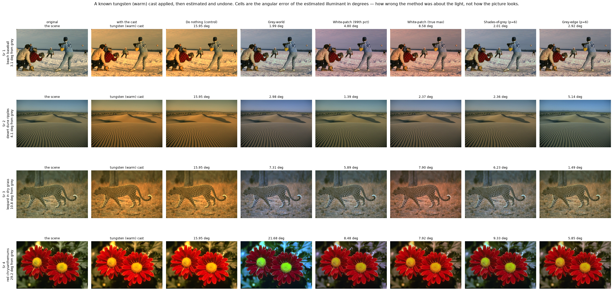
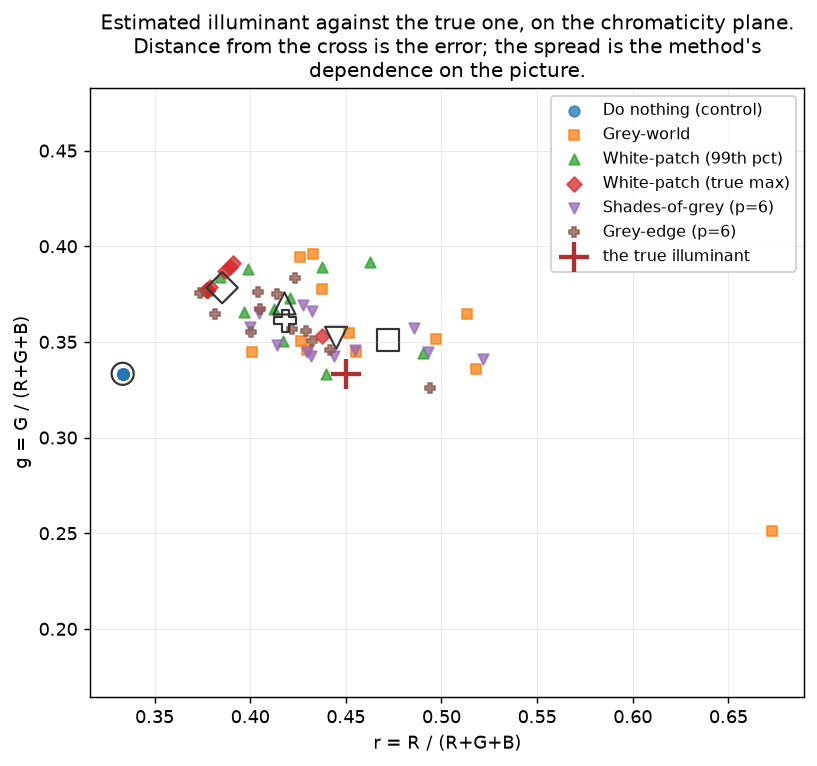
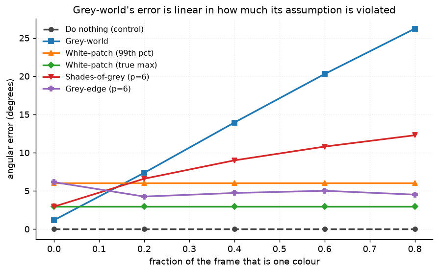
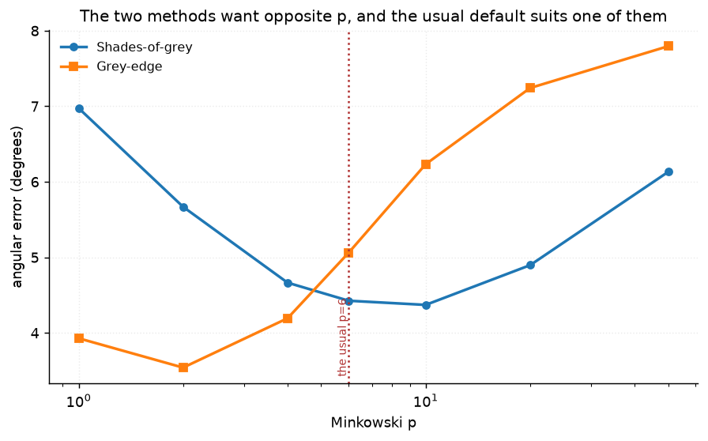
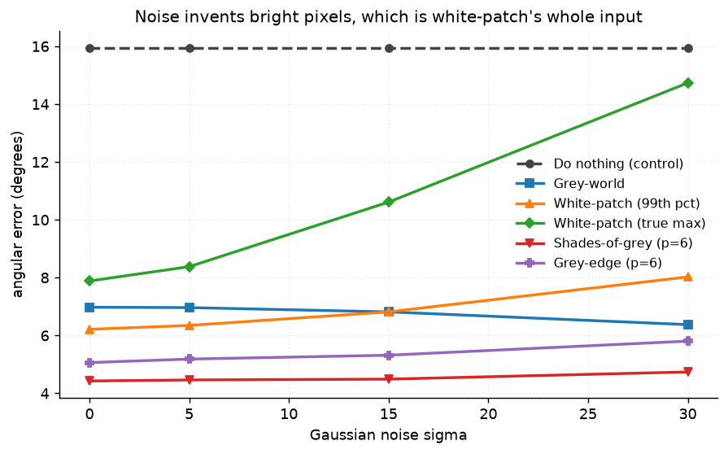

# 39 · White balance — classical computer vision

[](https://www.python.org/)
[](https://opencv.org/)
[](#)
[](#)

Five illuminant estimators and a do-nothing control, scored by **angular error in
degrees** against a cast that was applied and is therefore known exactly.

> **The claim under test:** grey-world assumes the scene averages to grey and
> white-patch assumes something in it is white. Both assumptions can be violated
> on purpose, and when they are, the failure is not a degradation — it is total.
> A single clipped highlight reduces white-patch to **exactly** the do-nothing
> control.

**No neural network, no training, no GPU.** The cast is applied, so the answer is
known; the metric is how wrong each method is about the *light*, not how the
picture looks.

---

## Results

Four scenes under a tungsten cast, one row each. Cells are the angular error of
the estimated illuminant, in degrees.



| Sr | Scene | Do nothing | Grey-world | White-patch 99% | White-patch max | Shades-of-grey | **Grey-edge** |
|---:|---|---:|---:|---:|---:|---:|---:|
| 1 | beach baseball · 3.1° from grey | 15.95 | **1.99** | 4.80 | 8.58 | 2.01 | 2.92 |
| 2 | desert dune ripples · 4.1° | 15.95 | 2.98 | **1.39** | 2.37 | 2.36 | 5.14 |
| 3 | leopard in dry grass · 10.8° | 15.95 | 7.31 | 5.89 | 7.90 | 6.23 | **1.49** |
| 4 | red chrysanthemums · 29.2° | 15.95 | **21.68** | 8.48 | 7.92 | 9.33 | **5.85** |

**Row 4 is grey-world's designed failure happening on a real photograph.** Two
red chrysanthemums fill the frame, the scene's own mean sits 29° from grey, and
grey-world reports an illuminant **21.68° wrong — worse than not correcting at
all**. It has no way to tell a red light from a red subject.

Averaged over all twelve photographs:

| Method | Angular error (°) | PSNR (dB) | SSIM | Time (ms) |
|---|---:|---:|---:|---:|
| Do nothing (control) | 15.949 | 18.86 | 0.9203 | **0.005** |
| Grey-world | 6.977 | 23.94 | 0.9403 | 2.53 |
| White-patch (99th pct) | 6.212 | 26.90 | 0.9699 | 4.17 |
| White-patch (true max) | 7.884 | 25.36 | 0.9709 | 2.73 |
| **Shades-of-grey (p=6)** | **4.426** | 27.59 | 0.9707 | 12.91 |
| Grey-edge (p=6) | 5.062 | **28.54** | **0.9764** | 21.46 |

**The two columns do not rank the same way.** Shades-of-grey estimates the light
best (4.43°); grey-edge produces the better-looking image (28.54 dB, 0.9764).
Estimating the illuminant and applying the correction are different questions,
and neither column is the other's proxy.

---

## The signature figure: where each method actually lands



Each point is one photograph's estimate; the hollow marker is that method's mean;
the red cross is the true illuminant. **Every method sits left of the cross** —
they all under-correct a warm light. The lone grey-world point far to the right
at r = 0.67 is the red chrysanthemums.

A bar chart of mean error says how wrong a method is. This says *how*: a method
whose points cluster tightly in the wrong place has a bias that could be
corrected, and one whose points scatter around the right answer does not.

---

## Each assumption, broken on purpose

| Scene | Do nothing | Grey-world | WP 99% | **WP max** | Shades-of-grey | Grey-edge |
|---|---:|---:|---:|---:|---:|---:|
| Dominant colour, **neutral** light | **0.000** | **23.034** | 4.349 | 2.649 | 11.180 | 3.201 |
| Clipped highlight, **warm** light | 15.949 | 6.119 | 7.971 | **15.949** | 5.607 | 5.342 |

> **A single clipped highlight puts white-patch at 15.949° — the do-nothing
> control is 15.949°.** Not approximately: the same number. The brightest pixel
> is (255, 255, 255), so the method concludes the light is white and applies no
> correction whatsoever. It does not degrade gracefully; it switches off.
>
> **The 99th-percentile variant gets 7.971° on the same scene**, half the error,
> because throwing away the top 1% throws away exactly the clipped pixel. That is
> what the percentile is for, measured rather than asserted.
>
> **Grey-world hallucinates a 23° cast out of a neutrally-lit scene** that is
> mostly one colour. Doing nothing scores 0.000 there — the light really is
> white — so every one of those 23 degrees is the assumption showing through.

The two scenes cannot be lit the same way and that is not a flaw in the
experiment. Grey-world's failure needs a *neutral* light, so that any error is
invented. White-patch's failure needs a *real* cast, so that the brightest pixel
is the one thing in frame that has lost it.

### The order of operations is the whole test

The first version of the highlight scene painted a white circle and *then*
applied the cast — which makes the highlight carry the illuminant perfectly.
White-patch scored **0.0°** on the scene built to break it, its best result
anywhere in the project.

A blown highlight is clipped at the sensor, which happens **after** the light has
been multiplied in. Cast first, then paint pure white over it.
`test_the_clipped_highlight_scene_is_built_in_the_right_order` keeps it that way.

---

## Grey-world's error is linear in how much its assumption is violated



| Fraction of frame that is one colour | 0% | 20% | 40% | 60% | 80% |
|---|---:|---:|---:|---:|---:|
| **Grey-world** | 1.17 | 7.36 | 13.94 | 20.28 | **26.21** |
| Shades-of-grey (p=6) | 2.94 | 6.59 | 8.99 | 10.79 | 12.27 |
| **Grey-edge (p=6)** | 6.14 | 4.26 | 4.72 | 5.01 | **4.51** |

**Grey-world's error is a straight line through the violation** — 22× from one
end to the other. Grey-edge does not move, because a large flat region
contributes almost no edges, and edges are all it looks at. That is the whole
argument for the method, and it is one plot.

Note the crossover: at 0% dominance grey-edge is the *worst* of the three
(6.14 against grey-world's 1.17). When the assumption holds, the method built to
survive its failure is the one you should not use.

---

## The exponent everyone copies is set for the wrong method



| p | 1 | 2 | 4 | **6** | 10 | 20 | 50 |
|---|---:|---:|---:|---:|---:|---:|---:|
| Shades-of-grey | 6.97 | 5.67 | 4.67 | 4.43 | **4.37** | 4.90 | 6.13 |
| Grey-edge | 3.93 | **3.54** | 4.19 | 5.06 | 6.23 | 7.24 | 7.79 |

**The two methods want opposite exponents.** Shades-of-grey improves up to p≈10;
grey-edge is best at p=2 and gets steadily worse. The widely-quoted default p=6
sits near shades-of-grey's optimum and costs grey-edge **1.52° — 43% more error**
than p=2 would.

p=1 is the plain mean, p=∞ is the maximum, and these two methods are the same
formula applied to pixels and to gradients. The exponent says how much to trust
the brightest evidence, and a gradient image's brightest evidence is not the same
kind of thing as a pixel's.

---

## Noise breaks the brightest pixel and not the mean



| σ | 0 | 5 | 15 | 30 |
|---|---:|---:|---:|---:|
| Grey-world | 6.98 | 6.96 | 6.82 | **6.38** |
| White-patch (99th pct) | 6.21 | 6.35 | 6.82 | 8.02 |
| **White-patch (true max)** | 7.88 | 8.38 | 10.61 | **14.73** |

Noise invents bright pixels, and that is white-patch's entire input — its error
nearly doubles by σ30, approaching the do-nothing control again. Grey-world
averages over every pixel and zero-mean noise does not move a mean, so it gets
very slightly **better**. Same degradation, opposite sign, and both follow
directly from what the method reads.

---

## How the images were chosen

Twelve photographs ordered by **how far the scene's own mean already sits from the
grey axis**, in degrees. That is not one of `tools/select_images.py`'s stock
axes, and it is the right one here: it is precisely grey-world's error on an
uncast image, so it predicts where the method must fail before any cast is
applied.

```
mushers_and_husky      0.6°    swallowtail_on_phlox   9.3°
gentoo_on_shingle      1.9°    leopard_in_dry_grass  10.8°
beach_baseball         3.1°    lakeside_verandah     13.0°
desert_dune_ripples    4.1°    spotted_cat_on_a_log  16.0°
louvre_pyramid         5.6°    red_chrysanthemums    29.2°
cyclists_on_a_lane     6.9°    tiger_in_the_shade     8.3°
```

Selecting on generic chroma would not have worked — a picture can be vividly
coloured and still average to grey. None of these twelve appears in any other
project; `tools/check_image_reuse.py` enforces that by perceptual hash.

---

## Try it on your own image

```bash
python infer.py photo.jpg                        # all five estimators
python infer.py photo.jpg --method "Grey-edge (p=6)" --out balanced.png
python infer.py --photo red_chrysanthemums --cast "tungsten (warm)"
```

With `--photo` the cast is applied by the tool, so the angular error is real. On
your own photograph there is no ground truth, so **no error is printed** — what
is printed instead is how far your scene's mean sits from grey, which is
grey-world's error in advance, and how far apart the five estimates are. Five
methods that disagree by 15° on your picture is the useful signal.

---

## Limitations

* **The cast is a per-channel gain, which is the easy case.** A real illuminant
  change is a spectral one; modelling it as three multipliers is the von Kries
  approximation, and it is what makes the ground truth exact here. Every number
  in this project is an upper bound on performance under a real light.
* **The correction is the same three multipliers applied backwards**, so a method
  that estimates the illuminant perfectly recovers the original to within
  quantisation. That is checked (`test_correcting_by_the_true_illuminant_recovers_the_original`)
  and it means PSNR here measures the estimate, not the correction machinery.
* **Twelve photographs and one cast per row.** The angular errors have a
  seed-to-seed component that is not reported; the differences quoted (23° against
  3°) are far larger than it, but a 0.5° gap in the main table is not a ranking.
* **The two failure scenes are synthetic.** They have to be: triggering
  white-patch's failure requires a clipped highlight under a known cast, and no
  annotated photograph in this repo carries one. The dominance sweep is the bridge
  between them and the photographs, and row 4 of the results table is the failure
  happening on a real image.
* **`Do nothing` scores 15.949° in most tables because that is the cast's own
  angle.** It is a constant, not a measurement, and it is there so every other
  number can be read as "better or worse than not trying".

---

## Tests

13 tests, run with `pytest projects/39_white_balance/tests -q`. They pin the
harness (the highlight scene built in the right order, the oracle recovering the
original, the control estimating white by definition) and every finding: that a
clipped highlight reduces white-patch to exactly the do-nothing control, that a
dominant colour breaks grey-world and not the edge methods, that grey-world's
error is monotone in the violation, that every method makes an almost-uncast
image worse, that the usual Minkowski default is set for the wrong method, that
noise breaks the brightest pixel and not the mean, and that angular error and
PSNR rank differently.

---

## Keywords

white balance · colour constancy · illuminant estimation · grey world ·
white patch · max-RGB · shades of grey · grey edge · Minkowski norm · angular
error · chromaticity · von Kries · colour cast · clipped highlight ·
classical computer vision · no deep learning · OpenCV · Python · CPU only ·
reproducible image processing experiments

## References

* Buchsbaum, *A spatial processor model for object colour perception*, Journal of
  the Franklin Institute, 1980 — grey world.
* Land, *The Retinex Theory of Color Vision*, Scientific American 1977 — the
  max-RGB idea behind white patch.
* Finlayson & Trezzi, *Shades of Gray and Colour Constancy*, Color Imaging
  Conference 2004 — the Minkowski family swept here.
* van de Weijer, Gevers & Gijsenij, *Edge-Based Color Constancy*, IEEE TIP 2007 —
  grey edge.
* Hordley & Finlayson, *Re-evaluating Colour Constancy Algorithms*, ICPR 2004 —
  why angular error and not image distance.
