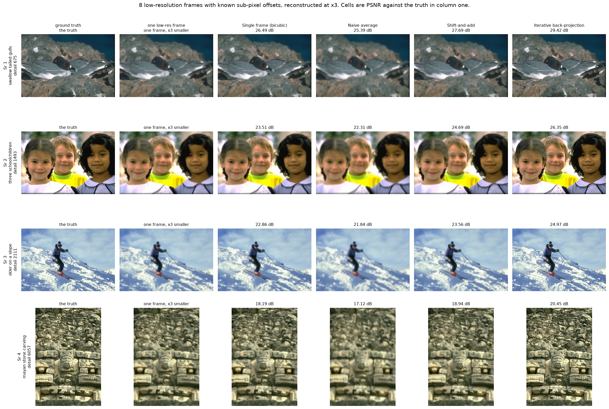
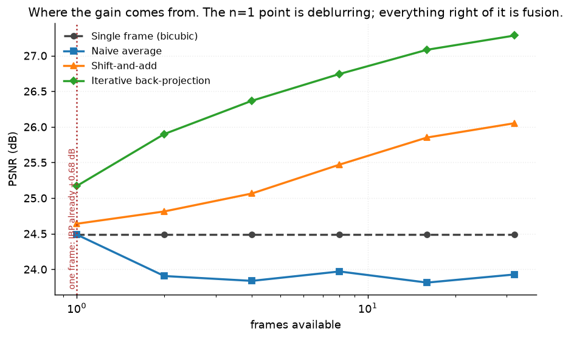
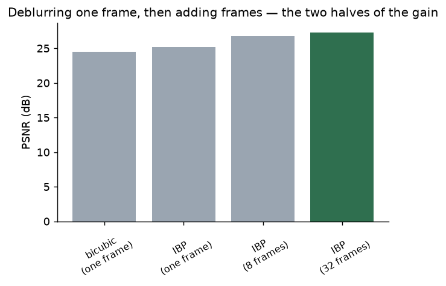
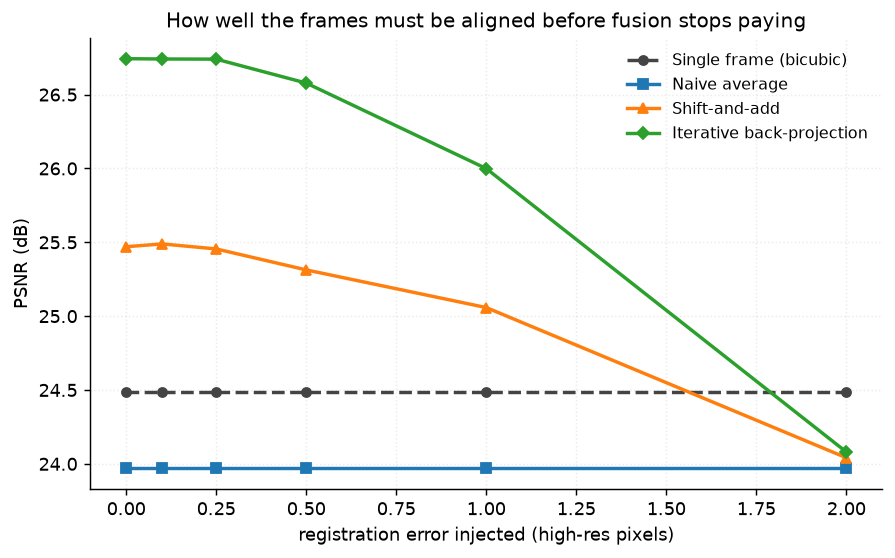
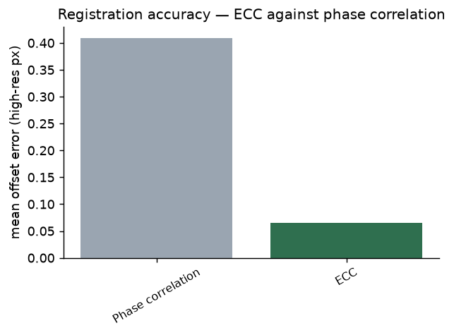
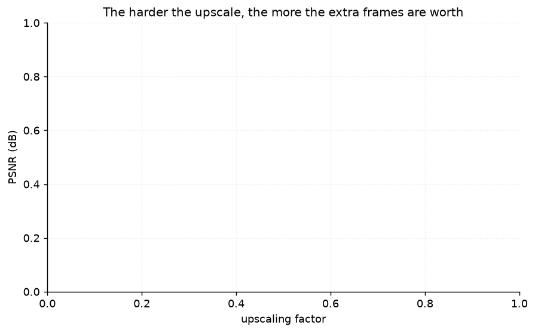

# 40 · Multi-frame super-resolution — classical computer vision

[](https://www.python.org/)
[](https://opencv.org/)
[](#)
[](#)

The honest contrast with [project 21](../21_super_resolution/), which found the
entire nearest-to-Lanczos argument worth **0.49 dB** — every single-image method
is a weighted average of the same surviving samples.

> **The claim under test:** several frames with *sub-pixel* offsets genuinely
> break that plateau, because each frame samples the scene at different positions.
> It does: **+2.25 dB**, four and a half times the whole single-image argument.
> But **0.68 dB of that is available from one frame** and is deblurring, not
> fusion — and quoting the full figure credits fusion with it.

**No neural network, no training, no GPU.**

---

## Results

Four scenes, eight low-resolution frames each with known sub-pixel offsets,
reconstructed at ×3. Cells are PSNR against the ground truth in column one.



| Sr | Scene | Single frame (bicubic) | Naive average | Shift-and-add | **Back-projection** |
|---:|---|---:|---:|---:|---:|
| 1 | swallow tailed gulls · detail 675 | 26.49 | 25.39 | 27.69 | **29.42** |
| 2 | three schoolchildren · detail 1493 | 23.51 | 22.31 | 24.69 | **26.35** |
| 3 | skier on a slope · detail 2111 | 22.86 | 21.84 | 23.56 | **24.97** |
| 4 | mayan stone carving · detail 6057 | 18.19 | 17.12 | 18.94 | **20.45** |

Averaged over all twelve photographs:

| Method | PSNR (dB) | SSIM | Gain over one frame | Time (ms) |
|---|---:|---:|---:|---:|
| Single frame (bicubic) | 24.49 | 0.6366 | — | **0.4** |
| **Naive average** | 23.97 | 0.5926 | **−0.52** | 17.0 |
| Shift-and-add | 25.47 | 0.6838 | +0.98 | 50.1 |
| **Iterative back-projection** | **26.74** | **0.7634** | **+2.26** | 849.5 |

> **Naive averaging is worse than a single frame** on every scene, −0.52 dB.
> Averaging frames that are not aligned is a blur, and having eight of them makes
> the blur better estimated rather than smaller. It is the control that says the
> gain comes from the *alignment*, not from having more data.

---

## The signature result: where the gain actually comes from



| Frames | 1 | 2 | 4 | 8 | 16 | 32 |
|---|---:|---:|---:|---:|---:|---:|
| Single frame (bicubic) | 24.49 | — | — | — | — | — |
| Shift-and-add | 24.64 | 24.81 | 25.07 | 25.47 | 25.85 | 26.05 |
| **Back-projection** | **25.17** | 25.90 | 26.37 | 26.74 | 27.08 | **27.28** |

**The n=1 column is the control this project exists to provide.** Iterative
back-projection inverts the known blur whether or not there is anything to fuse,
so it beats bicubic by **+0.68 dB from a single frame**. The headline +2.26 dB is
not all fusion:



| | PSNR | contributed by |
|---|---:|---|
| bicubic, one frame | 24.49 | — |
| back-projection, one frame | 25.17 | **+0.68 dB deblurring** |
| back-projection, 8 frames | 26.74 | +1.57 dB fusion |
| back-projection, 32 frames | 27.28 | +2.11 dB fusion |

Fusion is the larger half, but a third of the eight-frame gain is available
without any second frame at all. Any comparison that omits the n=1 point is
attributing a deconvolution to super-resolution.

### And the sub-pixel part is the part that is actually resolution

| Offsets | Single frame | Naive average | Shift-and-add | Back-projection |
|---|---:|---:|---:|---:|
| **Sub-pixel** | 24.49 | 23.97 | **25.47** | **26.74** |
| Whole low-res pixels | 24.49 | 22.10 | 24.65 | 25.94 |

**+0.81 dB** for the offsets being fractional. Whole-pixel offsets land the
sensor on exactly the same grid positions, so they carry no samples the first
frame does not already have — what remains is noise averaging and edge coverage.

---

## The frames have to be aligned, and to how much



| Injected error (high-res px) | 0.0 | 0.1 | 0.25 | 0.5 | 1.0 | **2.0** |
|---|---:|---:|---:|---:|---:|---:|
| Shift-and-add | 25.47 | 25.49 | 25.46 | 25.31 | 25.06 | 24.04 |
| Back-projection | 26.74 | 26.74 | 26.74 | 26.58 | 26.00 | **24.08** |
| *single frame* | *24.49* | *24.49* | *24.49* | *24.49* | *24.49* | *24.49* |

**Fusion stops paying at about 2 high-resolution pixels of registration error** —
two thirds of one low-resolution pixel at ×3 — where both methods fall *below*
just upscaling one frame. Up to half a pixel it costs almost nothing (−0.16 dB),
which is a wider tolerance than the method's reputation suggests.

### Which puts a number on the registration itself



| Method | Mean offset error (high-res px) |
|---|---:|
| Phase correlation | 0.4095 |
| **ECC** | **0.0646** |

**ECC is 6.3× more accurate**, and comfortably inside the 0.5 px tolerance where
phase correlation is not. It is also the finding this project got backwards
first: `register_ecc` negated the translation it returned.

A negated offset has exactly the right magnitude and exactly the wrong direction.
The only symptom is a registration error of roughly twice the true offset — which
reads as "ECC is inaccurate", and had it reported as **11× worse** than phase
correlation instead of 6× better. Nothing crashes, nothing looks odd, and the
number is plausible. `test_ecc_returns_the_offset_and_not_its_negative` checks
the sign against known offsets, which is the only way it shows up.

---

## More frames do not buy an arbitrary scale factor



| Upscale | Single frame | Best multi-frame | Gain |
|---|---:|---:|---:|
| ×2 | 26.61 | 30.07 | **+3.46** |
| ×3 | 24.49 | 27.08 | +2.60 |
| ×4 | 23.34 | 25.50 | **+2.16** |

**Sixteen frames are worth 3.46 dB at ×2 and 2.16 dB at ×4** — the gain shrinks
as the task gets harder, which is the opposite of the intuition that more
upscaling is where you need more frames most. Upscaling by *s* needs *s²* times
as many samples per output pixel, so the same sixteen frames fill the ×4 grid a
quarter as densely. Extra frames buy a fixed amount of information, and it is
spread thinner the more you ask of it.

---

## How the images were chosen

Twelve photographs selected by `tools/select_images.py --axis detail` and then
ordered by this module's own `detail()` — Laplacian variance of the greyscale
image. Detail is the axis that decides whether super-resolution has anything to
recover: a smooth scene has no high-frequency content for extra samples to
reveal.

```
ladybird_on_a_leaf     194    skier_on_a_slope      2112
pintail_at_dusk        266    deer_in_bare_woods    2181
carved_stone_relief    665    otters_on_gravel      2726
swallow_tailed_gulls   673    two_at_a_wagon        2754
toadstool_in_moss     1150    foxes_under_a_ledge   4129
three_schoolchildren  1497    mayan_stone_carving   6048
```

A factor of 31 from end to end. The ladybird on a smooth leaf is the control:
even a perfect reconstruction has almost nothing to add there, and PSNR is
highest on it precisely because there is so little to get wrong. None of these
twelve appears in any other project; `tools/check_image_reuse.py` enforces that
by perceptual hash — it rejected a thirteenth candidate during selection as the
same porcupine already used by project 37.

---

## Try it on your own frames

```bash
python infer.py frame1.png frame2.png frame3.png ...     # your own burst
python infer.py --photo mayan_stone_carving --frames 16  # simulated, with truth
python infer.py --photo skier_on_a_slope --registration ECC
```

Given your own frames there is no ground truth, so **no PSNR is printed**. What
is printed instead is the registered offset of each frame and whether it is
sub-pixel — because whole-pixel offsets are the case where the whole exercise
buys nothing, and a burst from a tripod is exactly that case.

---

## Limitations

* **The degradation model is known exactly and matched by the reconstruction.**
  Shift, Gaussian blur, decimate — and back-projection inverts precisely that
  blur. Real optics are not a known Gaussian, and every number here is an upper
  bound for that reason alone.
* **The offsets are pure translations.** Real hand-held bursts rotate and have
  parallax; `make_stack` has no rotation, so the registration problem here is
  two numbers per frame rather than six.
* **Noise is 2.0 σ Gaussian and identical in every frame's statistics.** A real
  burst has shot noise that scales with brightness, which changes the optimal
  weighting between frames and is not modelled.
* **PSNR is the headline and it is a blunt instrument.** SSIM is reported beside
  it and ranks the methods the same way here, which is worth stating precisely
  because it is not guaranteed — see project 26 for a case where they disagree.
* **The n=1 control isolates deblurring from fusion for *this* implementation.**
  A different back-projection with a different regulariser would split the
  0.68/1.57 differently; what generalises is that the split exists and must be
  measured, not that it is one third.

---

## Tests

14 tests, run with `pytest projects/40_multiframe_super_resolution/tests -q`.
They pin the harness (the stack shifting before it decimates, whole-pixel
offsets really being whole low-resolution pixels, and the ECC sign against known
offsets) and every finding: that multiple frames break project 21's plateau, that
part of the gain is deblurring rather than fusion, that sub-pixel offsets are the
part that is actually resolution, that naive averaging is worse than one frame,
that ECC is the more accurate registration, that fusion stops paying at two
pixels of misalignment, and that a fixed number of frames buys less the harder
the upscale.

---

## Keywords

multi-frame super-resolution · burst super-resolution · sub-pixel registration ·
shift and add · iterative back-projection · IBP · phase correlation · ECC ·
findTransformECC · image registration · aliasing · sampling · PSNR ·
classical computer vision · no deep learning · OpenCV · Python · CPU only ·
reproducible image processing experiments

## References

* Irani & Peleg, *Improving Resolution by Image Registration*, CVGIP 1991 — the
  back-projection used here.
* Park, Park & Kang, *Super-resolution image reconstruction: a technical
  overview*, IEEE Signal Processing Magazine 2003.
* Evangelidis & Psarakis, *Parametric Image Alignment Using Enhanced Correlation
  Coefficient Maximization*, TPAMI 2008 — the ECC criterion.
* Baker & Kanade, *Limits on Super-Resolution and How to Break Them*, TPAMI 2002
  — why the gain shrinks with the scale factor.
