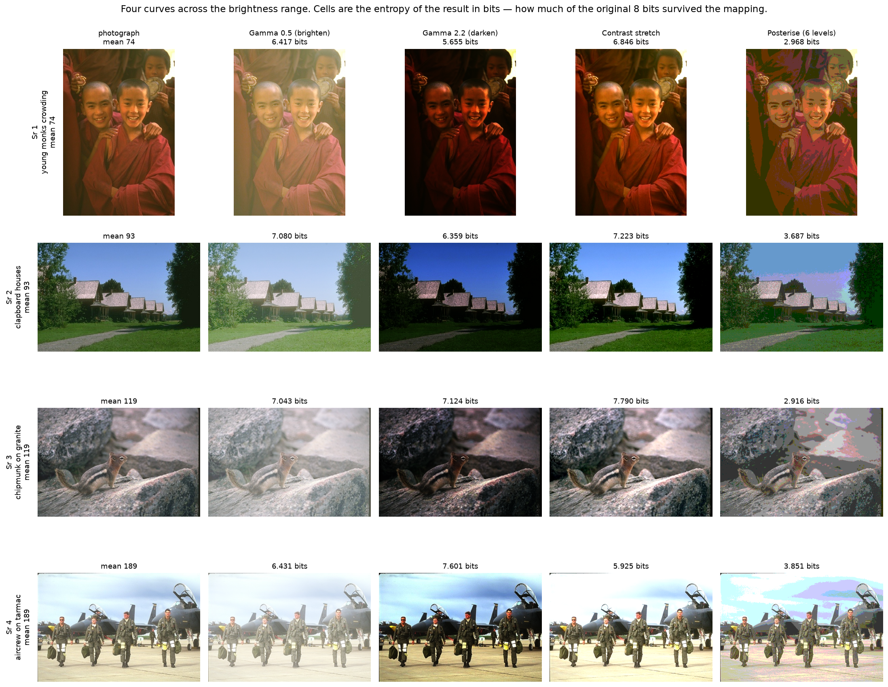
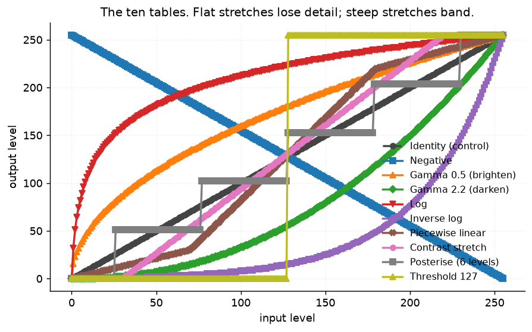
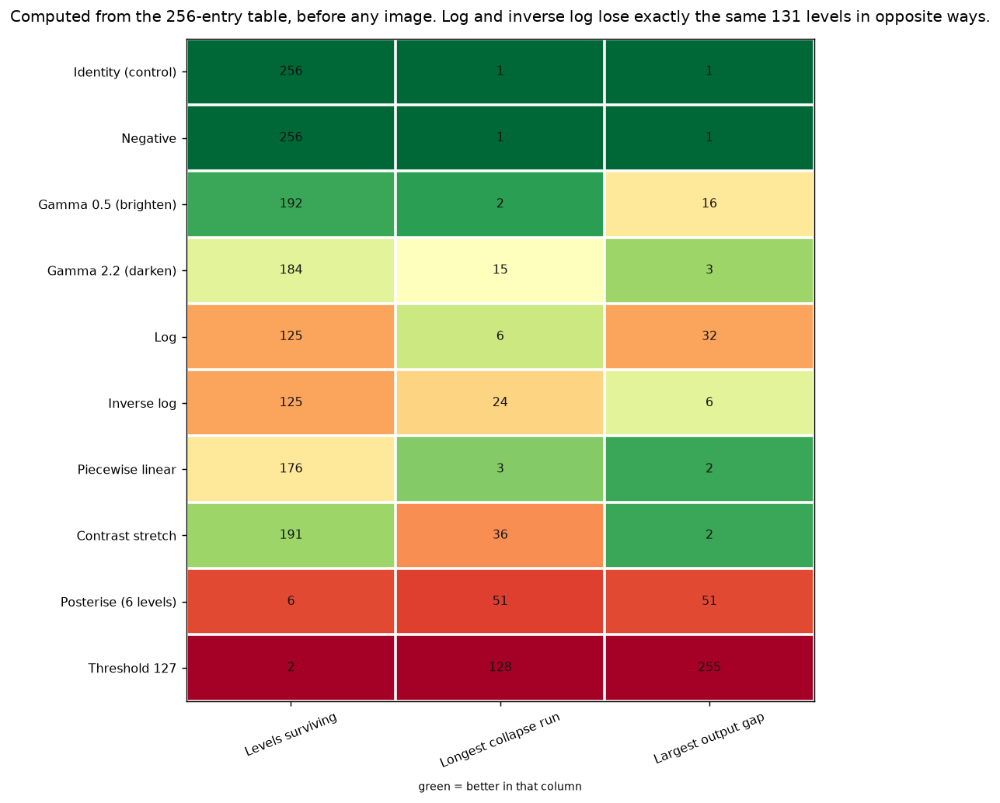
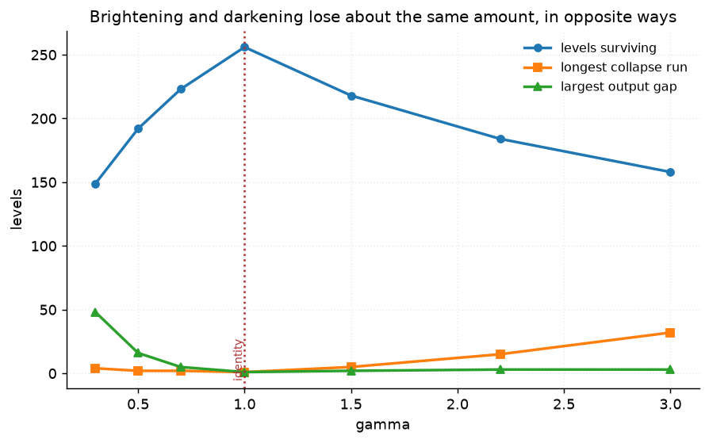
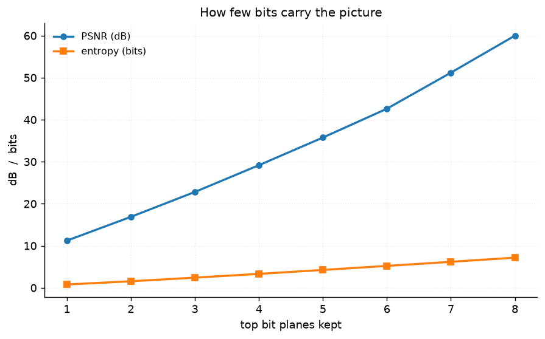
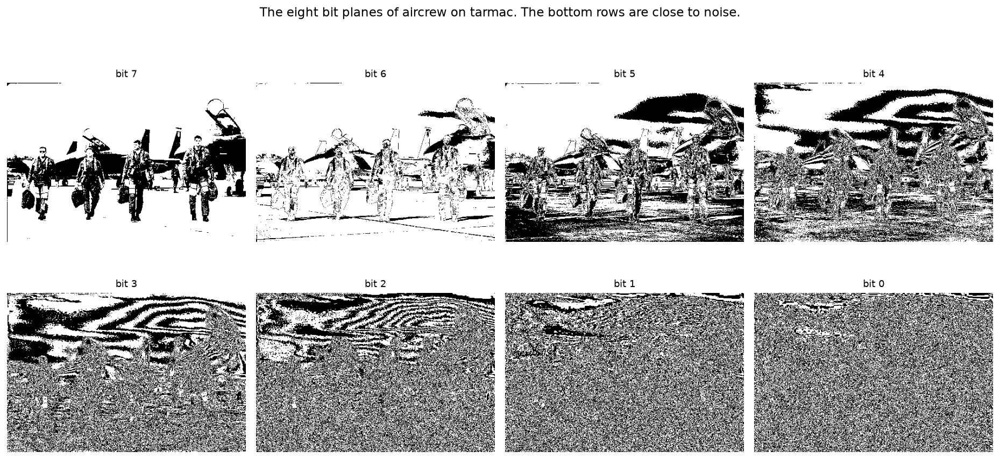

# 41 · Point transforms — classical computer vision

[](https://www.python.org/)
[](https://opencv.org/)
[](#)
[](#)

Ten per-pixel curves, each written twice — once as a 256-entry lookup table and
once as the arithmetic it replaces — and checked for **bit-exact** equality.

> **The claim under test:** a point transform on 8-bit data *is* a lookup table,
> so the two implementations must be identical to the bit. They were not, on 136
> of 256 input levels, and the reason is one line: a table built with
> `.astype(np.uint8)` truncates where the arithmetic rounds.

> **And the loss is computable before you have an image.** Counting how many of
> the 256 levels survive gives it exactly — and on twelve photographs the
> prediction is off by **zero levels**.

**No neural network, no training, no GPU.**

---

## Results

Four photographs across the brightness range, four curves. Cells are the entropy
of the result in bits — how much of the original 8 bits survived.



| Sr | Scene | Gamma 0.5 (brighten) | Gamma 2.2 (darken) | Contrast stretch | Posterise (6) |
|---:|---|---:|---:|---:|---:|
| 1 | firewalkers at night · mean 47 | 6.396 | 4.884 | 5.320 | 2.111 |
| 2 | three girls by hay · mean 100 | 7.170 | 6.750 | 7.245 | 2.712 |
| 3 | chipmunk on granite · mean 119 | 7.043 | 7.124 | 7.790 | 2.916 |
| 4 | aircrew on tarmac · mean 189 | 6.431 | 7.601 | 5.925 | 3.851 |

**The same curve is worth opposite things at opposite ends of the pool.**
Brightening the firewalkers keeps 6.40 bits where darkening them keeps 4.88;
on the bright tarmac it is the other way round, 6.43 against 7.60. A point
transform has no quality of its own — only a match or a mismatch to where the
pixels already are.

---

## The claim that had to be fixed to be true

| Transform | Bit-identical | LUT (ms) | Arithmetic (ms) | Speedup |
|---|---:|---:|---:|---:|
| Identity (control) | ✔ | 0.0475 | 0.0992 | **2.1×** |
| Negative | ✔ | 0.0476 | 0.7328 | 15.4× |
| Gamma 0.5 (brighten) | ✔ | 0.0486 | 2.0941 | **43.0×** |
| Gamma 2.2 (darken) | ✔ | 0.0486 | 2.0218 | 41.6× |

Every table now reproduces the arithmetic **exactly**, at up to 43× the speed.
The identity is the control: its "arithmetic" is a memory copy, so the table
cannot win by much, and it does not.

It was not true when this project was written. `lut_power` ended with:

```python
return np.clip(c * np.power(v, gamma) * 255.0, 0, 255).astype(np.uint8)   # truncates
```

while `shared.io.to_uint8` — the arithmetic path — ends with:

```python
return (np.clip(img, 0.0, 1.0) * 255.0 + 0.5).astype(np.uint8)            # rounds
```

`np.power(1/255, 0.5) * 255 = 15.9687`. The table said **15**; the arithmetic
said **16**. On gamma 0.5 the two disagreed on **136 of 256 input levels**, every
one of them by exactly one.

**Nothing looks wrong when that happens.** The image is one level darker across
half its tones, which is invisible, and truncation biases every curve downward by
half a level on average — so a brightening gamma systematically under-brightens.
The only thing that finds it is asserting the equality the theory promises.

---

## The signature result: two ways to lose, and one number that hides both




| Transform | Levels surviving | Levels lost | Longest **run** | Largest **gap** |
|---|---:|---:|---:|---:|
| Identity (control) | 256 | 0 | 1 | 1 |
| Negative | 256 | 0 | 1 | 1 |
| **Gamma 0.5 (brighten)** | 192 | 64 | **2** | **16** |
| **Gamma 2.2 (darken)** | 184 | 72 | **15** | **3** |
| **Log** | 125 | **131** | 6 | **32** |
| **Inverse log** | 125 | **131** | **24** | 6 |
| Piecewise linear | 176 | 80 | 3 | 2 |
| Contrast stretch | 191 | 65 | 36 | 2 |
| Posterise (6 levels) | 6 | 250 | 51 | 51 |
| Threshold 127 | 2 | 254 | 128 | 255 |

A **run** is many input levels collapsed onto one output — detail lost, result
smooth. A **gap** is two adjacent inputs landing far apart — no detail lost at
all, but the output histogram has holes and a smooth gradient becomes visible
steps. They are produced by opposite halves of the same curve.

> **Log and inverse log lose exactly the same 131 levels**, and could not look
> more different: log has runs of 6 and gaps of 32, inverse log has runs of 24
> and gaps of 6. A single "information loss" number cannot tell a curve that
> bands from one that smears.
>
> **Brightening bands; darkening smears — and the usual explanation has it
> backwards.** The standard line is that brightening duplicates levels and that
> is why it bands. Gamma 0.5 has a longest run of **2**: it duplicates almost
> nothing. Its largest gap is **16**. Brightening bands because it *spreads*
> adjacent shadow levels apart, not because it merges them. Gamma 2.2, which
> merges (run 15, gap 3), loses detail without banding.



The sweep is symmetric in the amount lost and antisymmetric in the mechanism:
either side of γ=1 loses levels, and which failure you get depends only on which
side.

---

## The table predicts the loss, and the prediction is exact

| | from the table alone | measured on 12 photographs |
|---|---:|---:|
| Gamma 0.5 | 192 | 192 |
| Log | 125 | 125 |
| Posterise (6) | 6 | 6 |
| Threshold | 2 | 2 |

**Zero disagreement on all ten curves.** The measured count can only be lower —
an image need not contain every input level — and across twelve photographs
spanning mean 47 to 189, every level occurs somewhere. The loss really is a
property of the curve, computable before any image exists.

---

## Contrast and information are different quantities

| Transform | RMS contrast | Entropy (bits) |
|---|---:|---:|
| **Threshold 127** | **0.4183** | **0.786** |
| Piecewise linear | 0.2621 | 6.640 |
| Contrast stretch | 0.2503 | 6.519 |
| Identity (control) | 0.1973 | 7.173 |
| Log | 0.1012 | 6.041 |

**Thresholding maximises contrast and nearly minimises information.** It is the
clearest available demonstration that "more contrast" and "more visible detail"
are not the same claim — a binary image has the highest possible RMS contrast and
one bit per pixel.

---

## How few bits carry the picture




| Top planes kept | 1 | 2 | 3 | **4** | 5 | 6 | 7 |
|---|---:|---:|---:|---:|---:|---:|---:|
| PSNR (dB) | 11.2 | 16.9 | 22.8 | **29.2** | 35.8 | 42.6 | 51.2 |
| Entropy (bits) | 0.79 | 1.55 | 2.42 | **3.31** | 4.24 | 5.21 | 6.18 |

**Half the bits carry 29 dB.** Each additional plane is worth almost exactly 6 dB
— which is what it should be, since one bit is a factor of two in amplitude and
20·log₁₀(2) = 6.02. The bottom planes are close to noise, which is the intuition
behind every bit-depth reduction and, ultimately, behind compression.

---

## How the images were chosen

Twelve photographs selected by `tools/select_images.py --axis brightness`, which
is where a point transform's effect lives: the same gamma brightens a dark frame
and washes out a bright one.

```
firewalkers_at_night   47    bighorn_ram          113
young_monks_crowding   74    chipmunk_on_granite  119
golden_pavilion        85    horses_in_a_meadow   126
clapboard_houses       93    woman_by_a_wall      134
three_girls_by_hay    100    monk_under_a_tree    149
market_fruit_stall    102    aircrew_on_tarmac    189
```

The firewalkers are flame against near-black, where a brightening curve has the
most to reveal and the most quantisation to reveal it with; the aircrew are
bright concrete, where the same curve has nothing left to lift. None of these
twelve appears in any other project; `tools/check_image_reuse.py` enforces that
by perceptual hash, and rejected a thirteenth candidate as the same elk already
used by project 37.

---

## Try it on your own image

```bash
python infer.py photo.jpg                       # all ten curves, with their costs
python infer.py photo.jpg --transform "Gamma 0.5 (brighten)" --out out.png
python infer.py photo.jpg --gamma 0.6           # any exponent, cost computed first
```

It prints, for each curve, how many of the 256 levels survive it, the longest
collapse run and the largest output gap — all computed from the table, before
your image is touched. Then it prints what your image actually contains, because
a curve that collapses levels your photograph does not use costs you nothing.

---

## Limitations

* **Everything here is 8-bit.** The whole argument — 256 entries, levels lost,
  runs and gaps — is a statement about quantisation, and at 16 bits per channel
  the numbers change completely and mostly stop mattering. That is the real
  answer to banding and it is outside what this project measures.
* **`levels_surviving` counts distinct outputs, not perceptual difference.** Two
  adjacent levels are "surviving" as distinct even though no one can see the
  difference, so the count is an upper bound on usable information.
* **RMS contrast is a global standard deviation.** It says nothing about where
  the contrast is, which is exactly why thresholding scores highest on it.
* **The arithmetic path is numpy, not C.** The 43× speedup is against vectorised
  numpy on float64; a hand-written C loop would narrow it, and the real point is
  the bit-exactness rather than the ratio.
* **The four-curve figure uses entropy as its cell score**, which is a summary of
  the whole histogram. It cannot show *where* the loss landed, which is what the
  run/gap columns are for.

---

## Tests

14 tests, run with `pytest projects/41_point_transforms/tests -q`. They pin the
exact claims (table and arithmetic bit-identical, only the bijections
invertible, the table's prediction matching twelve photographs) and the defect
itself (`test_truncating_instead_of_rounding_breaks_it_on_half_the_levels`),
plus every finding: that brightening bands while darkening smears, that log and
inverse log lose exactly the same levels in opposite ways, that contrast and
information are different quantities, that posterising loses exactly what it
says, and that half the bits carry most of the picture.

---

## Keywords

point transform · lookup table · LUT · cv2.LUT · gamma correction · power law ·
log transform · contrast stretching · piecewise linear · posterisation ·
thresholding · bit-plane slicing · quantisation · banding · entropy ·
RMS contrast · classical computer vision · no deep learning · OpenCV · Python ·
CPU only · reproducible image processing experiments

## References

* Gonzalez & Woods, *Digital Image Processing*, chapter 3 — the intensity
  transformations implemented here.
* Poynton, *Digital Video and HD: Algorithms and Interfaces*, chapter 23 — why
  gamma exists and what 8 bits cost.
* ITU-R BT.709-6 — the transfer function the 2.2 exponent approximates.
