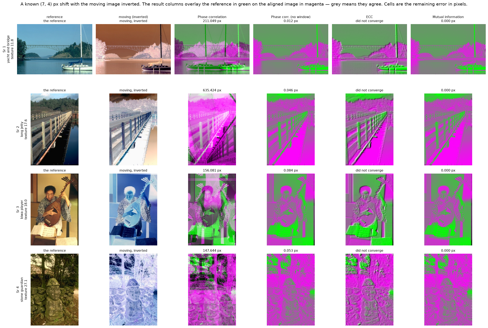
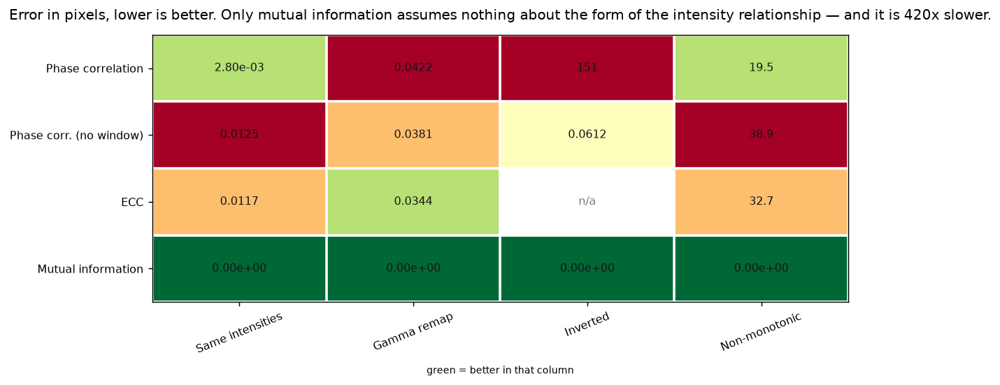
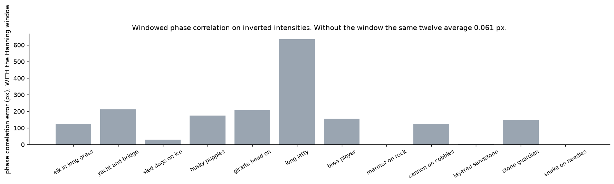
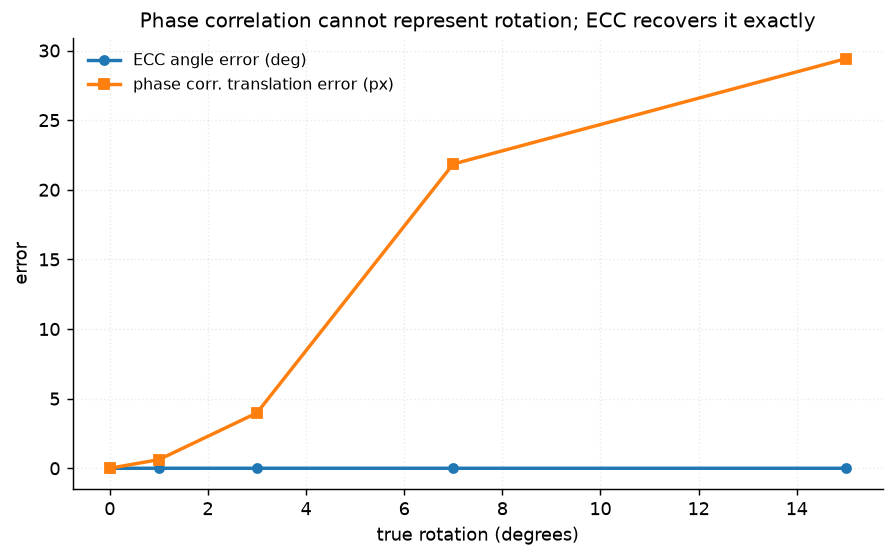

# 42 · Image registration — classical computer vision

[](https://www.python.org/)
[](https://opencv.org/)
[](#)
[](#)

Phase correlation, ECC and mutual information, aligned against a transform that
was applied and is therefore known to the pixel.

> **The claim under test:** phase correlation and ECC assume the two images have
> the same (or a linearly related) intensities; mutual information assumes only a
> statistical dependence, which is why it is the standard for multi-modal
> registration. True — and the project's own warning about the Hanning window
> turned out to be exactly backwards.

**No neural network, no training, no GPU.**

---

## Results

Four scenes, a known (7, 4) px shift, and the moving image **inverted**. The
result columns overlay the reference in green on the aligned image in magenta;
grey means they agree.



| Sr | Scene | Phase correlation | Phase corr. (no window) | ECC | **Mutual information** |
|---:|---|---:|---:|---:|---:|
| 1 | sled dogs on ice · texture 13.5 | 30.446 | 0.053 | n/a | **0.000** |
| 2 | long jetty · texture 17.6 | 635.424 | 0.046 | n/a | **0.000** |
| 3 | biwa player · texture 18.0 | 156.081 | 0.084 | n/a | **0.000** |
| 4 | stone guardian · texture 27.1 | 147.644 | 0.053 | n/a | **0.000** |

*Error in pixels. `n/a` means the method returned nothing at all.*

And on matched intensities — the condition every registration comparison starts
with:

| Method | Mean error (px) | Success rate | Time (ms) |
|---|---:|---:|---:|
| Phase correlation | **0.0028** | 1.000 | 3.90 |
| Phase corr. (no window) | 0.0125 | 1.000 | **3.43** |
| ECC | 0.0117 | 1.000 | 18.68 |
| Mutual information | **0.0000** | 1.000 | 1661.52 |

**All four land inside 0.013 px.** Any ranking drawn from this table is noise,
which is why the project does not stop here.

---

## The signature result: which assumption each method rests on



| Intensities | Phase correlation | Phase corr. (no window) | ECC | **Mutual information** |
|---|---:|---:|---:|---:|
| Same | 0.003 | 0.013 | 0.012 | **0.000** |
| Gamma remap (monotonic) | 0.042 | 0.038 | 0.034 | **0.000** |
| **Inverted** | **151.241** | 0.061 | **n/a** | **0.000** |
| **Non-monotonic** | 19.502 | 38.906 | 32.704 | **0.000** |

> **Mutual information is exact on every row**, including a non-monotonic remap
> that destroys any linear *or* rank relationship between the two images. That is
> the multi-modal case, it is the only row nothing else survives, and it is the
> entire argument for the method.
>
> **It costs 426×** the time — 1662 ms against phase correlation's 3.9. MI has no
> closed form, so alignment is a search, and the price is paid on every pair
> whether or not the intensities needed it.
>
> **ECC returns nothing at all on inverted intensities.** A normalised *linear*
> correlation reads a perfect negative as a terrible match, so the optimiser
> never converges. Not a large error — no answer.


The MI surface over the search window, on inverted intensities: one unambiguous
peak at the true shift. Finding it means evaluating every point on that grid,
which is the 426×.

---

## The Hanning window: the advice was backwards

This project's own docstring used to carry a warning that phase correlation
*requires* a Hanning window, and that omitting it is "the single most common
reason an implementation silently returns nonsense". Measured:

| | with Hanning | without |
|---|---:|---:|
| ordinary shifted pairs | 0.0055 px | 0.0133 px |
| **crop pairs, borders genuinely differ** | **0.7041 px** | **0.6800 px** |
| **inverted intensities** | **151.24 px** | **0.0612 px** |

The second row is the test the advice is actually about: two overlapping crops of
one photograph, so the borders show different content and the frame really is
non-periodic. The window is worth **−0.024 px** there — the unwindowed variant is
marginally better, and neither fails.

**And on inverted intensities the window is what breaks the method.**



| Image | with Hanning | without |
|---|---:|---:|
| long jetty | **635.42** | 0.046 |
| yacht and bridge | **211.05** | 0.012 |
| giraffe head on | **208.44** | 0.085 |
| husky puppies | **173.89** | 0.052 |
| *(five more over 30 px)* | | |
| layered sandstone | 3.90 | 0.052 |
| snake on needles | 0.02 | 0.048 |
| marmot on rock | 0.01 | 0.080 |

**Nine of twelve fail by 30 to 635 pixels; three come through untouched — and
nothing about the picture predicts which.** Unwindowed, all twelve land under
0.13 px.

The reason is that multiplying by a window is multiplication by a *shape*:

```
(255 − I) · w  =  255·w − I·w
```

The window's own smooth profile enters the spectrum at **255 times** the
amplitude of anything in the photograph. Which peak then wins depends on the
content, which is why three images survive. Without the window, inversion is only
a sign, phase correlation is blind to it, and the shift comes back exactly.

---

## What phase correlation cannot do at all



| True rotation | 0° | 1° | 3° | 7° | 15° |
|---|---:|---:|---:|---:|---:|
| **ECC angle error** | 0.000° | 0.000° | 0.001° | 0.000° | **0.000°** |
| Phase corr. translation error | 0.000 px | 0.618 | 3.976 | 21.850 | **29.412** |

ECC recovers the angle to a thousandth of a degree at every level. Phase
correlation has no way to *express* rotation — it returns a translation, and the
translation it returns gets steadily worse as the rotation grows, because there
is no translation that explains a rotated image.

This is a capability difference rather than an accuracy one, and it is the reason
to reach for ECC even though it is five times slower and fails on inverted data.

---

## Noise is not what limits any of them

| σ | 0 | 5 | 15 | 30 | 50 |
|---|---:|---:|---:|---:|---:|
| Phase correlation | 0.003 | 0.008 | 0.017 | 0.023 | 0.029 |
| ECC | 0.012 | 0.010 | 0.011 | 0.014 | **0.013** |
| Mutual information | 0.000 | 0.000 | 0.000 | 0.000 | **0.000** |

Every method stays under 0.04 px at σ50. Registration integrates over the whole
frame, and zero-mean noise averages out — the failures in this project are all
about *what relationship is assumed*, not about signal quality.

---

## How the images were chosen

Twelve photographs selected by `tools/select_images.py --axis texture`, then
ordered by this module's `texture_energy` (mean local standard deviation in a 9×9
window). Texture is what registration consumes: a flat region has no features to
align.

```
elk_in_long_grass    11.3    biwa_player          18.0
yacht_and_bridge     11.8    marmot_on_rock       18.4
sled_dogs_on_ice     13.5    cannon_on_cobbles    24.1
husky_puppies        16.5    layered_sandstone    24.4
giraffe_head_on      17.1    stone_guardian       27.1
long_jetty           17.7    snake_on_needles     31.3
```

None of these twelve appears in any other project;
`tools/check_image_reuse.py` enforces that by perceptual hash.

---

## Try it on your own pair

```bash
python infer.py reference.jpg moving.jpg
python infer.py reference.jpg moving.jpg --method "Mutual information"
python infer.py --photo stone_guardian --modality inverted
```

With `--photo` the transform is applied here, so the error printed is real. On
your own pair there is no truth, so what is printed instead is the **mutual
information between the two images before and after each alignment** — which
rises when an alignment is right regardless of what the intensities are doing,
and is the only self-check available without ground truth.

It also reports whether the two images have a monotonic intensity relationship,
because that is the single fact that decides whether you need MI's 426× or not.

---

## Limitations

* **The transform is applied by this project, so every pair is perfectly
  explained by a translation (or a rotation).** Real pairs have parallax,
  occlusion and lighting that no global warp fits, and every error here is a
  lower bound for that reason.
* **`synthetic_mri` is a sine remap, not a second imaging modality.** It is
  non-monotonic, which is the property that matters, but a real MRI-to-CT pair
  also differs in resolution, noise character and what is visible at all.
* **MI is searched exhaustively over ±20 px.** A displacement outside that window
  is simply not found, and the 426× cost scales with the square of the search
  radius. Production MI registration uses a pyramid and an optimiser; this is the
  transparent version.
* **The Hanning finding is about `cv2.phaseCorrelate` on same-sized pairs.** The
  window still matters for the wraparound case a Fourier method has when the
  displacement approaches the frame size, which this project does not test — the
  largest shift swept is 40 px on a 481 px frame.
* **`success_rate` uses a 1 px threshold**, which is generous for methods that
  routinely reach 0.01 px and meaningless for the ones that fail by hundreds.
  The mean error column is the informative one.

---

## Tests

14 tests, run with `pytest projects/42_image_registration/tests -q`. They pin the
harness (ECC's sign against a known shift, crop pairs really differing at the
border) and every finding: that the methods do not differ on matched
intensities, that only MI survives a non-monotonic remap and costs two orders of
magnitude for it, that ECC does not converge at all on inverted data, that the
Hanning window earns nothing on ordinary pairs and breaks most inverted ones,
that phase correlation cannot represent rotation while ECC recovers it exactly,
and that noise is not what limits any of them.

---

## Keywords

image registration · phase correlation · cross-power spectrum · Hanning window ·
ECC · findTransformECC · enhanced correlation coefficient · mutual information ·
joint histogram · multi-modal registration · sub-pixel alignment · image
alignment · classical computer vision · no deep learning · OpenCV · Python ·
CPU only · reproducible image processing experiments

## References

* Kuglin & Hines, *The phase correlation image alignment method*, IEEE ICCS 1975.
* Evangelidis & Psarakis, *Parametric Image Alignment Using Enhanced Correlation
  Coefficient Maximization*, TPAMI 2008.
* Viola & Wells, *Alignment by Maximization of Mutual Information*, IJCV 1997.
* Maes et al., *Multimodality image registration by maximization of mutual
  information*, IEEE TMI 1997.
* Zitová & Flusser, *Image registration methods: a survey*, Image and Vision
  Computing 2003.
