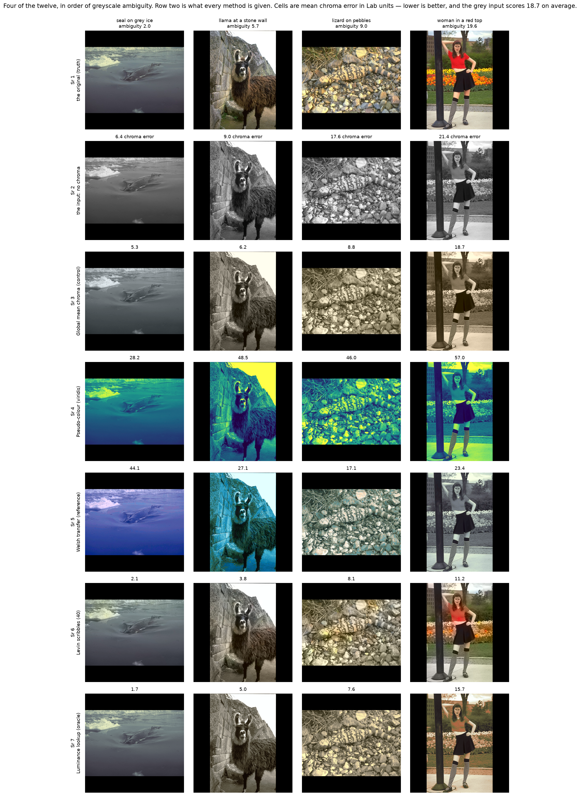
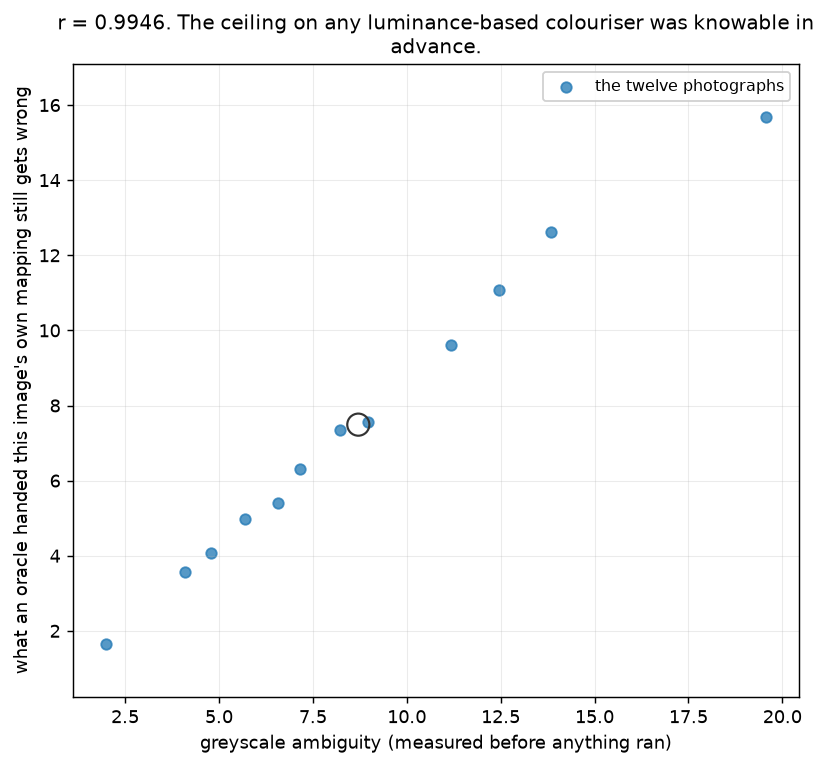
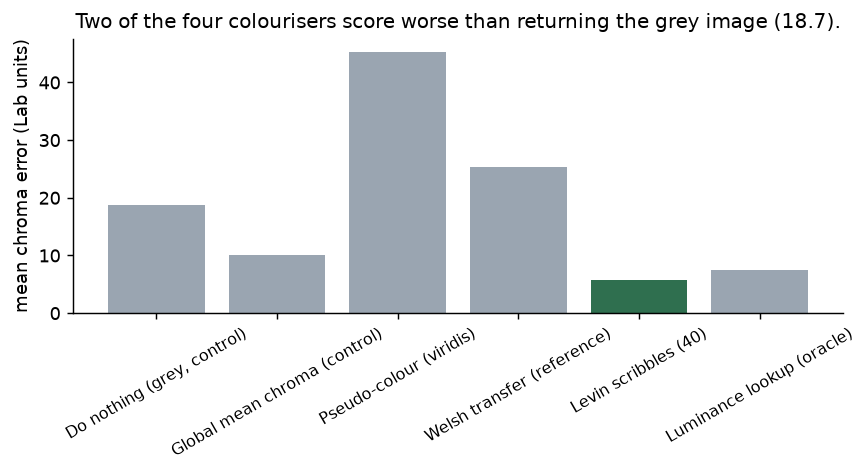
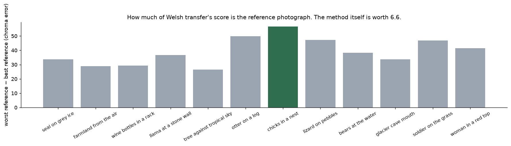
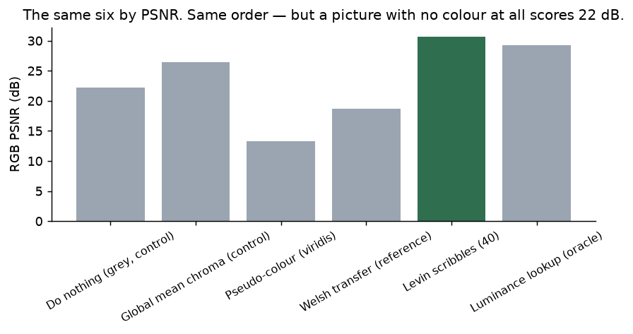
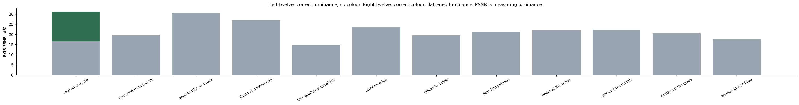
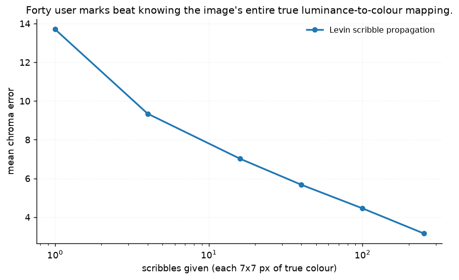

# 43 · Grayscale → colour — classical computer vision

[](https://www.python.org/)
[](https://opencv.org/)
[](#)
[](#)

Throw away the colour of a photograph and put it back. The truth is the original,
so this is one of the few restoration problems with an exact, uncontested answer —
which makes everything *else* the interesting part.

> **The ceiling was knowable before anything ran.** The statistic the twelve
> photographs were *selected* on — how much chroma survives inside one luminance
> level — predicts what an oracle **handed that image's own luminance-to-colour
> mapping** still cannot recover, at **r = 0.995** across the set. The hardest
> photograph was identified before a single method was called.

> **Two of the four colourisers score worse than returning the grey image.**
> Pseudo-colour 45.3 and Welsh transfer 25.3 chroma error, against **18.7** for
> doing nothing. They are not failing by being timid: their colourfulness is 93
> and 38 against the grey image's 0.3. They add a great deal of colour and it is
> the wrong colour.

> **Welsh transfer's score is the reference photograph, not the method.** Running
> it with each of the other eleven photographs as reference gives a spread
> averaging **39.1** chroma units. The entire difference between running the
> method and doing nothing is **6.6**. The choice of reference matters **6×
> more** than the method.

**No neural network, no training, no GPU.**

---

## Results

Four of the twelve, in order of greyscale ambiguity. Row 2 is what every method is
given. Cells are mean chroma error in Lab units — lower is better.



| Sr | Photograph | Ambiguity | Do nothing (grey) | Global mean chroma | Pseudo-colour | Welsh transfer | Levin scribbles (40) | Luminance lookup (oracle) |
|---:|---|---:|---:|---:|---:|---:|---:|---:|
| 1 | seal on grey ice | 2.0 | 6.4 | 5.3 | 28.2 | 44.1 | 2.1 | **1.7** |
| 2 | llama at a stone wall | 5.7 | 9.0 | 6.2 | 48.5 | 27.1 | **3.8** | 5.0 |
| 3 | lizard on pebbles | 9.0 | 17.6 | 8.8 | 46.0 | 17.1 | **8.1** | 7.6 |
| 4 | woman in a red top | 19.6 | 21.4 | 18.7 | 57.0 | 23.4 | **11.2** | 15.7 |

| Method | Chroma error | RGB PSNR (dB) | Colourfulness | Oracle? |
|---|---:|---:|---:|---|
| **Levin scribbles (40)** | **5.67** | **30.68** | 30.7 | yes |
| Luminance lookup | 7.49 | 29.29 | 27.2 | yes |
| Global mean chroma | 10.12 | 26.47 | 13.0 | yes |
| **Do nothing (grey, control)** | **18.68** | 22.24 | **0.3** | — |
| Welsh transfer (reference) | 25.27 | 18.64 | 38.0 | no |
| Pseudo-colour (viridis) | 45.29 | 13.28 | 92.6 | no |

*Three rows are marked **oracle** because they are given the truth in some form —
the true mapping, the true mean, or forty true colours. They are upper bounds,
not algorithms, and the table says so rather than ranking them silently against
the two that are not.*

---

## The signature result: the axis predicted the ceiling



The twelve were chosen by spreading them across **greyscale ambiguity** — the
population-weighted spread of chroma *within* a luminance bin. It is computed from
the colour original, before any method exists.

The **oracle** is a lookup table from luminance to colour, fitted on the very image
it is tested on. It is the answer to *"if grey determined colour, how good could
that possibly be?"*

| Photograph | Ambiguity | Oracle still wrong by |
|---|---:|---:|
| seal on grey ice | 2.00 | 1.66 |
| farmland from the air | 4.10 | 3.57 |
| wine bottles in a rack | 4.78 | 4.08 |
| llama at a stone wall | 5.69 | 4.98 |
| tree against tropical sky | 6.57 | 5.41 |
| otter on a log | 7.15 | 6.30 |
| chicks in a nest | 8.23 | 7.34 |
| lizard on pebbles | 8.98 | 7.56 |
| bears at the water | 11.19 | 9.60 |
| glacier cave mouth | 12.46 | 11.07 |
| soldier on the grass | 13.83 | 12.63 |
| **woman in a red top** | **19.56** | **15.68** |

**r = 0.9946, slope 0.83.** Monotone across all twelve. The order of the table was
fixed before a method ran, and the results came out in that order.

The woman in the red top is the extreme case and the picture explains itself: a
red top, orange tulips and green grass at similar brightness. The oracle can only
answer *"what colour is this grey?"*, and here that question has three answers.

---

## Two methods that made things worse



| | Chroma error | Colourfulness |
|---|---:|---:|
| **Do nothing (grey)** | **18.68** | **0.28** |
| Welsh transfer | 25.27 | 37.99 |
| Pseudo-colour (viridis) | 45.29 | 92.58 |

The do-nothing control here is unusually informative because a grey image is not
a *neutral* answer — it is the claim that every pixel has zero chroma, which is
wrong everywhere. Beating it should be easy. Two of the four methods do not.

Pseudo-colour is in the table because "add colour to a grayscale image" means
exactly this in a great deal of software, and it produces a vividly coloured
picture with no relation to the scene. Welsh transfer is a real algorithm from a
real paper, and the next section is why it does badly here.

---

## The reference is the answer



Welsh transfer needs a reference photograph. Which one you give it is usually
treated as a detail. Running each image against **all eleven** alternatives:

| Photograph | With the rule reference | Best possible | Worst possible | Spread | Grey control |
|---|---:|---:|---:|---:|---:|
| seal on grey ice | 44.06 | **10.38** | 44.06 | 33.67 | **6.38** |
| farmland from the air | 42.12 | 42.05 | 71.04 | 28.99 | 44.60 |
| wine bottles in a rack | 12.95 | 10.43 | 39.72 | 29.30 | **6.30** |
| llama at a stone wall | 27.06 | 11.43 | 48.14 | 36.71 | **8.98** |
| tree against tropical sky | 35.23 | **19.02** | 45.56 | 26.54 | 23.05 |
| otter on a log | 13.28 | 10.19 | 60.13 | 49.95 | 16.22 |
| chicks in a nest | 19.58 | 13.73 | 70.47 | 56.74 | 26.49 |
| lizard on pebbles | 17.06 | 10.70 | 57.93 | 47.23 | 17.64 |
| bears at the water | 16.42 | 16.08 | 54.29 | 38.21 | **15.54** |
| glacier cave mouth | 27.08 | 14.91 | 48.66 | 33.75 | 16.10 |
| soldier on the grass | 25.08 | 16.26 | 63.14 | 46.87 | 21.41 |
| woman in a red top | 23.35 | 18.25 | 59.73 | 41.48 | 21.38 |

* **Mean spread across references: 39.1.** The method-vs-nothing gap is 6.6.
* On **8 of 12** the rule reference is worse than doing nothing.
* On **4 of 12** the *best of eleven* references is still worse than doing nothing.

The first version of this control shuffled the references randomly, and three
images kept their own — producing a table that said nothing. Running all eleven
is the fix, and it turns an uninformative control into the section above.

---

## PSNR: the usual complaint is wrong, and there is a worse one



**PSNR ranks these six methods in exactly the same order as the chroma-only
error.** The standard accusation — that it reorders colourisation methods — does
not hold on this set, and saying so is more useful than repeating it.



What is wrong is the *scale*.

| | RGB PSNR | Chroma error |
|---|---:|---:|
| Correct luminance, **no colour at all** | **22.2 dB** | 18.68 |
| Correct colour, **flattened luminance** | **14.8 dB** | ~0.2 |

**A 7.5 dB gap for the same information, depending which half of the image it is
in.** An image containing none of what this project estimates scores 22 dB; an
image containing all of it and nothing else scores 15. Every method here
reproduces luminance exactly, so most of every PSNR in the table above was handed
to it.

*(The chroma-only image's own chroma error is 0.03–0.95 rather than 0, because
flattening L pushes saturated colours outside the sRGB gamut and the round trip
clips them. The two largest residuals are the tropical sky and the red top, which
is the explanation rather than a coincidence.)*

---

## Where the colour is beats what the colour is



| Scribbles | 1 | 4 | 16 | 40 | 100 | 250 |
|---|---:|---:|---:|---:|---:|---:|
| Chroma error | 13.70 | 9.35 | 7.02 | **5.67** | 4.45 | **3.16** |

Levin's method propagates a few known colours under one assumption:
**neighbouring pixels with similar luminance should have similar colour.** That is
written as a quadratic cost over every pixel and its eight neighbours and
minimised as a sparse linear system.

**Forty 7×7 marks (5.67) beat knowing the image's entire true luminance-to-colour
mapping (7.49)**, and sixteen (7.02) nearly do. Forty marks is about 2,000 pixels
of the ~150,000 in the image — roughly 1.3%. The lookup table has the *whole*
image's colour statistics and cannot use them, because it has no way to say
*where*.

That is the whole problem in one comparison: colourisation is not short of colour
knowledge, it is short of spatial assignment.

---

## Try it

```bash
python infer.py photo.jpg                          # colourise your own photograph
python infer.py --image woman_in_a_red_top
python infer.py --image otter_on_a_log --scribbles 100
python infer.py --image seal_on_grey_ice --reference glacier_cave_mouth
```

On one of the project's photographs there is an exact truth, so every method gets
a real score and the ambiguity of that image is printed first — which tells you
the ceiling before you look at the results. On your own photograph there is no
truth, so what you get is the outputs, the colourfulness of each, and your
image's ambiguity.

---

## Limitations

* **Three of the six rows are oracles.** Levin's scribbles are sampled from the
  truth, the lookup table is fitted on the image it is tested on, and the global
  mean is the image's own mean. They are labelled, and a test asserts the
  labelling, but they are upper bounds and not usable methods.
* **Twelve photographs, one pool.** BSDS500 and USC-SIPI are daylight photographs
  of natural scenes; nothing here says how a document scan, an X-ray or a night
  shot would behave.
* **Levin's optimisation runs at 200 px wide** and the chroma is upsampled. At
  full resolution the result differs in the third decimal and takes about forty
  times as long; chroma is low-frequency, which is the same assumption the method
  itself rests on.
* **Scribble positions are a jittered grid**, not a user's choices. A person would
  put marks on the objects that matter, which would do better; the grid is the
  version that can be repeated.
* **Chroma error in Lab a,b is not a perceptual metric.** ΔE2000 would weight it
  differently. The ordering here is not close enough for that to change it, but
  the numbers are not just-noticeable differences.
* **Welsh transfer is implemented from the paper's description** with 400 samples
  and a 5×5 neighbourhood. A larger sample helps slightly and does not change its
  position in the table.

---

## Tests

19 tests, run with `pytest projects/43_grayscale_to_colour/tests -q`. They pin the
result (the selection axis predicts the oracle ceiling at r > 0.95, and names the
same easiest and hardest photograph; two methods score worse than the grey
control and are the two most colourful; the reference spread exceeds the method's
whole effect by 4×), the honest negative (PSNR *does* rank these methods
correctly, and is nonetheless mostly luminance), the setup (every method preserves
luminance exactly, the grey input really has no colour, the twelve are ordered by
ambiguity), and the ambiguity statistic itself against a constructed isoluminant
pair.

---

## Keywords

colourisation · grayscale to colour · Levin optimisation · scribble propagation ·
Welsh colour transfer · pseudo-colour · Lab colour space · chroma error ·
PSNR · ill-posed inverse problem · oracle · control ·
classical computer vision · no deep learning · OpenCV · Python · CPU only ·
reproducible image processing experiments

## References

* Levin, Lischinski & Weiss, *Colorization Using Optimization*, SIGGRAPH 2004 —
  the scribble propagation implemented here.
* Welsh, Ashikhmin & Mueller, *Transferring Color to Greyscale Images*, SIGGRAPH
  2002 — the reference-based transfer.
* Reinhard, Ashikhmin, Gooch & Shirley, *Color Transfer between Images*, IEEE
  CG&A 2001 — the luminance remapping Welsh's method uses.
* Charpiat, Hofmann & Schölkopf, *Automatic Image Colorization via Multimodal
  Predictions*, ECCV 2008 — on colourisation being multimodal, which is what the
  ambiguity axis measures.
* Photographs come from BSDS500 and the USC-SIPI image database; provenance for
  each is recorded in `assets/real/README.md`.
