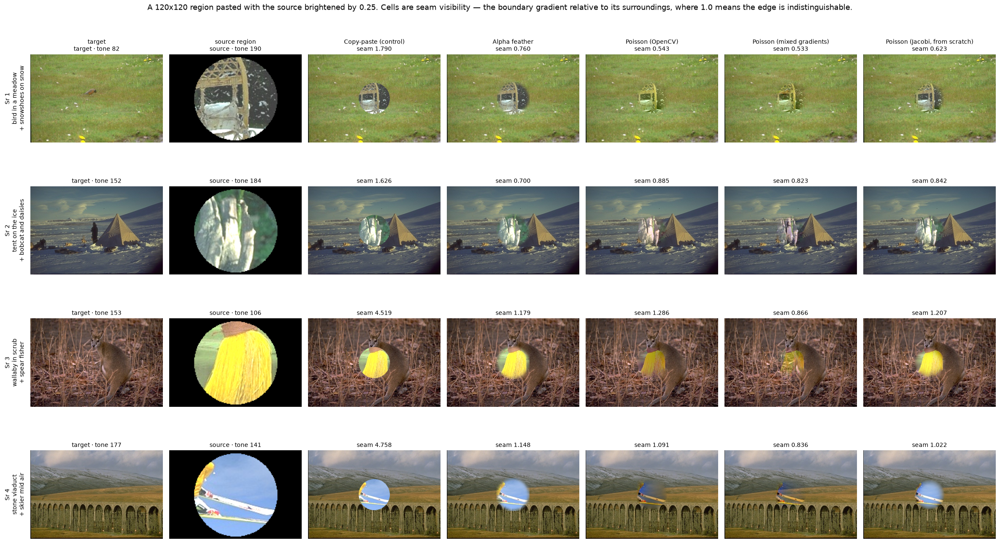
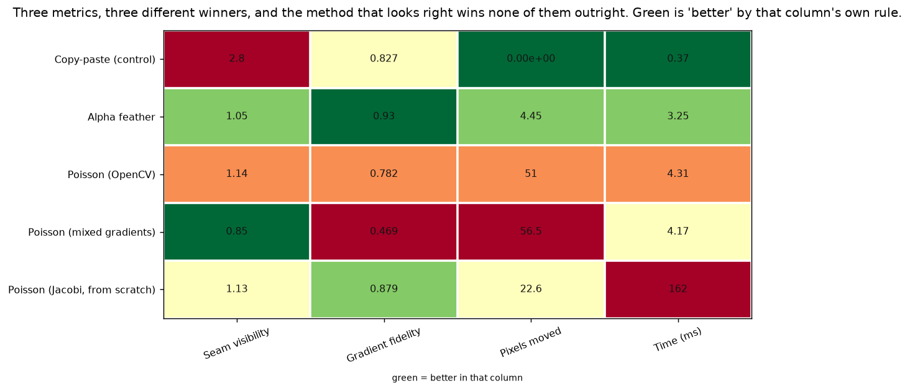
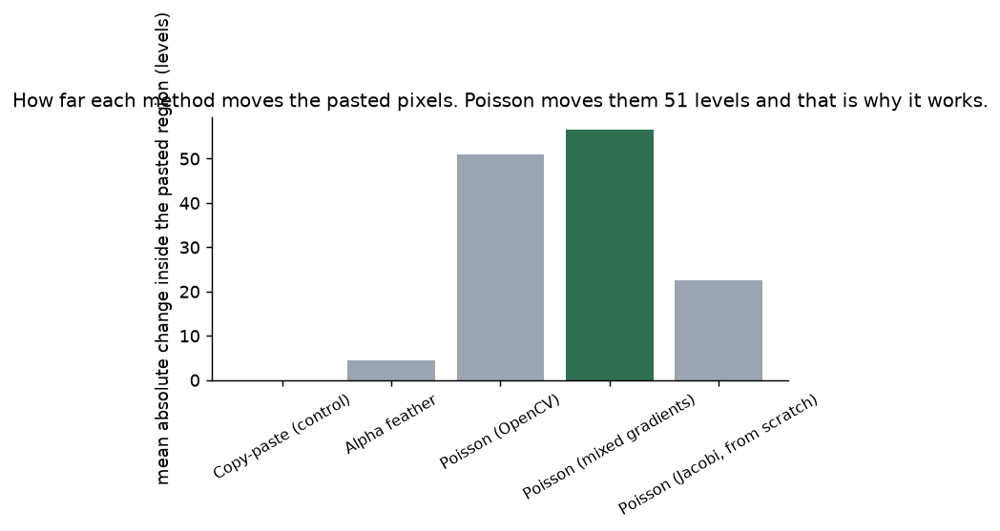
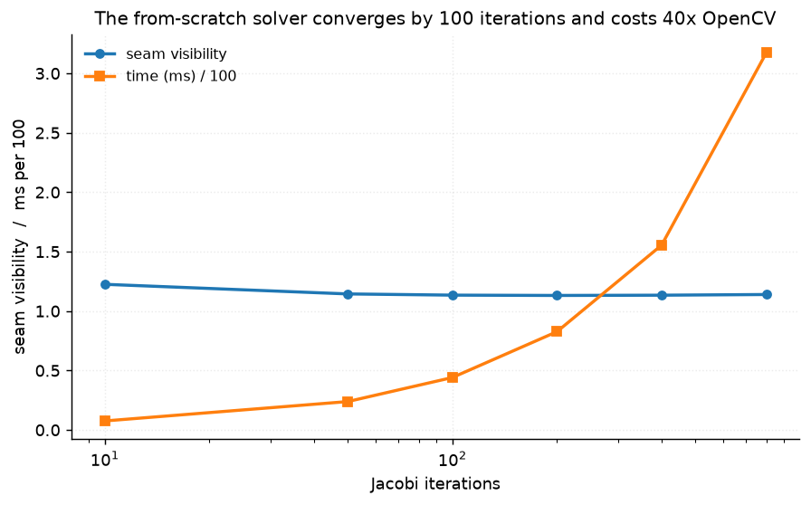
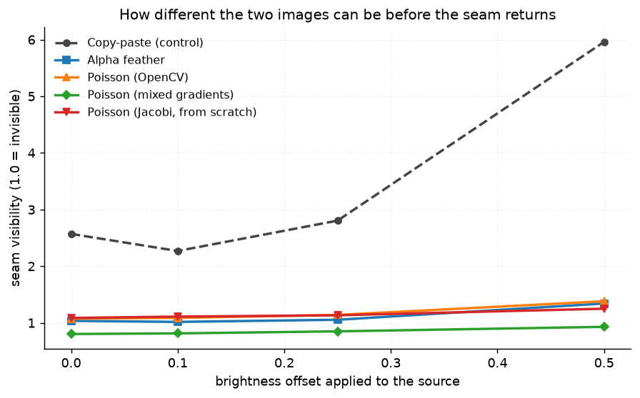

# 44 · Poisson blending — classical computer vision

[](https://www.python.org/)
[](https://opencv.org/)
[](#)
[](#)

Composite in the gradient domain instead of the pixel domain — with the Poisson
equation solved twice, once by OpenCV and once by hand, so the mathematics is
visible and both answers can be checked against each other.

> **The claim under test:** Poisson blending does not copy pixels, it copies
> **gradients**, and the result reads as seamless *because* the pasted region's
> actual colours have been changed — often drastically. Measured: it moves them
> **51 grey levels** where alpha feathering moves them 4.5, and it is the one
> that looks right.
>
> Which means every obvious metric is wrong. Score fidelity to the source and
> copy-paste wins with a perfect 0.0 while having the worst seam in the table.

**No neural network, no training, no GPU.**

---

## Results

Four pairs, a 120×120 region pasted with the source brightened by 0.25. Cells are
**seam visibility** — the boundary gradient relative to its surroundings, where
1.0 means the edge is indistinguishable from the image's own texture.



| Sr | Pair | Copy-paste | Alpha feather | Poisson (OpenCV) | Mixed gradients | Jacobi (from scratch) |
|---:|---|---:|---:|---:|---:|---:|
| 1 | bird in a meadow + snowshoes on snow | 1.790 | 0.760 | **0.543** | 0.533 | 0.623 |
| 2 | tent on the ice + bobcat and daisies | 1.626 | **0.700** | 0.885 | 0.823 | 0.842 |
| 3 | wallaby in scrub + spear fisher | 4.519 | **1.179** | 1.286 | 0.866 | 1.207 |
| 4 | stone viaduct + skier mid air | 4.758 | 1.148 | **1.091** | 0.836 | 1.022 |

Averaged over all six pairs:

| Method | Seam visibility | Gradient fidelity | **Pixels moved** | Time (ms) |
|---|---:|---:|---:|---:|
| **Copy-paste (control)** | **2.805** | 0.827 | **0.00** | **0.37** |
| Alpha feather | **1.054** | **0.930** | 4.45 | 3.25 |
| Poisson (OpenCV) | 1.140 | 0.782 | **51.04** | 4.31 |
| Poisson (mixed gradients) | **0.850** | **0.469** | 56.52 | 4.17 |
| Poisson (Jacobi, from scratch) | 1.134 | 0.879 | 22.62 | 162.26 |

**Every column has a different winner, and the method that looks right wins none
of them outright.** That is the result.

---

## The signature finding: the obvious metric inverts the conclusion




> **Poisson moves the pasted pixels 11× further than alpha feathering** — 51.0
> grey levels against 4.5 — and that is precisely why it works. Look at row 1 of
> the figure: the snowshoe frame arrives white-on-black and leaves
> green-and-yellow, because the solver kept its *gradients* and took its
> *brightness* from the meadow.
>
> **Copy-paste scores a perfect 0.00 on pixel fidelity** and has a seam 2.8× its
> surroundings. Any evaluation that rewards keeping the source's colours ranks
> the methods exactly backwards.

### And the seam metric has its own bias

**Alpha feather edges the mean** (1.054 against Poisson's 1.140) while being
obviously worse to look at — row 1 is a grey disc sitting in green grass. It
lowers the boundary gradient by *attenuating* it rather than by reconciling it,
and having moved the pixels only 4.5 levels, the brightness step is still there.
Per pair the two split two-all, so the metric does not actually separate them.

**Mixed gradients wins the seam outright (0.850) by making the paste
see-through.** It keeps whichever of the two gradients is stronger, so the
target's own texture bleeds into the pasted region — which gives the lowest
boundary contrast anywhere in the table and by far the worst gradient fidelity
(0.469). The skier in row 4 becomes a ghost.

**No single column here is trustworthy alone.** The figure is the result and the
numbers are the caveat, which is the opposite of the usual arrangement and is
worth saying out loud.

---

## The equation, solved twice

```
minimise  |∇f − ∇source|²   inside the region
subject to  f = target      on the boundary
```

whose solution satisfies `∇²f = ∇²source`. Discretised, every interior pixel is
the average of its four neighbours minus the source's Laplacian, so iterating
that update converges to the answer.

| | Seam visibility | Time (ms) |
|---|---:|---:|
| Poisson (OpenCV) | 1.1403 | 4.31 |
| Poisson (Jacobi, from scratch) | 1.1337 | 162.26 |

**They agree to 0.0066** — two independent implementations of the same equation,
which is the only real check that either is right — and the transparent one costs
**38×** the time.



| Iterations | 10 | 50 | **100** | 200 | 400 | 800 |
|---|---:|---:|---:|---:|---:|---:|
| Seam visibility | 1.225 | 1.144 | **1.134** | 1.132 | 1.134 | 1.139 |

Converged by 50 iterations and flat thereafter; the slight rise past 200 is float
accumulation in the Jacobi update, not further progress.

### The one line that makes it Poisson blending

```python
f = sub.copy()                  # target everywhere, INCLUDING the boundary ring
f[interior] = patch[interior]   # a starting guess, interior only
```

Seeding the boundary from the source instead — `f[region_mask] = patch[...]` —
makes `f = source` an **exact fixed point** of the iteration, because the
solution of `∇²f = ∇²g` with `f = g` on the boundary *is* g.

The solver then "converged" in zero steps to the copy-paste answer and reported
a seam visibility of **2.8046 — identical to the control, to four decimal
places** — with nothing at all to indicate it had not run. It is the quietest
failure in this repository: a method that is a no-op, reporting a plausible
number, in a table where another row happens to carry the same one.

---

## How far apart the two images can be



| Offset | 0.00 | 0.10 | 0.25 | **0.50** |
|---|---:|---:|---:|---:|
| **Copy-paste (control)** | 2.570 | 2.269 | 2.805 | **5.960** |
| Alpha feather | 1.035 | 1.017 | 1.054 | 1.342 |
| Poisson (OpenCV) | 1.075 | 1.088 | 1.140 | **1.381** |
| Mixed gradients | 0.803 | 0.814 | 0.850 | 0.929 |

**Copy-paste's seam more than doubles as the mismatch grows; Poisson's moves by
0.31.** The harder the two images are to reconcile, the more the gradient domain
is worth — at 0.50 the control is 4.3× worse than Poisson, against 2.4× at zero
offset.

Note that at **zero** offset copy-paste still leaves a 2.57 seam. The two images
differ in colour and texture whatever the brightness, and a hard boundary between
two photographs is visible without any help.

---

## How the images were chosen

Twelve photographs selected by `tools/select_images.py --axis tone`, which
measures how wide a range of greys a scene occupies. Tone is the axis here: the
seam a blend has to hide *is* the tonal discontinuity between the two images.

```
bird_in_a_meadow      82    soldier_and_child    211
tent_on_the_ice      152    ploughing_with_oxen  218
wallaby_in_scrub     153    skier_mid_air        225
stone_viaduct        177    spear_fisher         233
zebra_in_grass       181    bobcat_and_daisies   240
carved_boat_houses   202    snowshoes_on_snow    250
```

They are paired into six (target, source) pairs, **each photograph used exactly
once**, deliberately across the range rather than at random — the quantity that
decides how hard a blend is, is the *difference* between the two images, and
pairing like with like would give the seam nothing to be made of. Pair 1 is the
extreme: tone 82 into tone 250.

None of these twelve appears in any other project;
`tools/check_image_reuse.py` enforces that by perceptual hash.

---

## Try it on your own images

```bash
python infer.py target.jpg source.jpg --x 300 --y 200
python infer.py target.jpg source.jpg --method "Poisson (mixed gradients)"
python infer.py --pair 0 --offset 0.5
```

It reports, for your pair, the tonal distance between the two images (which
predicts how hard the blend is), the seam visibility of each method, and **how
far each one moved your pasted pixels**. That last number is the one to read: a
method that barely moved them has not reconciled anything, whatever its seam
score says.

---

## Limitations

* **The mask is an ellipse, not an object.** Real compositing traces a subject,
  and a boundary that follows an object's own edge is a much easier one to hide
  because the gradient there is genuine. Every seam number here is for the hard
  case of a boundary that cuts across content.
* **`seam_visibility` is a ratio of gradient magnitudes and can be gamed by
  blurring**, which alpha feather does and mixed gradients does more thoroughly.
  This is stated rather than fixed, because a metric that could not be gamed
  would need to model what a person notices.
* **`pixel_difference` is reported to *invert* the ranking, not to rank.** It is
  in the table as the demonstration that the obvious metric is wrong.
* **The brightness offset is a uniform add.** A real mismatch between two
  photographs is a difference of illuminant, white balance and exposure at once,
  which Poisson handles better than a flat offset suggests — its gradient
  matching is indifferent to all three.
* **The Jacobi solver runs a fixed iteration count** rather than testing for
  convergence, so its timing is a function of that choice. The convergence table
  is there so the choice can be checked.

---

## Tests

14 tests, run with `pytest projects/44_poisson_blending/tests -q`. They pin the
solver (the boundary ring keeping the target's values, the from-scratch result
agreeing with OpenCV's, the iteration converging, the placement using the patch
size) and every finding: that the method that works moves the pixels most, that
copy-paste is the worst seam by a wide margin, that the seam metric cannot
separate feathering from blending, that mixed gradients wins it by making the
paste transparent, and that the harder the mismatch the more the gradient domain
is worth.

---

## Keywords

Poisson blending · gradient domain compositing · seamless cloning ·
seamlessClone · mixed gradients · Dirichlet boundary condition · Jacobi
iteration · Laplacian · alpha blending · feathering · image compositing ·
classical computer vision · no deep learning · OpenCV · Python · CPU only ·
reproducible image processing experiments

## References

* Pérez, Gangnet & Blake, *Poisson Image Editing*, SIGGRAPH 2003 — the method,
  including the mixed-gradients variant.
* Agarwala et al., *Interactive Digital Photomontage*, SIGGRAPH 2004.
* Szeliski, Uyttendaele & Steedly, *Fast Poisson blending using multi-splines*,
  ICCP 2011 — on why the solve is the expensive part.
* Land & McCann, *Lightness and Retinex Theory*, JOSA 1971 — why local contrast
  and not absolute brightness is what vision reads.
