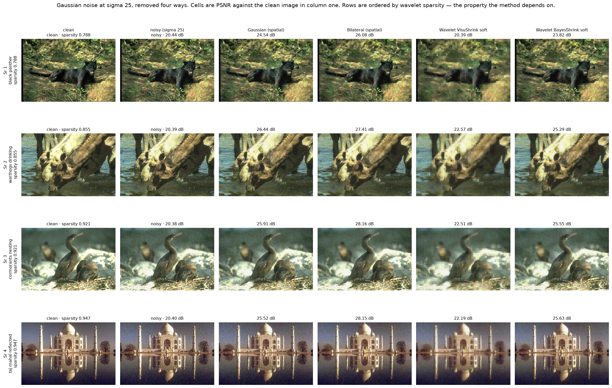
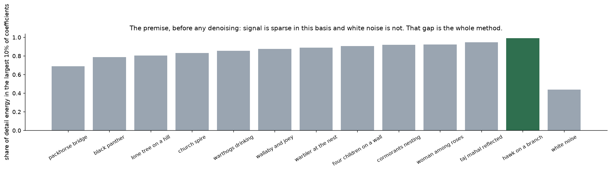
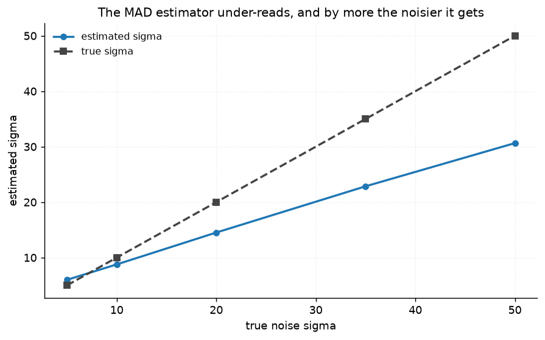
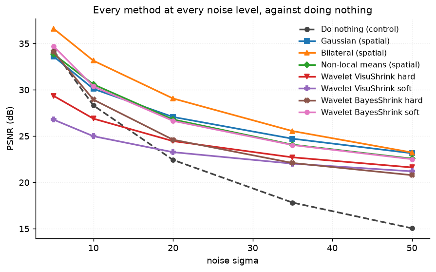

# 45 · Wavelet denoising — classical computer vision

[](https://www.python.org/)
[](https://opencv.org/)
[](#)
[](#)

A Haar transform written out by hand, four threshold rules, and three spatial
denoisers given exactly the same information — so the comparison is of methods
rather than of tuning effort.

> **The claim under test:** wavelet denoising works because natural images are
> *sparse* in this basis and white noise is not. **The premise is true and the
> method still loses.** Signal carries 0.69–0.99 of its energy in the top 10% of
> coefficients against white noise's 0.44 — and a bilateral filter beats every
> wavelet variant by **2.1 dB** for a quarter of the time.

**No neural network, no training, no GPU.**

---

## Results

Four photographs, Gaussian noise at σ 25. Rows are ordered by wavelet sparsity —
the property the method depends on. Cells are PSNR against the clean image.



| Sr | Scene | Gaussian | **Bilateral** | VisuShrink soft | BayesShrink soft |
|---:|---|---:|---:|---:|---:|
| 1 | black panther · sparsity 0.788 | 24.54 | **26.08** | 20.39 | 23.82 |
| 2 | warthogs drinking · sparsity 0.855 | 26.44 | **27.41** | 22.57 | 25.29 |
| 3 | cormorants nesting · sparsity 0.921 | 25.91 | **28.16** | 22.51 | 25.55 |
| 4 | taj mahal reflected · sparsity 0.947 | 25.52 | **28.15** | 22.19 | 25.63 |

Over all twelve:

| Method | PSNR (dB) | SSIM | Time (ms) |
|---|---:|---:|---:|
| Do nothing (control) | 20.57 | 0.4235 | **0.02** |
| Gaussian (spatial) | 26.14 | 0.6695 | 1.83 |
| **Bilateral (spatial)** | **27.67** | **0.7320** | 4.11 |
| Non-local means (spatial) | 25.62 | 0.6820 | 494.20 |
| Wavelet VisuShrink hard | 23.74 | 0.5799 | 13.44 |
| Wavelet VisuShrink soft | 22.77 | 0.5223 | 15.34 |
| Wavelet BayesShrink hard | 23.53 | 0.5413 | 14.28 |
| Wavelet BayesShrink soft | 25.58 | 0.6576 | 16.56 |

**The bilateral filter wins at all five noise levels tested.** The best wavelet
variant is 2.1 dB behind it and four times slower.

---

## The premise, measured before anything depends on it



| Signal | Share of detail energy in the largest 10% of coefficients |
|---|---:|
| packhorse bridge (dense woodland) | 0.688 |
| taj mahal reflected | 0.947 |
| hawk on a branch (bird on plain sky) | **0.989** |
| **white noise** | **0.439** |

The gap is real and large. A perfectly flat spectrum would put 0.10 in the top
10%; noise scores 0.44 because the largest samples of a Gaussian are still larger
than the rest, and every photograph scores 0.69 or above. **Thresholding really
can separate them.**

That is what makes the result interesting rather than disappointing: the method's
justification is sound, and the Haar basis is still not a good enough one.

---

## Every method gets the same information

The first version of this project ran the spatial denoisers on fixed constants
while the wavelet methods adapted to the noise. That is a comparison of tuning
effort, and it flattered the wavelets by about a decibel each:

| | was | best at σ 25 | handicap |
|---|---:|---:|---:|
| Non-local means | h = 10 | h = 16 | **1.6 dB** |
| Gaussian | σ = 1.5 | σ = 0.8 | 0.9 dB |
| Bilateral | range 50 | range 80 | 1.4 dB |

All three now read the image's own MAD noise estimate — the same one BayesShrink
uses. Two constants fell out of the sweep that are worth stating on their own:

* **Non-local means wants h ≈ 0.6 σ, not h ≈ σ.** Measured optima were 0.60, 0.64
  and 0.60 of the true noise at σ 10, 25 and 50. The advice usually quoted is a
  factor of 1.7 too high, and it costs 1.6 dB.
* **The bilateral filter's range width wants 3–5× the noise.** Too narrow and it
  reads noise as edges and faithfully preserves it.

---

## The noise estimate is biased in both directions



| True σ | 5 | 10 | 20 | 35 | 50 |
|---|---:|---:|---:|---:|---:|
| Estimated | **5.99** | 8.77 | 14.52 | 22.86 | **30.64** |
| Error | **+20%** | −12% | −27% | −35% | **−39%** |

**It over-reads when the noise is small and under-reads increasingly as it
grows**, for two different reasons:

* at σ 5 the image's own fine detail lands in the same diagonal subband and sets
  a floor the estimate cannot fall below;
* at σ 50 clipping at 0 and 255 flattens that subband — the *actual* noise
  standard deviation after clipping is 45.3, not 50, and the estimator sees less
  still.

BayesShrink's threshold is proportional to this number, so it inherits both
errors: too aggressive on quiet images, too timid on loud ones.

---

## Soft against hard is not a question with an answer

| | soft | hard | winner |
|---|---:|---:|---|
| **VisuShrink** | 22.77 | **23.74** | hard, by 0.97 dB |
| **BayesShrink** | **25.58** | 23.53 | soft, by 2.04 dB |

**The two design choices are not independent.** Paired with a universal threshold
that is far too large, hard thresholding wins — at least it leaves the surviving
coefficients alone. Paired with a well-scaled per-subband threshold, soft wins,
because shrinkage is the right correction for a coefficient that is signal *plus*
noise rather than one or the other.

Neither "soft is better" nor "hard is better" survives being stated on its own.

---

## When not to denoise at all



| σ | 5 | 10 | 20 | 35 | 50 |
|---|---:|---:|---:|---:|---:|
| **Do nothing (control)** | **34.24** | 28.31 | 22.43 | 17.83 | 15.05 |
| Gaussian | 33.61 | 30.11 | 27.07 | 24.73 | 23.16 |
| **Bilateral** | **36.61** | **33.15** | **29.07** | **25.55** | **23.24** |
| Non-local means | 33.86 | 30.59 | 26.80 | 24.08 | 22.57 |
| Wavelet VisuShrink soft | **26.78** | 24.99 | 23.27 | 22.03 | 21.20 |
| Wavelet BayesShrink soft | 34.70 | 30.38 | 26.65 | 24.04 | 22.51 |

**At σ 5, five of seven methods make the image worse than leaving it alone.**
VisuShrink loses **7.5 dB** — its universal threshold is chosen so that noise is
*never* exceeded, which guarantees it removes signal too. A denoiser with no way
to decide there is nothing to remove is a liability on a clean image.

The bilateral filter is the exception at both ends: +2.4 dB at σ 5 and +8.2 dB at
σ 50.

---

## And no threshold rescues the basis

The best possible **single** threshold — one value for every subband and every
image, found by searching with the clean images in hand — reaches 25.19 dB.
BayesShrink, adapting per subband, reaches 25.58.

**The adaptive rule beats the best global constant**, which is the argument for
BayesShrink stated as a number rather than as a motivation. And the remaining
2.1 dB to the bilateral filter is not about thresholds at all: it is the Haar
basis, whose two-tap filters alias badly and have no directional selectivity. A
longer wavelet or a shift-invariant transform would close part of that gap, and
neither is what "wavelet denoising" usually means when it is recommended.

---

## How the images were chosen

Twelve photographs ranked by **this project's own premise** — the share of
wavelet energy in the largest 10% of coefficients — because no stock axis in
`tools/select_images.py` measures it, and nothing else predicts how well the
method can work.

```
packhorse_bridge        0.688    four_children_on_a_wall  0.905
black_panther           0.788    cormorants_nesting       0.922
lone_tree_on_a_hill     0.804    woman_among_roses        0.923
church_spire            0.832    taj_mahal_reflected      0.947
warthogs_drinking       0.855    hawk_on_a_branch         0.989
wallaby_and_joey        0.875    warbler_at_the_nest      0.891
```

None of these twelve appears in any other project;
`tools/check_image_reuse.py` enforces that by perceptual hash.

---

## Try it on your own image

```bash
python infer.py photo.jpg                       # all methods, premise checked first
python infer.py photo.jpg --sigma 25            # add known noise, so PSNR is real
python infer.py photo.jpg --method "Bilateral (spatial)" --out clean.png
```

It measures **your** image's wavelet sparsity before denoising anything, because
that is the number that says whether the method has a chance — and it prints the
estimated noise with the warning that the estimate over-reads on quiet images and
under-reads on loud ones.

---

## Limitations

* **Haar only.** Two-tap filters are the crudest wavelet there is; Daubechies or
  a shift-invariant transform would close part of the 2.1 dB gap. The conclusion
  is about the Haar basis, and that it is what a from-scratch implementation
  reaches for is part of the point.
* **The transform is decimated**, so it is not shift-invariant and the result
  depends on where the image starts. Cycle spinning is the standard fix and is
  not implemented here.
* **Additive white Gaussian noise only.** Real sensor noise is signal-dependent
  and partly spatially correlated, which undermines the sparsity argument — noise
  that is not white does not spread evenly across coefficients.
* **The tuning constants come from six photographs at three noise levels.** They
  are compromises across that range rather than any one level's optimum; a method
  left at its own optimum at every level would score a few tenths higher.
* **`reconstruct` truncates odd dimensions.** One Haar step halves each axis, so
  a 321×481 array comes back 320×480. `denoise_wavelet` handles that itself and
  returns the original size, but the raw transform does not.
* **PSNR is the headline.** SSIM is reported beside it and ranks the methods the
  same way here, which is worth stating because it is not guaranteed.

---

## Tests

15 tests, run with `pytest projects/45_wavelet_denoising/tests -q`. They check the
premise before anything that depends on it, pin the harness (every method given
the same noise estimate, the estimator's bias in both directions, the transform
invertible, the pipeline surviving odd dimensions), and every finding: that the
premise holds and the method still loses, that the bilateral filter wins at every
noise level, that most methods are worse than doing nothing at σ 5, that soft
against hard depends on the threshold rule, that VisuShrink is far too
aggressive, that no single threshold matches an adaptive rule, and that
non-local means wants six tenths of the noise rather than all of it.

---

## Keywords

wavelet denoising · Haar wavelet · discrete wavelet transform · soft
thresholding · hard thresholding · VisuShrink · BayesShrink · universal
threshold · MAD noise estimation · sparsity · bilateral filter · non-local means
· classical computer vision · no deep learning · OpenCV · Python · CPU only ·
reproducible image processing experiments

## References

* Donoho & Johnstone, *Ideal spatial adaptation by wavelet shrinkage*,
  Biometrika 1994 — VisuShrink and the universal threshold.
* Chang, Yu & Vetterli, *Adaptive Wavelet Thresholding for Image Denoising and
  Compression*, IEEE TIP 2000 — BayesShrink.
* Coifman & Donoho, *Translation-Invariant De-Noising*, 1995 — cycle spinning,
  the fix this project does not implement.
* Buades, Coll & Morel, *A non-local algorithm for image denoising*, CVPR 2005.
* Tomasi & Manduchi, *Bilateral Filtering for Gray and Color Images*, ICCV 1998.
