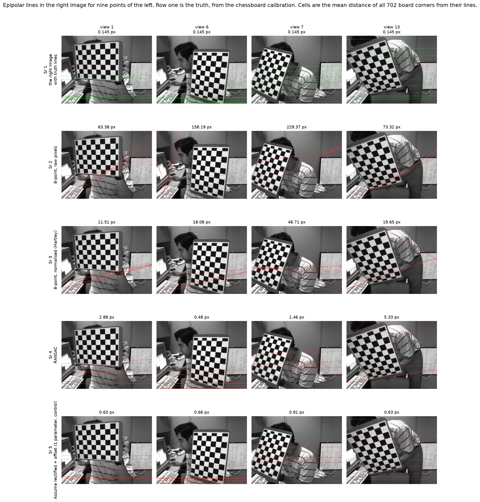
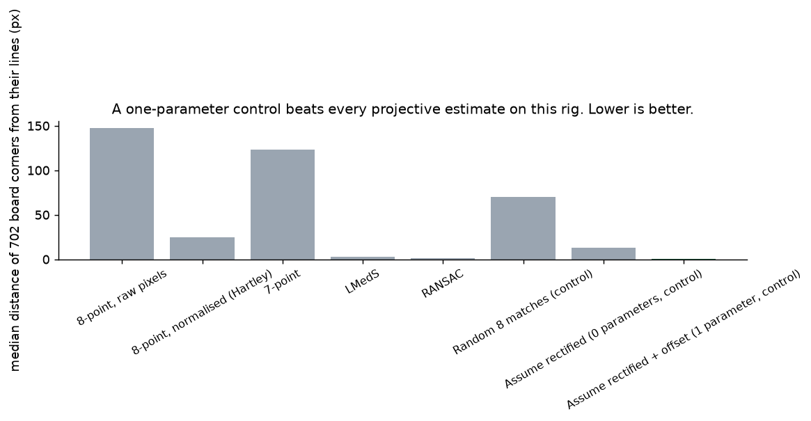
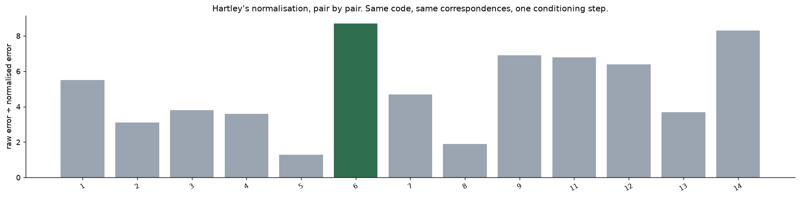
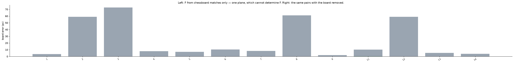
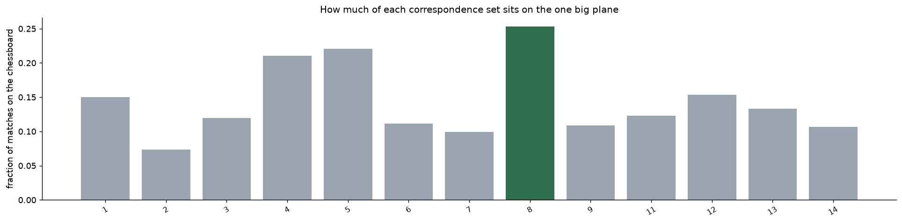
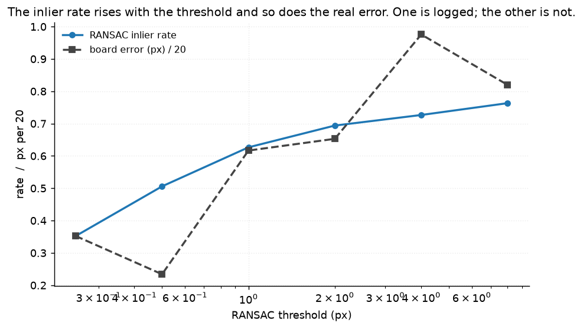
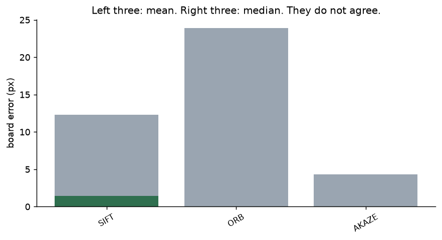

# 46 · Epipolar geometry — classical computer vision

[](https://www.python.org/)
[](https://opencv.org/)
[](#)
[](#)

Five estimators of the fundamental matrix, three controls, and — unusually — a
ground truth that shares no measurement with any of them.

> **The best estimate of F here has one parameter.** A control that assumes a
> rectified rig and fits a **single constant vertical offset, by taking a
> median**, puts the 702 chessboard corners **0.74 px** from their epipolar lines.
> RANSAC manages 1.46, LMedS 3.00, and the normalised eight-point algorithm
> 24.68. On a nearly parallel rig, estimating a general projective F from noisy
> features is worse than using the structure you already have.

> **RANSAC reports an 81% inlier rate on a configuration that cannot determine
> F.** Correspondences confined to one plane — the chessboard — are mathematically
> insufficient, and the estimate is **5.7× worse** than with the board removed.
> Nothing in the output says so.

> **The inlier rate improves as the answer gets worse.** From a 0.25 px threshold
> to 8 px, the inlier rate rises 0.352 → 0.763 while the real error rises
> 7.05 → 16.39 px. The number that goes in the log and the number that matters
> point opposite ways.

**No neural network, no training, no GPU.**

---

## Results

Epipolar lines in the right image for nine points of the left. Row 1 is the
truth, from the chessboard calibration. Cells are the mean distance of **all 702
board corners** from their lines.



| Sr | Pair | Matches | 8-point, raw pixels | 8-point, normalised | RANSAC | Assume rectified + offset (1 param) |
|---:|---|---:|---:|---:|---:|---:|
| 1 | view 1 | 261 | 63.38 | 11.51 | 2.88 | **0.63** |
| 2 | view 6 | 247 | 158.19 | 18.08 | **0.48** | 0.66 |
| 3 | view 7 | 272 | 229.37 | 48.71 | 1.46 | **0.91** |
| 4 | view 13 | 215 | 73.32 | 19.65 | 5.33 | **0.63** |

| Estimator | Board error **mean** (px) | Board error **median** (px) |
|---|---:|---:|
| 8-point, raw pixels | 144.02 | 147.58 |
| 8-point, normalised (Hartley) | 37.50 | 24.68 |
| 7-point | 114.45 | 123.45 |
| LMedS | 12.54 | 3.00 |
| RANSAC | 12.33 | 1.46 |
| Random 8 matches (control) | 101.49 | 69.94 |
| Assume rectified, 0 parameters (control) | 12.93 | 12.93 |
| **Assume rectified + offset, 1 parameter (control)** | **1.52** | **0.74** |
| **Calibration (truth)** | **0.14** | **0.14** |

*RANSAC's mean and median differ by 8×: it gets under 8 px on eleven of the
thirteen pairs and 59 and 73 px on the other two. The median is the honest
summary and both are reported.*

---

## Where the ground truth came from

This is the rare case where there is a real one.

The same two cameras photographed a **9×6 chessboard from thirteen poses**, and
[project 35](../35_camera_calibration/) calibrates them from **those board
corners alone**. The stereo extrinsics give

```
F = K₂⁻ᵀ [t]ₓ R K₁⁻¹
```

Every estimator in this project sees **only scene features** — SIFT matches on
the monitor, the keyboard, the desk. The two share no measurement, which is what
makes one usable to score the other. A test asserts that `calibration_truth`
contains no feature matching and `match_features` contains no board detection.

**The truth places all 702 corners within 0.145 px of their epipolar lines.**
That is the floor everything above is read against.

### The epipole is not a usable metric here

The truth epipole is at **(−48401, 641)** — 75 image widths outside a 640×480
frame, because the rig is nearly parallel. Epipole position is reported in many
papers and would be pure noise on this rig, so this project does not score it.
A test pins that, so nobody adds it back later.

---

## The signature result: one parameter wins



The board corners' disparity between the two cameras:

| | mean | standard deviation |
|---|---:|---:|
| horizontal (dx) | −155.02 px | 21.21 |
| **vertical (dy)** | **+12.93 px** | **0.79** |

**The vertical disparity is 12.93 px and varies by 0.79.** So:

* the **zero-parameter** control — "corresponding points have the same y" — is
  wrong by almost exactly 12.93 px, and scores **12.93**. A test asserts those
  two numbers match, because if they did not, one of them would be wrong.
* the **one-parameter** control — the same thing plus a constant offset, fitted
  by taking a median of the matches' vertical disparity — scores **0.74 px**.

One number, from a median, beating a seven-degree-of-freedom projective fit by
2× and the textbook linear algorithm by 33×.

**This is not an argument that F estimation is useless.** It is an argument that
a benchmark without a structural control cannot tell you whether an estimator
earned its parameters, and on this rig it did not. The truth still beats the
one-parameter control 5×, so there is real geometry left — just less than a full
projective fit needs to justify itself.

---

## Hartley's normalisation



| View | 1 | 2 | 3 | 4 | 5 | 6 | 7 | 8 | 9 | 11 | 12 | 13 | 14 |
|---|---:|---:|---:|---:|---:|---:|---:|---:|---:|---:|---:|---:|---:|
| Raw pixels (px) | 63.4 | 246.2 | 144.8 | 147.6 | 130.0 | 158.2 | 229.4 | 90.2 | 91.6 | 155.8 | 157.5 | 73.3 | 184.4 |
| Normalised (px) | 11.5 | 79.3 | 37.7 | 40.9 | 102.0 | 18.1 | 48.7 | 46.6 | 13.2 | 23.0 | 24.7 | 19.6 | 22.3 |
| **Ratio** | 5.5 | 3.1 | 3.8 | 3.6 | 1.3 | **8.7** | 4.7 | 1.9 | 6.9 | 6.8 | 6.4 | 3.7 | 8.3 |

**Every one of the thirteen pairs improves**, by 1.3× to 8.7×, median 4.7×.

The mechanism is conditioning, not accuracy. Image coordinates run to 640, so the
entries of the 9-vector the eight-point algorithm solves for differ by ~10⁴ in
magnitude, and the smallest singular vector of that matrix ends up decided by
floating-point rounding rather than by geometry. Hartley's normalisation puts the
centroid at the origin and scales the mean distance to √2, and the same code then
works.

**The un-normalised version had to be written here**, because OpenCV always
normalises internally and the broken variant cannot be obtained from it. A test
asserts `_eight_point` does not call `cv2.findFundamentalMat`.

---

## The planar trap



The chessboard is the largest flat thing in the frame and it attracts features.
**Correspondences confined to a single plane do not determine F** — any
homography-compatible F fits them exactly — so an estimator fed only board
matches is solving an ill-posed problem.

| | median board error | RANSAC inlier rate |
|---|---:|---:|
| F from **chessboard matches only** | **8.34 px** | **0.810** |
| F from the same pairs with the **board excluded** | **1.46 px** | — |
| F from everything | 1.96 px | — |

**5.7× worse, at an 81% inlier rate.** RANSAC is reporting that four of every five
correspondences agree beautifully with a matrix that is not determined by them.
It is not lying: they do agree. Agreement is simply not evidence when the
configuration is degenerate, and the inlier count cannot distinguish the two
cases.



Across the thirteen pairs, **7% to 22%** of SIFT matches land on the board. That
is small enough that excluding it changes the answer by less than the noise on
most pairs — and it is the reason this project excludes it anyway, because *"it
did not matter this time"* is not a property of the method.

---

## Inliers are not quality



| RANSAC threshold (px) | 0.25 | 0.5 | 1.0 | 2.0 | 4.0 | 8.0 |
|---|---:|---:|---:|---:|---:|---:|
| **Inlier rate** | 0.352 | 0.506 | 0.627 | 0.694 | 0.727 | **0.763** |
| **Real error (px)** | **7.05** | **4.68** | 12.33 | 13.06 | 19.52 | 16.39 |

The inlier rate is monotone in the threshold, which is arithmetic rather than a
finding: a looser threshold admits more points by definition. The real error
roughly doubles across the same range.

So the quantity a pipeline logs — *"RANSAC found 76% inliers"* — is a report about
the threshold you chose, not about the matrix you got. The best actual error in
this table is at 0.5 px, where the inlier rate is 0.506 and would read as a
warning sign.

---

## Feature detectors



| Detector | Matches | Board error **mean** | Board error **median** |
|---|---:|---:|---:|
| SIFT | 172.9 | 12.33 | **1.46** |
| ORB | 151.5 | 23.88 | 6.80 |
| AKAZE | 129.6 | **4.35** | 1.53 |

**They disagree depending on the statistic.** AKAZE has the better mean and SIFT
the better median — SIFT is slightly better most of the time and much worse when
it fails. With thirteen pairs neither difference is large enough to be a
recommendation, and reporting both is the point.

---

## Try it

```bash
python infer.py --view 7                       # every estimator on one pair
python infer.py --view 7 --board-only          # the degenerate case, live
python infer.py --view 7 --detector AKAZE
python infer.py --view 7 --threshold 8         # watch the inlier rate improve
```

It prints each estimator's error against the chessboard truth alongside its
*self-reported* fit quality — the error on its own correspondences, and RANSAC's
inlier rate — so the two can be compared on whatever pair you pick.

---

## Limitations

* **One rig, one room, thirteen pairs.** The rig is nearly parallel, which is
  exactly what makes the one-parameter control so strong. On a converged or
  hand-held pair it would be useless, and the projective estimators would earn
  their parameters.
* **The truth is a calibration, not a survey.** It is very good — 0.145 px over
  702 corners — but it is itself an estimate, with the caveats project 35
  documents at length.
* **The board region is excluded by a padded convex hull**, so a few matches just
  outside the board survive and a few just inside do not. The 12 px pad is a
  choice.
* **The seven-point algorithm returns up to three matrices and the first is
  taken.** Choosing among them needs a third view or a cheirality check, neither
  of which is done here, so its row is a lower bound on what it can do.
* **All images are undistorted first**, using project 35's intrinsics, because F
  is a pinhole quantity. Any error in that calibration is inherited here.
* **Lowe's ratio is fixed at 0.75 for every detector.** Tuning it per detector
  would make the detector comparison a comparison of tuning.

---

## Tests

17 tests, run with `pytest projects/46_epipolar_geometry/tests -q`. They pin the
result (one parameter beats every projective estimate; the zero-parameter control
is wrong by exactly the measured vertical offset; the rig's dy standard deviation
is what makes that work), the independence of the truth (asserted by inspecting
both sources), that normalisation improves every single pair, that RANSAC reports
a high inlier rate on a degenerate configuration, that the inlier rate improves as
the answer worsens, that the epipole is unusable here, and the algebra — rank-2
matrices, a symmetric distance that is symmetric, and a normalisation that
actually normalises.

They skip cleanly if the calibration images are not cached.

---

## Keywords

epipolar geometry · fundamental matrix · essential matrix · eight-point
algorithm · Hartley normalisation · seven-point algorithm · RANSAC · LMedS ·
epipolar line · epipole · stereo · planar degeneracy · inlier rate ·
Sampson error · classical computer vision · no deep learning · OpenCV · Python ·
CPU only · reproducible image processing experiments

## References

* Hartley, *In Defense of the Eight-Point Algorithm*, TPAMI 1997 — the
  normalisation this project measures.
* Hartley & Zisserman, *Multiple View Geometry in Computer Vision*, 2nd ed. —
  the seven-point algorithm, degenerate configurations and the Sampson distance.
* Torr, Zisserman & Maybank, *Robust Detection of Degenerate Configurations while
  Estimating the Fundamental Matrix*, CVIU 1998 — on exactly the planar trap
  above, and on why an inlier count cannot detect it.
* Longuet-Higgins, *A Computer Algorithm for Reconstructing a Scene from Two
  Projections*, Nature 1981 — the eight-point algorithm.
* The stereo images ship with OpenCV's sample data.
