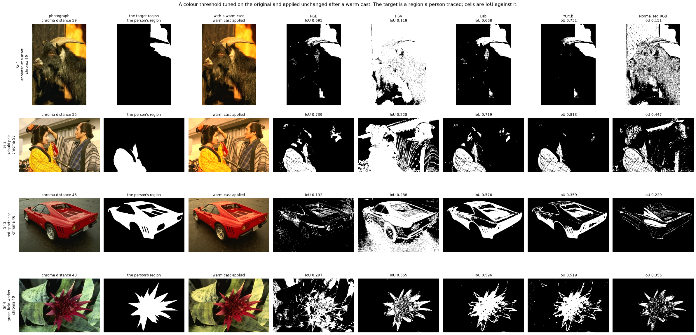
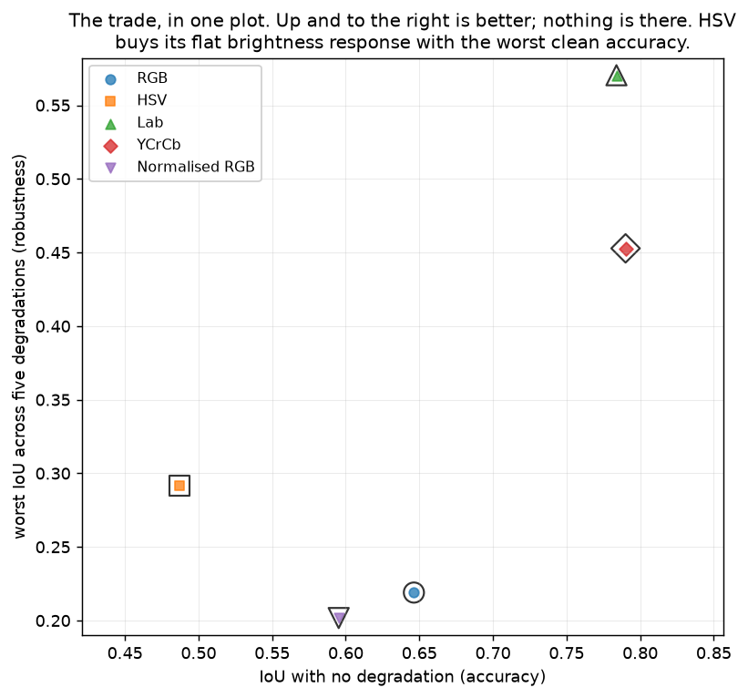
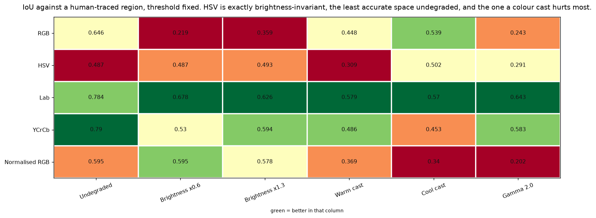
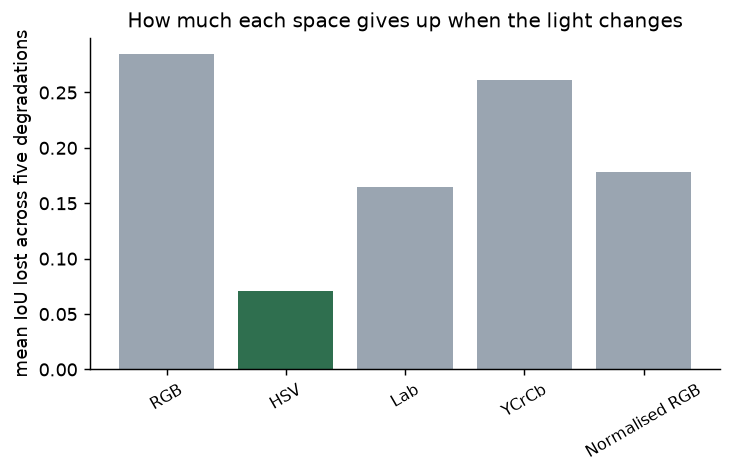
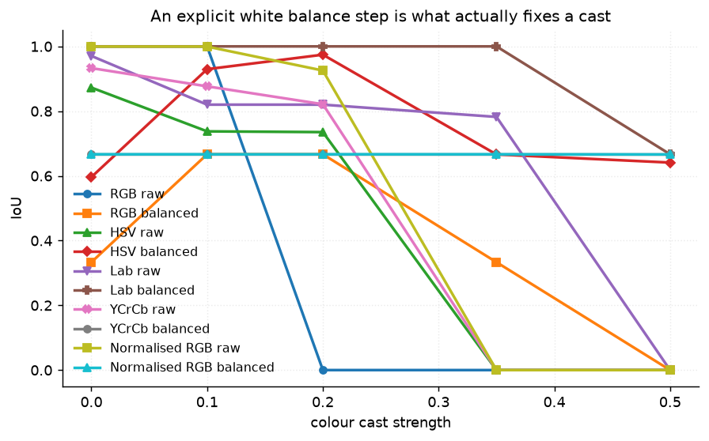

# 47 · Colour space robustness — classical computer vision

[](https://www.python.org/)
[](https://opencv.org/)
[](#)
[](#)

"Use HSV for colour detection, it's robust to lighting." Measured against twelve
regions that people traced by hand, with the threshold tuned once and never
retuned.

> **The claim under test:** it is exactly half true, and the half that is false
> causes real bugs. HSV is **exactly** brightness-invariant — 0.487 IoU
> undegraded, 0.487 at 0.6× brightness. It is also the **least accurate** space
> here undegraded, and a warm colour cast costs it **37%** of its IoU.

**No neural network, no training, no GPU.**

---

## Results

Four photographs, a threshold tuned on the original and applied unchanged after a
warm cast. The target is a region a person traced; cells are IoU against it.



| Sr | Scene | RGB | HSV | **Lab** | YCrCb | Normalised RGB |
|---:|---|---:|---:|---:|---:|---:|
| 1 | anteater at sunset · chroma 59 | 0.695 | 0.119 | 0.668 | **0.751** | 0.151 |
| 2 | kabuki pair · chroma 55 | 0.739 | 0.228 | 0.719 | **0.813** | 0.447 |
| 3 | red sports car · chroma 46 | 0.132 | 0.288 | **0.576** | 0.359 | 0.229 |
| 4 | green field worker · chroma 40 | 0.297 | **0.565** | 0.596 | 0.519 | 0.355 |

Over all twelve photographs and five degradations:

| Space | Tolerance | Undegraded | ×0.6 | ×1.3 | Warm cast | Cool cast | Gamma 2.0 | Worst | Mean loss |
|---|---:|---:|---:|---:|---:|---:|---:|---:|---:|
| RGB | 60 | 0.646 | **0.219** | 0.359 | 0.448 | 0.539 | 0.243 | 0.219 | **0.285** |
| **HSV** | 60 | **0.487** | **0.487** | **0.493** | **0.309** | 0.502 | 0.292 | 0.292 | **0.071** |
| **Lab** | 25 | 0.784 | 0.678 | 0.626 | 0.579 | 0.570 | 0.643 | **0.570** | 0.165 |
| YCrCb | 25 | **0.790** | 0.530 | 0.594 | 0.486 | 0.453 | 0.583 | 0.453 | 0.261 |
| Normalised RGB | 25 | 0.595 | **0.595** | 0.578 | 0.369 | 0.340 | **0.202** | 0.202 | 0.179 |

---

## The signature result: accuracy and robustness are a trade




**Three different winners:**

* **most accurate undegraded** — YCrCb, 0.790
* **most robust** — HSV, mean loss 0.071
* **best worst case** — Lab, 0.570

> **HSV is exactly brightness-invariant, and it is the worst space in the table
> undegraded.** 0.487 against Lab's 0.784. Hue is an angle in a plane, and
> scaling all three channels does not rotate it — but collapsing colour to one
> angle throws away most of what distinguishes a red robe from red earth.
>
> **And a warm cast costs it 0.178 IoU — 37%.** A cast multiplies the channels
> *differently*, which does rotate the hue angle. HSV survives the degradation
> the folklore names and fails the one it does not.
>
> **Normalised RGB is invariant to a scale by construction** (0.595 → 0.595) and
> **destroyed by gamma** (0.202). Dividing by the sum removes a multiplier; gamma
> is not a multiplier.



Plain RGB gives up the most — a mean loss of 0.285 and a collapse from 0.646 to
0.219 when the light drops to 0.6×. It has no invariance at all, which is the
baseline the other four are measured against.

---

## Each space gets its own tolerance

A single shared threshold width would decide the comparison on its own:

| Tolerance | RGB | HSV | Lab | YCrCb | Normalised RGB |
|---|---:|---:|---:|---:|---:|
| 15 | 0.196 | 0.338 | 0.761 | 0.748 | 0.499 |
| **25** | 0.378 | 0.443 | **0.784** | **0.790** | **0.595** |
| 35 | 0.514 | 0.444 | 0.653 | 0.687 | 0.584 |
| 45 | 0.604 | 0.457 | 0.503 | 0.581 | 0.523 |
| **60** | **0.646** | **0.487** | 0.235 | 0.339 | 0.487 |
| 80 | 0.613 | 0.423 | 0.178 | 0.205 | 0.412 |

**Lab and YCrCb peak at 25; RGB and HSV at 60.** The spaces do not share units —
Lab's a/b run about ±100 around a neutral axis while RGB spans 0–255 in three
correlated channels, so the same "distance 25" is a far wider net in one than in
the other. Every space is therefore given its own best value and compared at its
own best.

---

## What actually fixes a colour cast



At cast level 0.5, with the threshold still tuned on the original:

| Space | raw | after white balance |
|---|---:|---:|
| RGB | 0.000 | 0.000 |
| HSV | 0.000 | **0.641** |
| Lab | 0.000 | **0.667** |
| YCrCb | 0.000 | **0.667** |
| Normalised RGB | 0.000 | **0.666** |

**A strong cast takes every colour space to zero.** Not degraded — zero. And an
explicit white balance step restores four of the five to about 0.66.

That is the practical conclusion of the whole project: **no colour space is
invariant to a change of illuminant, and choosing a different one is not a
substitute for correcting it.** The correction is [project 39](../39_white_balance/).

---

## OpenCV's hue is half a circle

| Colour | true hue | OpenCV stores | a naive reading says |
|---|---:|---:|---:|
| red | 0° | 0 | 0 |
| yellow | 60° | 30 | **30** |
| green | 120° | 60 | **60** |
| cyan | 180° | 90 | **90** |
| blue | 240° | 120 | **120** |
| magenta | 300° | 150 | **150** |

Hue is stored as **0–179**, halved to fit in a `uint8`. A threshold written in
degrees selects the wrong colour at every angle except red — and it fails
silently, because 30 is a perfectly valid hue. Multiply by two to read degrees.

---

## How the images were chosen

Twelve photographs, each with a **human-traced region whose colour is distinct
from its surroundings** — the thing a colour threshold is written to find.
Selected by the Lab chroma distance between the region's mean and the rest of the
frame, which is what decides whether any space has something to separate. None of
`tools/select_images.py`'s stock axes measures it, because it is a property of a
*region* rather than of a picture.

```
lobsters_and_wine    63.3    woman_in_blue_dress  46.7
stacked_timber       62.4    red_robed_figures    46.5
anteater_at_sunset   59.0    red_sports_car       45.8
kabuki_pair          54.6    westminster_pair     43.3
tomato_stall         54.3    green_field_worker   39.9
kalmar_castle        53.2    yellow_trousers      47.9
```

Each entry records `(annotator, region label)` so the target is reproducible and
attributable to a person. None of the twelve appears in any other project;
`tools/check_image_reuse.py` enforces that by perceptual hash.

---

## Try it on your own image

```bash
python infer.py photo.jpg --x 320 --y 200      # sample a colour, threshold in all five
python infer.py --photo red_sports_car --cast warm
python infer.py photo.jpg --x 320 --y 200 --balance
```

You click a pixel; it builds a threshold around that colour in every space and
reports how much each selection changes when a cast is applied. With no traced
region there is no IoU, so what is printed instead is the **agreement between the
degraded and undegraded selections** — which is the same question the IoU column
asks, without needing a ground truth.

---

## Limitations

* **The degradations are applied, and they are global.** A real change of light
  moves shadows and specularities as well as the average colour, and is rarely
  uniform across a frame.
* **The target colour is the region's *mean*.** A traced region of a photograph
  is not one colour — a red robe has shadow and highlight in it — so a single
  centre with a radius is a crude model, and it is why the undegraded IoU tops
  out at 0.79 rather than near 1.
* **Five spaces, not a survey.** HSL, HSI, CIELUV and the opponent spaces are not
  here. Lab and YCrCb stand for "luminance separated from two chroma channels",
  which is the family that does well.
* **IoU against one annotator.** BSDS ships five to seven tracings per image and
  they disagree; project 36 measures that spread directly. The numbers here are
  against one person's idea of where the object ends.
* **The per-space tolerances are tuned on the same twelve photographs they are
  then scored on.** That inflates the undegraded column for every space equally;
  the robustness columns, which use the same fixed thresholds on degraded copies,
  are not affected.

---

## Tests

15 tests, run with `pytest projects/47_colour_space_robustness/tests -q`. They pin
the harness (the 0–179 hue, each space getting its own tolerance, the threshold
tuned once and never retuned, every target being one person's tracing of one
region) and every finding: that HSV is exactly brightness-invariant, that it is
also the least accurate space undegraded, that a colour cast is what it cannot
survive, that accuracy and robustness have different winners, that normalised RGB
is destroyed by gamma, that plain RGB loses the most, and that a strong cast
takes every space to zero while white balance restores it.

---

## Keywords

colour space · HSV · hue saturation value · Lab · CIELAB · YCrCb · normalised
RGB · chromaticity · colour thresholding · colour segmentation · illumination
invariance · colour constancy · white balance · OpenCV hue range · classical
computer vision · no deep learning · OpenCV · Python · CPU only · reproducible
image processing experiments

## References

* Gevers & Smeulders, *Color-based object recognition*, Pattern Recognition 1999
  — which colour features are invariant to what.
* Finlayson, Schiele & Crowley, *Comprehensive Colour Image Normalization*, ECCV
  1998.
* CIE 15:2004, *Colorimetry* — the Lab definition.
* ITU-R BT.601-7 — the YCrCb transform OpenCV implements.
* OpenCV documentation, `cv::cvtColor` — including the 0–179 hue range.
