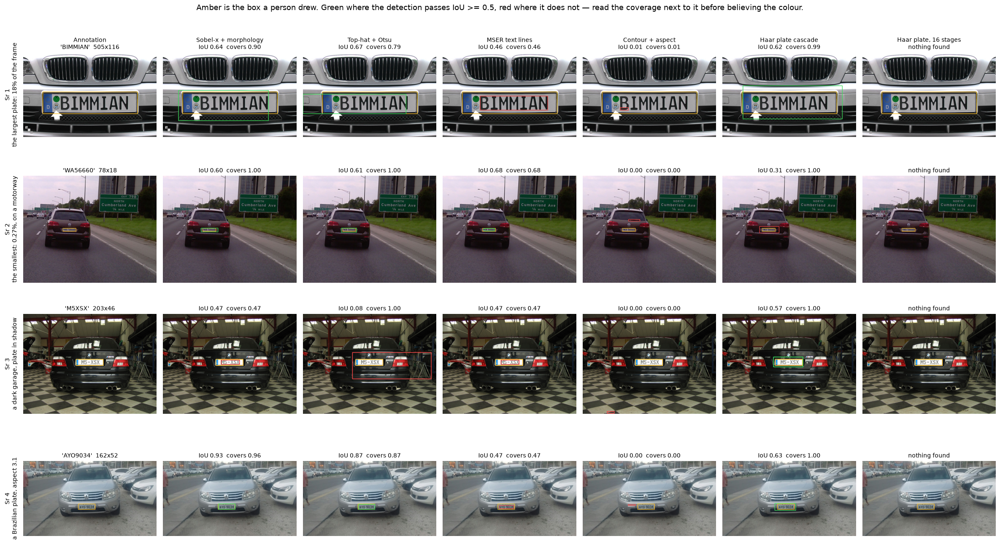
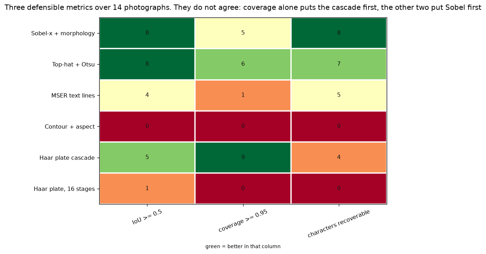
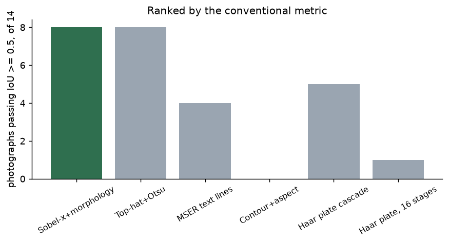
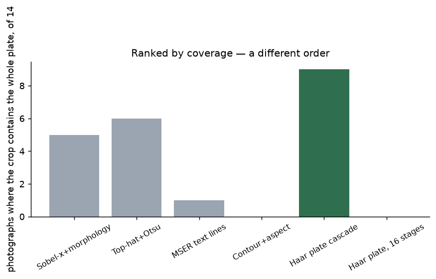
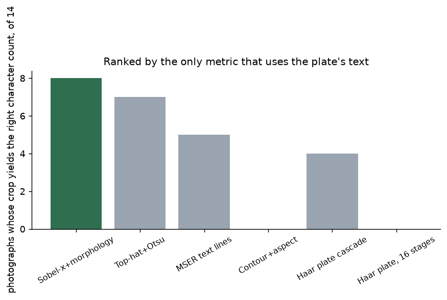
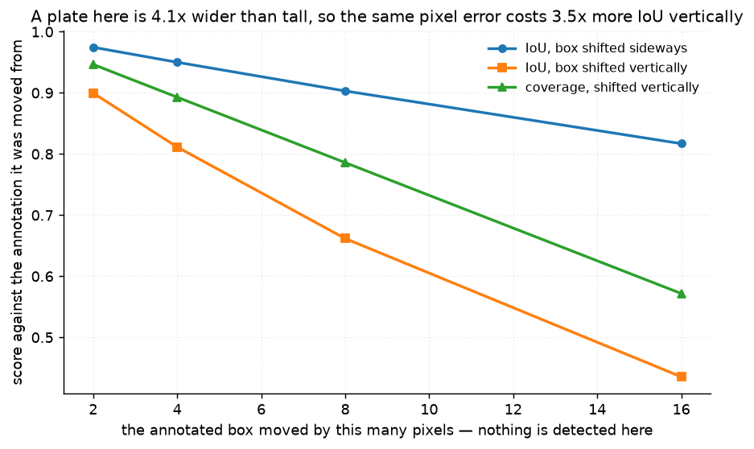
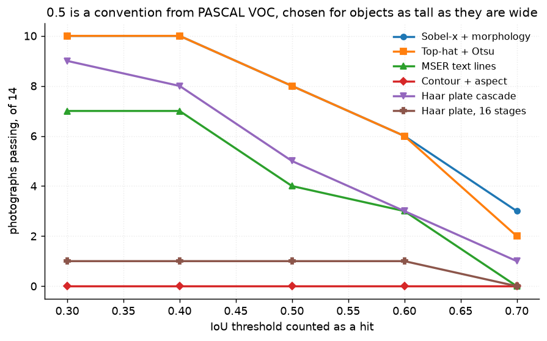

# 48 · Licence-plate localisation — classical computer vision

[](https://www.python.org/)
[](https://opencv.org/)
[](#)
[](#)

Find the number plate in a photograph of a car. Every classical locator exploits
the same two facts — a plate is a **dense band of vertical edges** (the
characters) inside a **bright rectangle of fixed aspect ratio** (about 4.4:1) —
and they differ only in which of the two they lean on.

This is the **one project in this repository with a human annotation**: fourteen
photographs from the openalpr benchmark, each with a box somebody drew *and the
plate's text typed out*. So unlike everything else here it can report a real
accuracy. What it mostly reports is that the accuracy is measuring the wrong
thing.

> **Two defensible metrics, two different winners.** `IoU >= 0.5` — the
> convention — puts `Sobel-x + morphology` and `Top-hat + Otsu` first at **8 of
> 14**, with OpenCV's own plate cascade at **5**. **Coverage of the annotated
> plate** reverses it exactly: the cascade takes **9 of 14** and Sobel drops to
> **5**.

> **The metric introduced to fix IoU is the worse of the two.** Coverage is the
> obvious repair, and it is what this project set out to argue for. It does not
> survive its own test: a third measure — the only one here that uses the plate's
> **typed text** — sides with IoU, **8 of 14** for Sobel against **4** for the
> cascade. A crop containing the plate *and half a boot lid* is not a crop you
> can segment characters out of.

> **And coverage is gamed outright by returning the whole photograph**, which
> scores **14 of 14** at a median IoU of 0.01.

> **Two obvious explanations tested and rejected.** Plate size does not predict
> difficulty (**r = +0.29**) — the smallest plate in the set is found by as many
> locators as the largest, which is 67× its area. And the 0.5 threshold is not
> what flips the ranking: swept from 0.3 to 0.7, **the same locator is first at
> every value.**

**No neural network, no training, no GPU.**

---

## Results

Four photographs spanning the difficulty axis. **Amber is the box a person
drew.** Green where the detection passes `IoU >= 0.5`, red where it does not —
read the coverage beside it before believing the colour.



| Sr | Photograph | Sobel-x + morphology | Top-hat + Otsu | MSER text lines | Contour + aspect | Haar plate cascade | Haar plate, 16 stages |
|---:|---|:--:|:--:|:--:|:--:|:--:|:--:|
| 1 | the largest plate, 18% of the frame | 0.64 / 0.90 | 0.67 / 0.79 | 0.46 / 0.46 | 0.01 / 0.01 | 0.62 / 0.99 | — |
| 2 | the smallest, 0.27%, on a motorway | 0.60 / 1.00 | 0.61 / 1.00 | 0.68 / 0.68 | 0.00 / 0.00 | **0.31 / 1.00** | — |
| 3 | a dark garage, plate in shadow | 0.47 / 0.47 | **0.08 / 1.00** | 0.47 / 0.47 | 0.00 / 0.00 | 0.57 / 1.00 | — |
| 4 | a Brazilian plate, aspect 3.1 | 0.93 / 0.96 | 0.87 / 0.87 | 0.47 / 0.47 | 0.00 / 0.00 | 0.63 / 1.00 | — |

*`IoU / coverage`. Row 3 is the whole argument in one cell: **top-hat scores
coverage 1.00 and IoU 0.08** by drawing a box around the entire boot lid. It
contains every character. It is useless. A metric that only asked "does the crop
contain the plate" would call that a success.*

*Row 2 is the opposite case and the one that made this project interesting: the
cascade scores **IoU 0.31, coverage 1.00** on a plate 78 pixels wide. That box
really does contain the plate and only a little else.*

---

## Where the ground truth comes from

**A person drew these boxes and typed these strings.** That is a weaker kind of
truth than the recorded transforms the rest of this repository uses — it is one
annotator's opinion about where a plate ends, and part of the coverage result
above is a statement about that opinion rather than about the world. It is
labelled human annotation rather than dressed up as ground truth.

What the **text** buys is the thing a box alone cannot say: how many characters
are on the plate. So a third metric becomes possible — binarise the crop, count
the character-shaped connected components, compare to the typed string.

**That proxy is scored before it is used.** Run on a crop of the *annotated* box,
where the answer must be right:

| | |
|---|---|
| exact character count | **10 of 14** |
| within one | **12 of 14** |
| badly wrong | 2 (`WSQ3021`, `W053011` — adjacent characters merge under the threshold) |

So the readability column carries an error of its own, stated here rather than
left implicit. It is used as a tie-breaker between two metrics that disagree,
not as an accuracy.

---

## Three metrics, and why the third one settles it



| Locator | IoU ≥ 0.5 | Coverage ≥ 0.95 | Characters recoverable | Median IoU | Median coverage |
|---|:--:|:--:|:--:|---:|---:|
| **Whole frame (control)** | 0/14 | **14/14** | 0/14 | 0.01 | 1.00 |
| Fixed box (control) | 0/14 | 1/14 | 1/14 | 0.00 | 0.00 |
| Nothing (control) | 0/14 | 0/14 | 0/14 | 0.00 | 0.00 |
| **Sobel-x + morphology** | **8/14** | 5/14 | **8/14** | 0.53 | 0.82 |
| **Top-hat + Otsu** | **8/14** | 6/14 | 7/14 | 0.54 | 0.89 |
| MSER text lines | 4/14 | 1/14 | 5/14 | 0.35 | 0.46 |
| Contour + aspect | 0/14 | 0/14 | 0/14 | 0.00 | 0.00 |
| **Haar plate cascade** | 5/14 | **9/14** | 4/14 | 0.45 | **1.00** |
| Haar plate, 16 stages | 1/14 | 0/14 | 0/14 | 0.00 | 0.00 |





The three bar charts are the same six locators ranked three ways, and the bars
change places. **Quoting one of these numbers is a choice, and the choice decides
the answer.**

The cascade's median coverage is exactly **1.00** — on every photograph where it
fires, the box contains the entire plate — and its median IoU is **0.45**,
meaning the box is consistently about twice the size it should be. Coverage
rewards that and IoU punishes it. The character count says IoU is right: the
cascade's crops yield a correct character count on **4 of 14**, the worst of the
four locators that work at all.

`Contour + aspect` scores **zero on all three metrics** while returning 168
boxes. It is here because it shares the aspect-ratio filter with every other
locator, so what it scores is what the aspect filter alone is worth: nothing.
Proposing candidates is the whole problem.

---

## What IoU is actually charging for



Nothing is detected in this experiment. The **annotated** box is moved by a known
number of pixels and scored against the annotation it came from, so the only
thing varying is the localisation error.

| Shift | IoU sideways | IoU vertically | Coverage vertically |
|---|---:|---:|---:|
| 2 px | 0.97 | 0.90 | 0.95 |
| 4 px | 0.95 | 0.81 | 0.89 |
| 8 px | **0.90** | **0.66** | 0.79 |
| 16 px | 0.82 | 0.44 | 0.57 |

**The same 8-pixel error costs 3.5× more IoU vertically than sideways**, because
the mean plate here is 4.1 times wider than it is tall and IoU charges for both
directions in proportion to the side they eat into.

A detector's localisation error is roughly isotropic in pixels. The *metric* is
not. So on a shape this elongated, IoU is substantially a measure of vertical
precision — which matters for cropping tightly, and rather less for reading.

This is a property of the shape and not of the threshold, which is the next
thing worth ruling out.

---

## The threshold is not the problem



`IoU >= 0.5` comes from PASCAL VOC, where objects are roughly as tall as they are
wide, and it is quoted for plates without comment. It was the obvious suspect.

| Locator | 0.3 | 0.4 | 0.5 | 0.6 | 0.7 |
|---|:--:|:--:|:--:|:--:|:--:|
| **Sobel-x + morphology** | **10** | **10** | **8** | **6** | **3** |
| Top-hat + Otsu | **10** | **10** | **8** | **6** | 2 |
| MSER text lines | 7 | 7 | 4 | 3 | 0 |
| Contour + aspect | 0 | 0 | 0 | 0 | 0 |
| Haar plate cascade | 9 | 8 | 5 | 3 | 1 |
| Haar plate, 16 stages | 1 | 1 | 1 | 1 | 0 |

**The same locator is first at every threshold.** Moving the cut-off changes how
many photographs pass; it does not change who wins. It is the choice of *metric*
that flips the ranking, not the choice of number — a negative result, and it
narrows the claim usefully.

---

## What does not explain anything


The plate spans **67× in area** across these fourteen photographs — 0.27% of the
frame to 18.31% — and the obvious hypothesis is that this is the whole story.

**It is not.** Log plate width against the number of locators that succeed gives
**r = +0.29**.

| Photograph | Plate | Share of frame | Found (IoU) | Found (coverage) |
|---|---|---:|:--:|:--:|
| eu10 | 78×18 | **0.27%** | 3/6 | 3/6 |
| eu5 | 183×42 | 0.84% | 0/6 | 3/6 |
| eu7 | 343×79 | 0.86% | 1/6 | 1/6 |
| AYO9034 | 162×52 | 0.91% | 3/6 | 2/6 |
| AZJ6991 | 236×76 | 1.09% | 3/6 | 0/6 |
| eu3 | 91×21 | 1.11% | 1/6 | 1/6 |
| eu1 | 203×46 | 1.25% | 1/6 | 2/6 |
| FZB9581 | 258×83 | 1.31% | 2/6 | 0/6 |
| eu6 | 96×22 | 1.39% | 1/6 | 2/6 |
| eu11 | 122×28 | 1.47% | 1/6 | 2/6 |
| eu9 | 131×30 | 1.54% | 0/6 | 3/6 |
| eu8 | 303×69 | 2.67% | 4/6 | 0/6 |
| eu2 | 139×32 | 3.07% | 3/6 | 1/6 |
| eu4 | 505×116 | **18.31%** | 3/6 | 1/6 |

The smallest plate in the set — 78×18 pixels, a quarter of a percent of the
frame — is found by **as many locators as the largest**, which is 67 times its
area. Whatever makes a plate hard here, it is not how big it is. Reported because
it was the first thing worth checking and it came out flat.

Note the last two columns disagreeing per photograph too: `eu9` is found by
**0 of 6** on IoU and **3 of 6** on coverage; `eu8` is **4 of 6** and **0 of 6**.
The two metrics do not merely rank the locators differently — they disagree about
which *photographs* are solved.

---

## Try it

```bash
python infer.py --image eu4          # the largest plate in the set
python infer.py --image eu1          # a dark garage; watch coverage and IoU part
python infer.py --image eu10         # 78 pixels wide
python infer.py car.jpg
```

Every run prints IoU and coverage side by side, and the character count against
the typed text where there is one. `eu1` is the whole project in one output:

```
locator                   boxes    IoU  covers  IoU>=.5  blobs
Sobel-x + morphology          8   0.47    0.47       NO      4
Top-hat + Otsu               29   0.08    1.00       NO      0
MSER text lines               6   0.47    0.47       NO      4
Contour + aspect             32   0.00    0.00       NO      0
Haar plate cascade            2   0.57    1.00      yes      2
Haar plate, 16 stages         0   0.00    0.00       NO      0

IoU says Haar plate cascade (0.57); coverage says Top-hat + Otsu (1.00).
  Crops with a usable character count (5 expected): Sobel-x + morphology, MSER text lines
  For scale: returning the whole photograph scores coverage 1.00 and IoU 0.01.
```

**The two locators that win a metric both produce unreadable crops, and the two
that produce readable crops both fail `IoU >= 0.5` — at 0.47.** On this
photograph every one of the three measures picks a different answer.

---

## Limitations

* **Fourteen photographs.** Every number here is a count out of fourteen, and a
  single photograph moves a locator by 7 percentage points. Differences smaller
  than about two photographs mean nothing.
* **The truth is one person's opinion**, not a measurement. Where a plate "ends"
  — at the characters, the painted edge, the pressed rim, the mounting frame — is
  a judgement, and the coverage numbers are partly a statement about that
  judgement.
* **The readability proxy is not OCR.** It counts character-shaped blobs and it
  is wrong on 2 of 14 annotated crops, which is stated above and bounds anything
  it is used for. Its role here is to break a tie between two metrics, and it
  would not support a finer claim.
* **No OCR at all**, so "reading the plate" is never actually attempted. The
  split this project measures is localisation versus *segmentability*, which is a
  necessary condition for reading and not a sufficient one.
* **Mostly European plates**, which are white or yellow with a fixed aspect ratio
  and a blue band. Three Brazilian plates are included and are noticeably
  different in aspect (3.1 against 4.4). A US state plate, with its coloured
  artwork, would break the brightness assumption every locator here makes.
* **One aspect band, one minimum width and one area cap shared by every
  locator**, so the comparison is of how candidates are proposed rather than of
  who tuned their filter more tightly.
* **No perspective**, no motion blur, no night shots, no rain. The plate is
  roughly frontal in all fourteen.

---

## Tests

Run with `pytest projects/48_plate_localisation/tests -q`. They pin the result
(the two metrics rank the locators in opposite orders; the whole-frame control
wins coverage outright; the readability proxy sides with IoU; plate size does not
predict difficulty; the winner is stable across thresholds), the mechanism (a
vertical shift costs more IoU than a horizontal one, on a shape wider than it is
tall), the construction (the annotation parses, the aspect filter is shared, the
proxy is validated on the truth crops before use), and the box arithmetic — IoU
against arithmetic, coverage of a contained box being exactly 1, and the
whole-frame box covering everything.

---

## Keywords

licence plate detection · number plate localisation · ANPR · ALPR ·
Haar cascade · MSER · morphological top-hat · Sobel gradient · aspect ratio
filter · IoU · intersection over union · evaluation metrics · PASCAL VOC
threshold · classical computer vision · no deep learning · OpenCV · Python ·
CPU only · reproducible image processing experiments

## References

* Anagnostopoulos et al., *License Plate Recognition From Still Images and Video
  Sequences: A Survey*, IEEE Trans. ITS 2008 — the locator families compared here.
* Matas, Chum, Urban & Pajdla, *Robust Wide Baseline Stereo from Maximally Stable
  Extremal Regions*, BMVC 2002 — MSER.
* Everingham et al., *The PASCAL Visual Object Classes (VOC) Challenge*, IJCV
  2010 — where `IoU >= 0.5` comes from, and what it was chosen for.
* Photographs and annotations come from the
  [openalpr benchmark](https://github.com/openalpr/benchmarks); provenance is
  recorded in `assets/real/README.md`.
