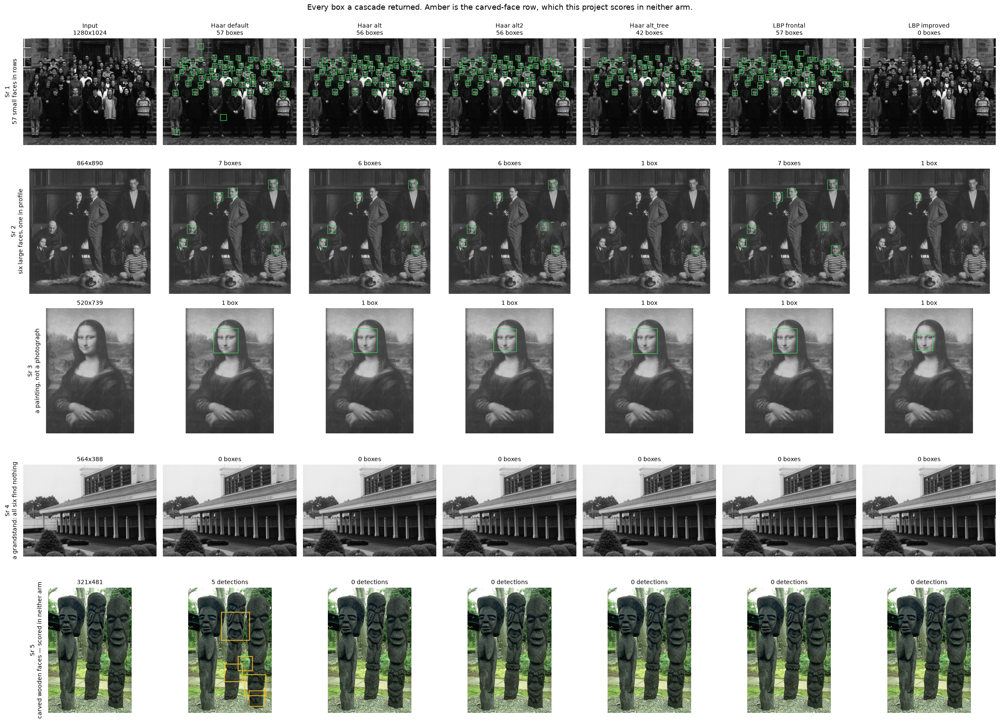
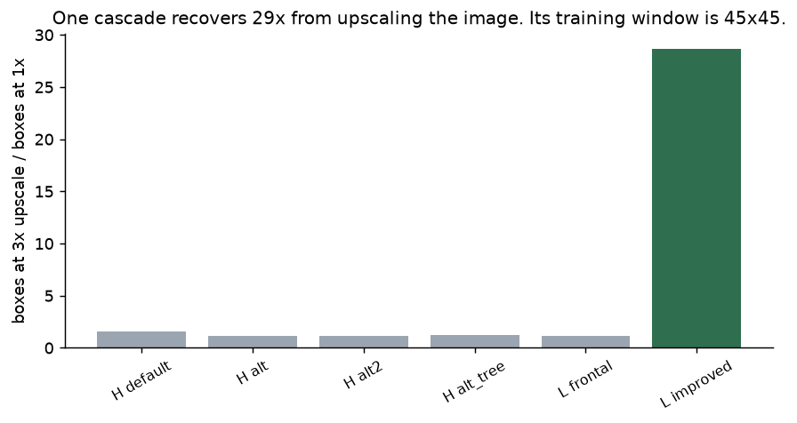
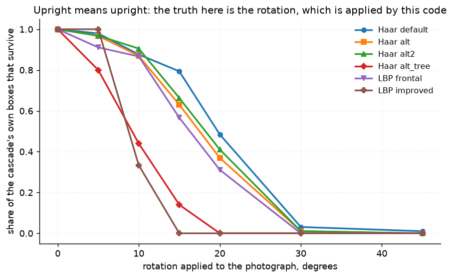
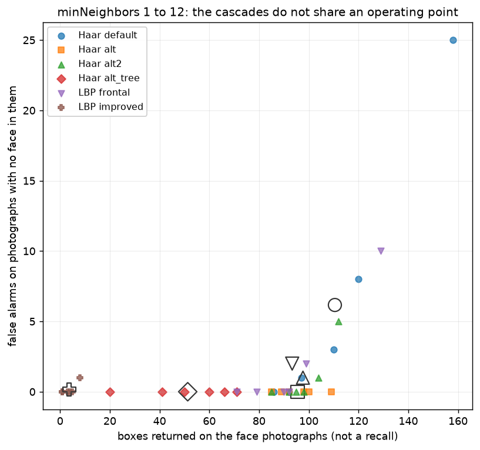
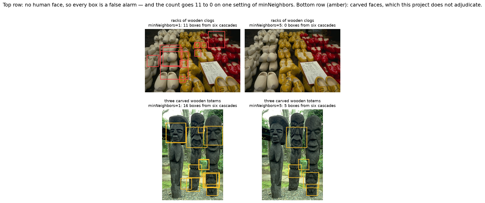

# 50 · Face detection — classical computer vision

[](https://www.python.org/)
[](https://opencv.org/)
[](#)
[](#)

Viola–Jones, 2001: a cascade of boosted classifiers slid over every position and
every scale. Twenty-five years later it still ships with OpenCV, in six variants,
and every tutorial picks one of them with a sentence like *"`alt2` is usually
better"*. This project asks what "better" could mean when nobody has labelled the
photographs.

> **A cascade is trained at one face size and cannot see below it.** OpenCV's
> `lbpcascade_frontalface_improved` has a **45×45** training window where every
> other cascade here has 20×20 or 24×24. On eleven group photographs it finds
> **3 faces** where the cascade it replaced finds **90**. Upscaling the images 3×
> recovers it — **28.7×** more detections, against **1.54×** for the next most
> improved. It is not broken; it is blind below its own window.

> **And `minSize` cannot fix that.** `minSize` is a floor on the search, not a
> resampling: below a cascade's training window there is no classifier to
> evaluate. `minSize=12` and `minSize=24` return **byte-identical counts for all
> six cascades**.

> **Upright means upright.** At **20°** the best cascade keeps **48%** of its own
> detections; at **30°**, **3%**. `alt_tree` is at **zero by 20°** and
> `LBP improved` by **15°**. Nothing in the API suggests a tilted head is outside
> the model.

> **`minNeighbors` is an operating point, not a quality knob — and the cascades
> do not share one.** At `minNeighbors=1`, `Haar default` returns 158 boxes on
> the face photographs and **25 on photographs with no face in them**; `Haar alt`
> returns 109 and **0**.

> **Six cascades for one task agree unanimously on 2% of what they find** — 2 of
> 104 distinct boxes.

**No neural network, no training, no GPU.**

---

## Results

Five photographs chosen to be five different problems. Amber is the carved-face
row, which this project scores in neither arm.



| Sr | Photograph | Haar default | Haar alt | Haar alt2 | Haar alt_tree | LBP frontal | LBP improved |
|---:|---|:--:|:--:|:--:|:--:|:--:|:--:|
| 1 | 57 small faces in rows | 57 | 56 | 56 | 42 | 57 | **0** |
| 2 | six large faces, one in profile | 7 | 6 | 6 | 1 | 7 | 1 |
| 3 | a painting, not a photograph | 1 | 1 | 1 | 1 | 1 | 1 |
| 4 | a grandstand — all six find nothing | 0 | 0 | 0 | 0 | 0 | 0 |
| 5 | carved wooden faces | **5** | 0 | 0 | 0 | 0 | 0 |

*Row 1 is the training-window result: five cascades find 56–57 faces and the
sixth finds **none**. Row 5 is the one this project refuses to adjudicate —
`Haar default` finds five carved faces and every other cascade finds zero.*

*Row 4 is one of OpenCV's own face-cascade test images, and there is no face in
it any of the six can resolve.*

---

## Where the ground truth comes from

**Nobody has labelled a face in this repository, and nothing here pretends
otherwise.** There is no hand-drawn box, so there is no recall and no precision.
Three things stand in, and each is honest about what it is.

**1 — A recorded transform.** Rotate, scale, brighten, blur or re-encode by a
known amount; a box found in the original must reappear where the transform puts
it. The thing measured *is* the thing applied, so it is exact. What it measures
is not accuracy — a box this loses may never have been a face — but whether the
detector's own answer survives.

**2 — An empty truth.** Eleven photographs with no human face: animals,
textures, architecture. Chosen adversarially rather than conveniently — six
contain an animal looking straight at the camera, and one is a rack of wooden
clogs, exactly the repeated dark blob a Haar cascade should like. Every detection
there is a false alarm, with no annotation needed to say so.

**3 — Agreement between cascades**, reported as agreement and never as accuracy.

---

## The training window is in the XML, not in the API



| Cascade | Training window | Boxes at 1× | at 1.5× | at 2× | at 3× | Recovery |
|---|:--:|---:|---:|---:|---:|---:|
| Haar default | 24×24 | 97 | 115 | 123 | 149 | 1.54× |
| Haar alt | 20×20 | 92 | 98 | 100 | 103 | 1.12× |
| Haar alt2 | 20×20 | 95 | 98 | 101 | 106 | 1.12× |
| Haar alt_tree | 20×20 | 50 | 62 | 62 | 62 | 1.24× |
| LBP frontal | 24×24 | 90 | 97 | 100 | 106 | 1.18× |
| **LBP improved** | **45×45** | **3** | 51 | 80 | 86 | **28.67×** |

The prediction was specific before it was tested: *if* the 45×45 window is the
cause, then resampling the image up must recover **that** cascade and barely move
the ones already below their window. It does exactly that — 28.67× against a next
best of 1.54×.

And the thing a reader would try first does not work:

| Cascade | window | minSize 12 | minSize 24 | minSize 45 | minSize 80 |
|---|:--:|---:|---:|---:|---:|
| Haar default | 24 | 97 | 97 | 75 | 5 |
| Haar alt | 20 | 92 | 92 | 72 | 1 |
| Haar alt2 | 20 | 95 | 95 | 74 | 1 |
| Haar alt_tree | 20 | 50 | 50 | 28 | 1 |
| LBP frontal | 24 | 90 | 90 | 64 | 1 |
| LBP improved | 45 | **3** | **3** | **3** | 1 |

`minSize=12` and `minSize=24` are **identical for every cascade**, because below
the cascade's own window there is no classifier to evaluate. Lowering `minSize`
cannot conjure a 30-pixel classifier out of a 45-pixel one. **Resampling the
image is the only fix, and no tutorial mentions it.**

---

## Upright means upright



| Cascade | 0° | 5° | 10° | 15° | 20° | 30° | 45° |
|---|:--:|:--:|:--:|:--:|:--:|:--:|:--:|
| **Haar default** | 1.00 | 0.98 | 0.88 | **0.79** | **0.48** | 0.03 | 0.01 |
| Haar alt | 1.00 | 0.97 | 0.87 | 0.63 | 0.37 | 0.01 | 0.00 |
| Haar alt2 | 1.00 | 0.97 | 0.91 | 0.66 | 0.41 | 0.01 | 0.00 |
| Haar alt_tree | 1.00 | 0.80 | 0.44 | 0.14 | **0.00** | 0.00 | 0.00 |
| LBP frontal | 1.00 | 0.91 | 0.87 | 0.57 | 0.31 | 0.00 | 0.00 |
| LBP improved | 1.00 | 1.00 | 0.33 | **0.00** | 0.00 | 0.00 | 0.00 |
| *Nothing (control)* | 0.00 | 0.00 | 0.00 | 0.00 | 0.00 | 0.00 | 0.00 |
| *One centre box (control)* | **1.00** | **1.00** | **1.00** | **1.00** | **1.00** | **1.00** | 0.00 |
| *Every box (control)* | 1.00 | 0.86 | 0.84 | 0.81 | 0.78 | **0.63** | 0.04 |

A tilted head is common — someone leaning on a hand, a child looking up, a
snapshot held off-level. **By 20° the best of these has lost half its
detections.** `alt_tree`, which is the largest file of the six at 2.6 MB and 47
stages, is the most brittle: gone by 20°.

**And this score, alone, ranks the two controls first.** `One centre box` returns
a box at the middle of the frame, which a rotation about the centre does not
move — a perfect 1.00 through 30°, from a detector that never reads the image.
`Every box` scores 0.63 at 30° where every real cascade is below 0.03. Survival
is a *necessary* property, not a sufficient one, and that is exactly why the
empty-truth arm has to exist alongside it.

Changes that move nothing are a different story:

| Cascade | ×0.5 bright | ×1.5 bright | blur σ2 | blur σ4 | JPEG q30 | JPEG q10 |
|---|:--:|:--:|:--:|:--:|:--:|:--:|
| Haar default | 0.99 | 1.00 | 0.91 | **0.54** | 0.98 | 0.92 |
| Haar alt | 0.99 | 0.99 | 0.89 | 0.36 | 0.98 | 0.92 |
| Haar alt2 | 0.99 | 0.98 | 0.89 | 0.37 | 0.97 | 0.96 |
| Haar alt_tree | 0.98 | 0.96 | 0.40 | **0.02** | 0.96 | 0.84 |
| LBP frontal | 0.97 | 1.00 | 0.87 | 0.39 | 0.92 | 0.87 |
| LBP improved | 0.67 | 0.67 | 0.67 | 0.33 | 1.00 | 0.67 |

Brightness is free — every cascade histogram-equalises first, so halving the
exposure costs 1–3%. **JPEG at quality 10 is nearly free too**, which is worth
knowing before anyone argues for archiving at higher quality on a detector's
behalf. Blur is what actually hurts, and it separates the cascades by 27×
(0.54 against 0.02 at σ4).

---

## An empty truth, and the knob that moves along it



| Method | Boxes on faces | False alarms | Per megapixel |
|---|---:|---:|---:|
| Haar default | 97 | **1** | 0.6 |
| Haar alt | 92 | 0 | 0.0 |
| Haar alt2 | 95 | 0 | 0.0 |
| Haar alt_tree | 50 | 0 | 0.0 |
| LBP frontal | 90 | 0 | 0.0 |
| LBP improved | 3 | 0 | 0.0 |
| *Nothing (control)* | **0** | **0** | **0.0** |
| *One centre box (control)* | 11 | 11 | 6.5 |
| *Every box (control)* | 6276 | 6996 | 4119.1 |

At the default `minNeighbors=5` the false-alarm arm is almost empty — the one
false alarm in the whole set is `Haar default` on **a bobcat among ferns**. Taken
alone that table says the `Nothing` control is the best face detector available,
which is the point of including it.

The interesting result is the *curve*, not the point:

| Cascade | n=1 | n=2 | n=3 | n=5 | n=8 | n=12 |
|---|:--:|:--:|:--:|:--:|:--:|:--:|
| **Haar default** | 158 / **25** | 120 / 8 | 110 / 3 | 97 / 1 | 92 / 0 | 86 / 0 |
| **Haar alt** | 109 / **0** | 100 / 0 | 98 / 0 | 92 / 0 | 89 / 0 | 85 / 0 |
| Haar alt2 | 112 / 5 | 104 / 1 | 98 / 0 | 95 / 0 | 92 / 0 | 85 / 0 |
| Haar alt_tree | 71 / 0 | 66 / 0 | 60 / 0 | 50 / 0 | 41 / 0 | 20 / 0 |
| LBP frontal | 129 / 10 | 99 / 2 | 92 / 0 | 90 / 0 | 79 / 0 | 71 / 0 |
| LBP improved | 8 / 1 | 5 / 0 | 4 / 0 | 3 / 0 | 1 / 0 | 1 / 0 |

*boxes on the face photographs / false alarms on the face-free ones*

**One value of one knob does not mean the same thing to two cascades.** At
`minNeighbors=1`, `Haar default` buys 49 more boxes than `Haar alt` for 25 false
alarms; `Haar alt` at its loosest setting has none at all. A comparison run at
one setting — which is every comparison — cannot see that, and `minNeighbors=5`
is not a fair point for both.

---

## Agreement is agreement, not a count of faces

| Photograph | Distinct boxes | Found by 3+ | Found by all 6 |
|---|---:|---:|---:|
| addams-family | 7 | 6 | 0 |
| audrybt1 | 1 | 1 | 0 |
| bttf301 | 6 | 6 | 1 |
| churchill-downs | 0 | 0 | 0 |
| class57 | 61 | 55 | 0 |
| er | 9 | 6 | 0 |
| karen-and-rob | 2 | 2 | 0 |
| larroquette | 7 | 6 | 0 |
| mona-lisa | 1 | 1 | 1 |
| rehg-thanksgiving-1994 | 7 | 6 | 0 |
| waynesworld2 | 3 | 1 | 0 |

**2 of 104 distinct boxes — 2% — are found by all six cascades.** The two are the
Mona Lisa and one face in a *Back to the Future* still.

That number is low for a reason worth stating: agreement at the box level
requires the boxes to *overlap*, and the six cascades return systematically
different box sizes for the same face. So 2% is partly a statement about box
conventions rather than about disagreement over where faces are — at a 3-or-more
vote it is 90 of 104. Both numbers are given because neither is "the" answer, and
**neither is a count of faces**: six detectors that share an architecture and a
training set agree about their shared blind spots as readily as about faces.

---

## The photograph this project refuses to score



`Haar default` finds **5** carved wooden faces on a photograph of three totems.
Every other cascade finds **0**.

A carving has eyes, a nose and a mouth in the right arrangement. Whether a
detection there is a false alarm is a question about what the word "face" means,
not about the detector — and putting an answer to it inside a false-alarm rate
would be smuggling an opinion into a number. So the totems are in neither arm,
reported on their own, and the reader can decide.

The same applies, less obviously, to the **Mona Lisa**, which *is* in the face
set and which all six cascades find. This project counts that as a face. That is
also a choice.

---

## Try it

```bash
python infer.py --image class57                 # 57 faces, and one cascade finds none
python infer.py --image class57 --upscale 2     # the 45x45 cascade comes back
python infer.py --image addams-family --rotate 20
python infer.py --no-face 140075                # wooden clogs: every box is wrong
python infer.py photo.jpg
```

---

## Limitations

* **No annotation exists**, so there is no recall and no precision anywhere in
  this project. Every number is either a survival rate against a transform this
  code applied, a count on photographs known to be empty, or agreement between
  detectors. None of them is accuracy.
* **Eleven face photographs**, most of them 1990s television publicity stills and
  one class photograph that supplies 57 of the ~104 faces on its own. `class57`
  dominates every aggregate here.
* **Rotation survival is measured against the cascade's own detections at 0°**,
  so a cascade that finds very little has very little to lose — `LBP improved`
  starts from 3 boxes, and its curve should be read with that in mind rather than
  compared directly with the others'.
* **The axis-aligned hull of a rotated box is larger than the box**, so at 30° a
  correct detection can reach at most about 0.73 IoU. The threshold used is 0.5,
  which is below that ceiling out to 45°, but the survival numbers at large
  angles are still pessimistic by construction.
* **Eleven face-free photographs is a small empty arm**, and at the default
  setting it contains exactly one false alarm. The `minNeighbors` sweep exists
  because the single operating point has almost no signal in it.
* **One `scaleFactor`, one `minSize` and histogram equalisation shared by every
  cascade**, so the comparison is of models rather than of tuning. Tuning each
  separately would produce better numbers and a worse experiment.
* **Frontal cascades only.** No profile cascade, no rotation-invariant wrapper,
  and no attempt at the obvious fix for the rotation result — running the
  detector on several rotations of the image and merging.

---

## Tests

Run with `pytest projects/50_face_detection/tests -q`. They pin the result (the
45×45 cascade is blind at native scale and upscaling recovers it *and only it*;
every cascade loses most of its boxes by 30°; the cascades do not share an
operating point; the six do not agree), the mechanism (`minSize` below the
training window changes nothing, and the windows are what the XML says), the
controls (`Nothing` scores perfectly on the empty arm; `Every box` out-survives
every cascade under rotation; the centre box ignores the image), the construction
(the carved faces are in neither arm; false alarms are per megapixel; looser
`minNeighbors` never returns fewer boxes), and the box arithmetic — IoU against
arithmetic, a zero rotation being the identity, and one box never being credited
with three faces.

---

## Keywords

face detection · Viola-Jones · Haar cascade · LBP cascade · boosted classifier
cascade · minNeighbors · scaleFactor · training window · rotation invariance ·
false alarm rate · empty truth · control experiment · annotation-free evaluation
· classical computer vision · no deep learning · OpenCV · Python · CPU only ·
reproducible image processing experiments

## References

* Viola & Jones, *Rapid Object Detection using a Boosted Cascade of Simple
  Features*, CVPR 2001 — the method, and the upright-frontal assumption.
* Lienhart & Maydt, *An Extended Set of Haar-like Features for Rapid Object
  Detection*, ICIP 2002 — the `alt` cascades.
* Ahonen, Hadid & Pietikäinen, *Face Description with Local Binary Patterns*,
  TPAMI 2006 — the LBP features.
* Puttemans, Ergun & Goedemé, *Improving Open Source Face Detection by Combining
  an Adapted Cascade Classification Pipeline and Active Learning*, VISAPP 2017 —
  the 45×45 `lbpcascade_frontalface_improved` cascade.
* Photographs come from `opencv/opencv_extra` cascade test data and from BSDS500;
  provenance is recorded in `assets/real/README.md`.
