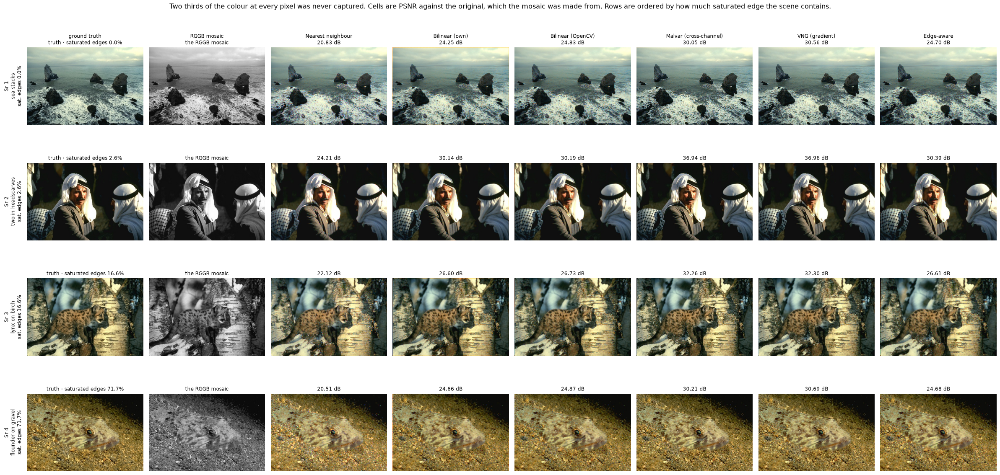
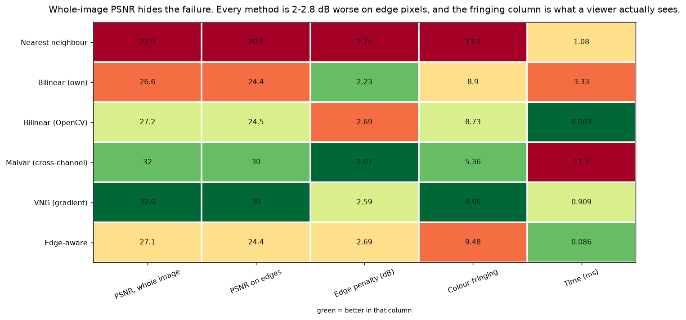
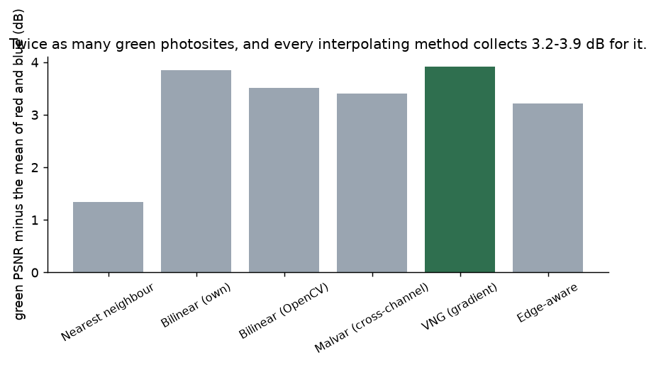
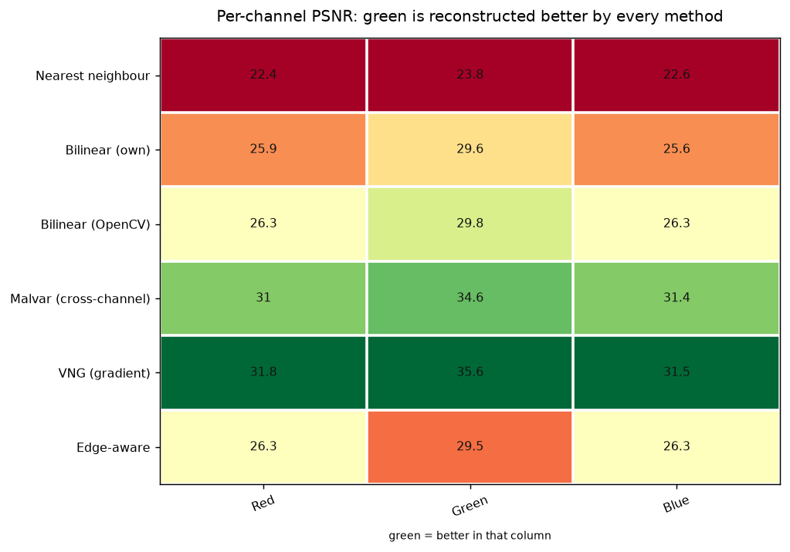
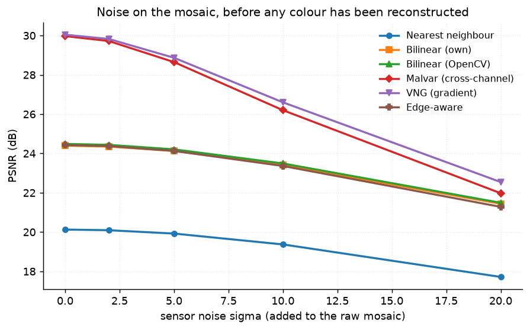

# 51 · Demosaicing — classical computer vision

[](https://www.python.org/)
[](https://opencv.org/)
[](#)
[](#)

A camera sensor records one colour per photosite. **Two thirds of the colour at
every pixel is never captured** — it is invented, before anyone sees the picture.
Six ways of inventing it, measured against the original the mosaic was made from.

> **The claim under test:** demosaicing error is not spread evenly. It
> concentrates on high-frequency, saturated edges, and whole-image PSNR hides
> that. **Every method here is 2.1–2.8 dB worse on edge pixels**, and the
> difference between a good method and a bad one — 9.75 dB — is entirely a
> question of whether it uses the green channel to guide the other two.

**No neural network, no training, no GPU.**

---

## Results

Four photographs mosaicked to a single RGGB channel and reconstructed. Rows are
ordered by how much saturated edge the scene contains — the project's own failure
condition. Cells are PSNR against the original.



| Sr | Scene | Nearest | Bilinear (own) | Bilinear (CV) | **Malvar** | **VNG** | Edge-aware |
|---:|---|---:|---:|---:|---:|---:|---:|
| 1 | sea stacks · sat. edges 0.0% | 20.83 | 24.25 | 24.83 | 30.05 | **30.56** | 24.70 |
| 2 | two in headscarves · 2.6% | 24.21 | 30.14 | 30.19 | 36.94 | **36.96** | 30.39 |
| 3 | lynx on birch · 16.6% | 22.12 | 26.60 | 26.73 | 32.26 | **32.30** | 26.61 |
| 4 | flounder on gravel · 71.7% | 20.51 | 24.66 | 24.87 | 30.21 | **30.69** | 24.68 |

Over all twelve:

| Method | PSNR | **On edges** | Edge penalty | Colour fringing | SSIM | Time (ms) |
|---|---:|---:|---:|---:|---:|---:|
| Nearest neighbour | 22.88 | 20.13 | **2.75** | 13.90 | 0.7621 | 1.03 |
| Bilinear (own) | 26.63 | 24.40 | 2.23 | 8.90 | 0.8481 | 3.10 |
| Bilinear (OpenCV) | 27.18 | 24.48 | 2.69 | 8.73 | 0.8504 | **0.05** |
| **Malvar (cross-channel)** | 32.04 | 29.97 | **2.07** | **5.36** | 0.9580 | 11.03 |
| **VNG (gradient)** | **32.63** | **30.04** | 2.59 | **4.96** | **0.9597** | 0.87 |
| Edge-aware | 27.11 | 24.43 | 2.69 | 9.48 | 0.8469 | 0.06 |

---

## The signature result: whole-image PSNR hides the failure



| Method | whole image | on edge pixels | penalty |
|---|---:|---:|---:|
| Nearest neighbour | 22.88 | 20.13 | **−2.75 dB** |
| Bilinear (own) | 26.63 | 24.40 | −2.23 dB |
| Bilinear (OpenCV) | 27.18 | 24.48 | −2.69 dB |
| Malvar (cross-channel) | 32.04 | 29.97 | −2.07 dB |
| VNG (gradient) | 32.63 | 30.04 | −2.59 dB |
| Edge-aware | 27.11 | 24.43 | −2.69 dB |

**Every method, without exception.** Most of a photograph is smooth, and
interpolating a missing colour across a smooth region is trivial — so the
whole-image average is dominated by the pixels where the problem does not exist.
The failure lives on the 3% of pixels that are edges, and it is 2 to 3 dB deep
there.

The **colour fringing** column is what a viewer actually notices: a magenta or
cyan halo on a high-contrast edge, caused by red, green and blue being
interpolated to slightly different places. Malvar and VNG cut it roughly in half.

---

## What actually helps: using green to place red and blue




The Bayer pattern is **half green**, a quarter red, a quarter blue — because the
eye's luminance response peaks in green. Every interpolating method collects that:

| Method | Red | **Green** | Blue | green advantage |
|---|---:|---:|---:|---:|
| **Nearest neighbour** | 22.38 | 23.82 | 22.58 | **+1.34 dB** |
| Bilinear (own) | 25.85 | 29.55 | 25.55 | +3.85 dB |
| Bilinear (OpenCV) | 26.25 | 29.80 | 26.34 | +3.51 dB |
| Malvar (cross-channel) | 30.98 | 34.58 | 31.38 | +3.40 dB |
| **VNG (gradient)** | 31.84 | 35.61 | 31.55 | **+3.91 dB** |
| Edge-aware | 26.25 | 29.51 | 26.34 | +3.21 dB |

**Nearest neighbour collects only 1.34 dB where the others collect 3.2–3.9.** It
copies a neighbour rather than interpolating between them, and copying cannot
exploit having twice as many to copy from. That is the density argument isolated:
the advantage is not in *having* more green samples, it is in averaging them.

> **Cross-channel interpolation is worth +4.86 dB** — 27.18 to 32.04 — and cuts
> colour fringing from 8.73 to 5.36. Green's gradients are known twice as well as
> red's or blue's, so Malvar and VNG use them to decide *where* to place the red
> and blue estimates. The bilinear methods interpolate each channel in isolation
> and cannot.

---

## The flag that is named for the thing it does not do

| | whole image | **on edges** |
|---|---:|---:|
| Bilinear (OpenCV) | 27.18 | 24.48 |
| **Edge-aware (OpenCV)** | **27.11** | **24.43** |
| Malvar (cross-channel) | 32.04 | 29.97 |

OpenCV's `COLOR_Bayer*2RGB_EA` produces **genuinely different pixels** from its
bilinear — up to 59 grey levels apart — and scores the same on both metrics,
including the edge metric it is named for. Both sit about 5 dB behind the
cross-channel methods.

This is reported because the name promises otherwise, and because it locates the
real gain: not in edge-adaptive weighting within a channel, but in using one
channel to inform another.

---

## The four Bayer phases are the same problem

| Pattern | RGGB | BGGR | GRBG | GBRG |
|---|---:|---:|---:|---:|
| Malvar PSNR | 32.039 | 32.014 | 32.028 | 32.017 |

Spread across all four: **0.025 dB**. Which corner the pattern starts in is a
relabelling, not a different problem — worth measuring once so it can be stopped
being wondered about.



Sensor noise lands on the raw mosaic, *before* any colour exists. Every method
degrades with it, and the cross-channel methods keep their lead throughout: a
better interpolator does not become a worse one because the samples are noisy.

---

## How the images were chosen

Twelve photographs ranked by **this project's own failure condition** — the share
of pixels that are both an edge and saturated. No stock axis in
`tools/select_images.py` measures it, and nothing else predicts where the methods
separate.

```
sea_stacks           0.0%    diver_and_coral     14.2%
kangaroo_resting     0.2%    lynx_on_birch       16.6%
laden_donkey         1.4%    villa_on_the_lake   22.4%
two_in_headscarves   2.6%    sandstone_ladder    29.1%
bison_in_snow        4.5%    flounder_on_gravel  71.8%
mono_lake_tufa       7.1%    drying_racks         8.7%
```

The sea stacks are grey surf with no saturated edge anywhere — the control. The
flounder is saturated texture across the whole frame. None of the twelve appears
in any other project; `tools/check_image_reuse.py` enforces that by perceptual
hash.

---

## Try it on your own image

```bash
python infer.py photo.jpg                      # mosaic it, then recover it six ways
python infer.py photo.jpg --pattern GRBG
python infer.py --photo flounder_on_gravel --method "VNG (gradient)" --out out.png
```

Your image is mosaicked here, so the original *is* the ground truth and the PSNR
printed is real — one of the few places in this repository where that is true for
an arbitrary input. It also reports your image's saturated-edge share, which
predicts how much the methods will separate on it before any of them runs.

---

## Limitations

* **The mosaic is simulated from an 8-bit JPEG.** A real raw file is 12 or 14 bits
  and linear; these photographs have already been demosaiced, gamma-encoded and
  compressed once, so the "original" is not a raw sensor reading and the absolute
  PSNRs are optimistic.
* **No optical low-pass filter.** Real sensors have one precisely to band-limit
  the scene before sampling, which is the correct fix for the aliasing that
  causes colour fringing. Simulating the mosaic without it makes the problem
  harder than a real camera's.
* **`edge_mask` is a dilated Canny**, so "edge pixels" is a choice. The penalty
  is measured consistently across methods, and the ranking does not depend on the
  dilation, but the absolute 2–3 dB does.
* **Colour fringing is measured as chroma error on edge pixels.** It correlates
  with what a viewer sees; it is not a perceptual model.
* **Noise is added to the mosaic as white Gaussian.** Real sensor noise is
  photon-shot-limited and therefore signal-dependent.

---

## Tests

14 tests, run with `pytest projects/51_demosaicing/tests -q`. They pin the mosaic
(one channel per pixel, half of them green, the raw value equal to the true
value) and every finding: that the error concentrates on edges for every method,
that cross-channel interpolation is what actually helps, that the edge-aware flag
does not help on edges *and* is nonetheless a different algorithm, that every
interpolating method collects the green density while nearest neighbour does not,
that interpolation is worth nearly ten decibels, and that the four Bayer phases
are the same problem.

---

## Keywords

demosaicing · debayering · Bayer pattern · colour filter array · CFA · RGGB ·
bilinear interpolation · Malvar-He-Cutler · VNG · variable number of gradients ·
edge-aware demosaicing · colour fringing · zipper artefacts · ISP · camera
pipeline · classical computer vision · no deep learning · OpenCV · Python ·
CPU only · reproducible image processing experiments

## References

* Bayer, *Color Imaging Array*, US Patent 3,971,065, 1976.
* Malvar, He & Cutler, *High-quality linear interpolation for demosaicing of
  Bayer-patterned color images*, ICASSP 2004.
* Chang, Cheung & Pang, *Variable Number of Gradients* demosaicing, 1999.
* Li, Gunturk & Zhang, *Image demosaicing: a systematic survey*, SPIE 2008.
* Gunturk et al., *Demosaicking: color filter array interpolation*, IEEE Signal
  Processing Magazine 2005 — on why cross-channel correlation is the key.
