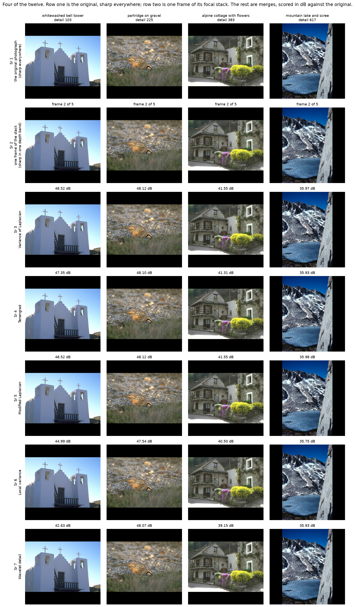
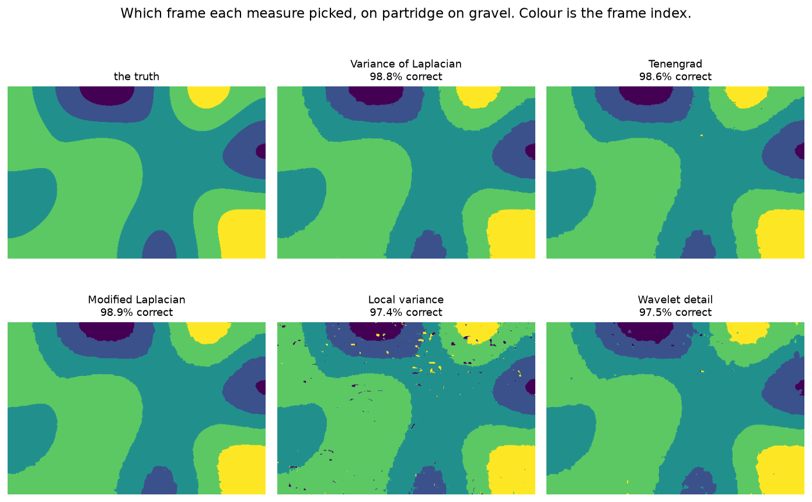
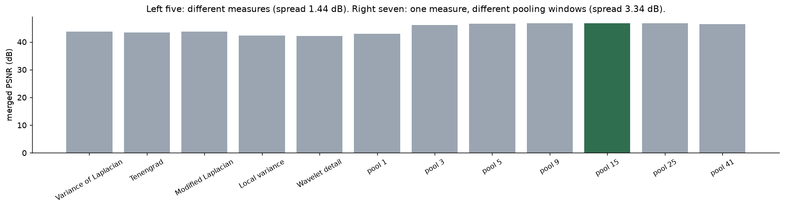
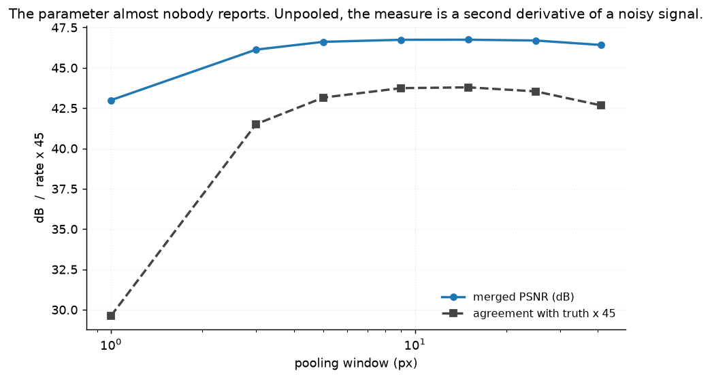
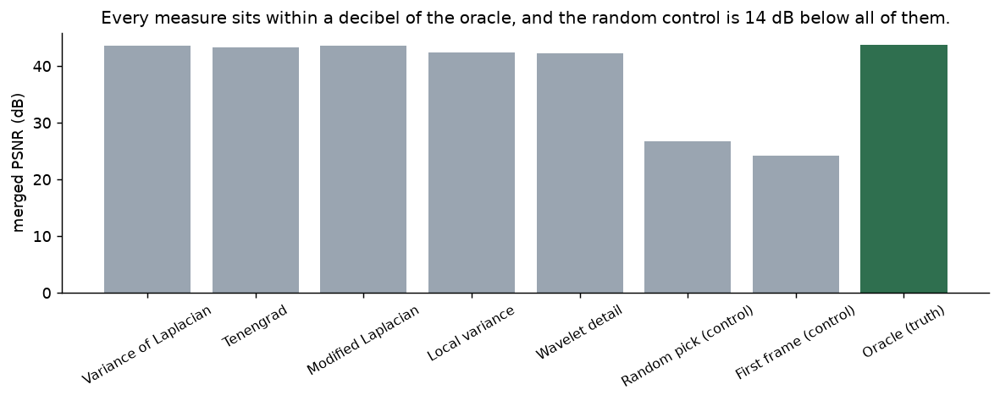
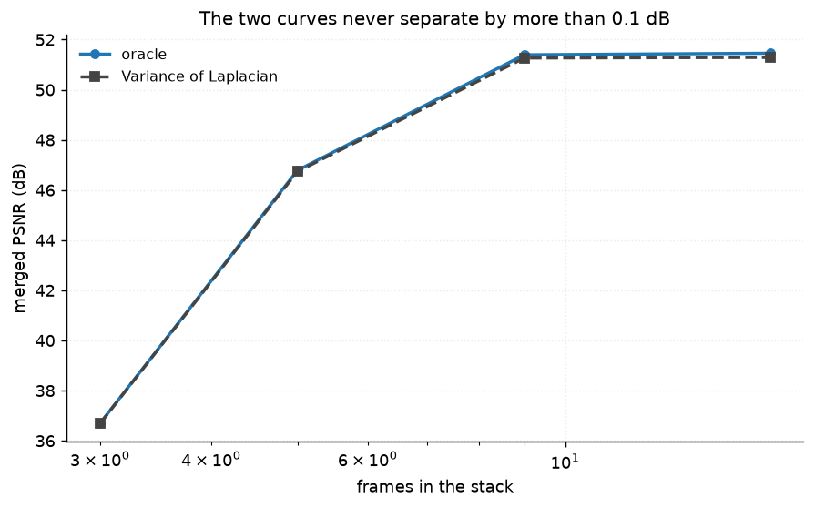
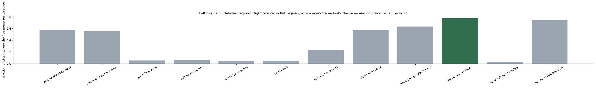
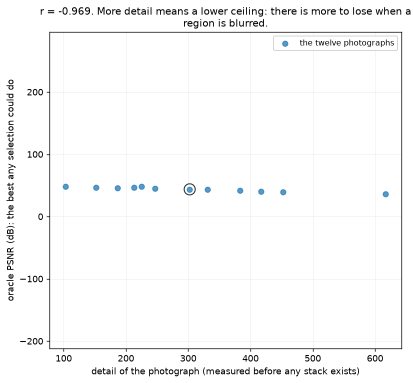
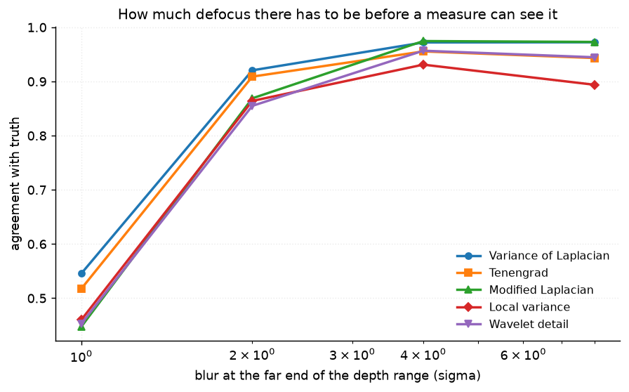

# 51 · Focus stacking / depth from focus — classical computer vision

[](https://www.python.org/)
[](https://opencv.org/)
[](#)
[](#)

A macro photographer shoots a stack at different focus distances and merges them
into one image sharp everywhere. The merge needs a **focus measure**: a per-pixel
number saying how in-focus this frame is here. Five measures, three controls,
twelve photographs, and a truth that is recorded rather than estimated.

> **The measure is not what decides the result.** The five land within **1.44 dB**
> of each other, and the best is **0.034 dB** from an oracle that is handed the
> answer. Changing the window the response is pooled over — a parameter almost
> nobody reports — moves the result **3.34 dB**, 2.3× as far.

> **What the task is worth:** picking a source frame per pixel at random scores
> **26.7 dB**; picking correctly scores **43.7**. So the problem is worth 17 dB,
> and every measure here captures at least **15.5** of it. The arguments in the
> literature are over the last decibel and a half.

> **Where no measure can be right:** on a flat region every frame is identically
> smooth, so there is no evidence at all. Agreement with the truth falls from
> **0.982** in detailed regions to **0.496** in flat ones, and the five measures
> disagree with *each other* on **58%** of flat pixels against **11%** elsewhere.

**No neural network, no training, no GPU.**

---

## Results

Four of the twelve. Row 1 is the original photograph, sharp everywhere; row 2 is
one frame of its focal stack. The rest are merges, scored in dB against the
original.



| Sr | Photograph | Detail | Flat share | Random (dB) | Oracle (dB) | Var. of Laplacian | Tenengrad | Modified Laplacian | Local variance | Wavelet detail |
|---:|---|---:|---:|---:|---:|---:|---:|---:|---:|---:|
| 1 | whitewashed bell tower | 103 | **1.2%** | 31.31 | **48.61** | 48.52 | 47.35 | **48.52** | 44.99 | 42.63 |
| 2 | partridge on gravel | 225 | 0.0% | 29.13 | 48.13 | 48.12 | 48.10 | **48.12** | 47.54 | 48.07 |
| 3 | alpine cottage with flowers | 383 | 1.1% | 24.27 | 41.58 | 41.55 | 41.31 | **41.55** | 40.50 | 39.15 |
| 4 | mountain lake and scree | 617 | 0.1% | 20.01 | 35.99 | 35.97 | 35.93 | **35.98** | 35.75 | 35.93 |

| Method | PSNR (dB) | Agreement with truth | |
|---|---:|---:|---|
| **Oracle (truth)** | **43.686** | 1.0000 | control |
| Modified Laplacian | **43.652** | **0.9763** | |
| Variance of Laplacian | 43.645 | 0.9724 | |
| Tenengrad | 43.347 | 0.9541 | |
| Local variance | 42.325 | 0.9307 | |
| Wavelet detail | 42.209 | 0.9536 | |
| **Random pick** | **26.711** | 0.2002 | control |
| **First frame** | **24.170** | 0.0248 | control |

*The random control gets 0.2002 of pixels right, which is exactly 1/5 for a
five-frame stack — the arithmetic check that the truth mask is what it claims to
be.*



---

## The signature result: pooling beats the measure



| Pooling window | 1 | 3 | 5 | 9 | 15 | 25 | 41 |
|---|---:|---:|---:|---:|---:|---:|---:|
| PSNR (dB) | **42.99** | 46.13 | 46.61 | 46.74 | **46.74** | 46.69 | 46.42 |
| Agreement with truth | **0.658** | 0.922 | 0.959 | 0.972 | **0.973** | 0.968 | 0.948 |

| | spread |
|---|---:|
| across the five measures | **1.443 dB** |
| across pooling windows | **3.342 dB** |



**Unpooled, the best measure gets 0.658 of pixels right. Pooled over 15 px, 0.973.**

The reason is not subtle once stated: a focus response is a *second derivative of
a noisy signal*, evaluated at one pixel. It is almost all noise. The window is
what turns it into a measurement, and it has an optimum — at 41 px the window has
grown larger than the depth structure and agreement falls again.

Every paper proposing a new focus measure specifies a pooling window somewhere in
its implementation section. On this data that choice is worth more than the
measure the paper is about.

---

## What the problem is worth



Between "pick at random" (26.7 dB) and "pick correctly" (43.7 dB) there are
**17.0 dB**, and the worst real measure captures 15.5 of them. That is the shape
of this problem: almost all of the available benefit is captured by any
reasonable answer, and the remaining 1.4 dB is what five decades of focus-measure
papers have been dividing up.



| Frames in the stack | 3 | 5 | 9 | 17 |
|---|---:|---:|---:|---:|
| Oracle (dB) | 36.701 | 46.784 | 51.394 | 51.456 |
| Variance of Laplacian (dB) | 36.692 | 46.738 | 51.266 | 51.290 |
| **Gap** | **0.009** | **0.047** | **0.127** | **0.166** |

**The gap to the oracle never exceeds 0.17 dB at any stack depth.** The selection
step is essentially solved; the ceiling is set by how finely the stack samples
depth, not by how it is searched. From 9 frames to 17 the oracle itself gains
0.06 dB — the stack has stopped sampling anything new.

---

## Where no measure can be right



| Photograph | Flat share | Measures disagree, **detailed** | Measures disagree, **flat** |
|---|---:|---:|---:|
| whitewashed bell tower | 1.2% | 0.151 | **0.578** |
| mossy boulders in a valley | 8.4% | 0.101 | **0.553** |
| picnic in the snow | 5.1% | 0.118 | **0.571** |
| alpine cottage with flowers | 1.1% | 0.085 | **0.634** |

| | Agreement with truth |
|---|---:|
| in detailed regions | **0.9822** |
| in flat regions | **0.4960** |

A flat region looks identical in every frame of the stack — that is what "flat"
means here. There is no evidence, so the argmax is decided by noise, and the five
measures scatter. **This is not a failure of any measure**; no measure could do
better, because the information is absent.

It is also predictable. `flat_share` is computed from the original photograph,
before any stack exists, and the seven photographs with any flat region at all
are exactly the ones where the measures scatter.

---

## The ceiling, and why its sign is the interesting part



**r = −0.969** between a photograph's detail and the oracle PSNR — the best score
any selection could reach.

**Negative.** More detail means a *lower* ceiling, and that is the opposite of
what the flat-region section might suggest. Both are true and they are about
different things:

* a **flat** region has no information about *which frame* is sharp, so selection
  fails there — but getting it wrong costs almost nothing, because every frame
  looks the same;
* a **detailed** region makes selection easy and makes each mistake expensive,
  and there is no such thing as a merge with no mistakes.

The whitewashed bell tower (detail 103) reaches 48.6 dB; the mountain lake
(detail 617) reaches 36.0. Six times the detail, 12.6 dB less headroom.



| Blur at the far end of the range (σ) | 1 | 2 | 4 | 8 |
|---|---:|---:|---:|---:|
| Variance of Laplacian | **0.545** | 0.921 | 0.972 | 0.972 |
| Modified Laplacian | **0.447** | 0.869 | 0.975 | 0.973 |
| Local variance | **0.460** | 0.864 | 0.931 | 0.894 |

**At σ 1 across the whole depth range, adjacent frames differ by 0.25 σ and every
measure falls to about half right.** There has to be enough defocus difference
between frames for any of this to work — which is a statement about how the stack
was *shot*, not about the merge.

*An earlier version of this sweep was non-monotone, with a dip at σ 2. That was
an artefact: the stack was approximated with nine blur levels whatever σ was, so
a small-σ stack was approximated eight times more finely than a large-σ one. The
levels now use a fixed σ step, and the curve is monotone. The artefact is
described here rather than deleted because it was not visible in any single
number — only in the shape of the sweep.*

---

## Where the ground truth came from

The stack is **built**, so the truth is recorded rather than estimated. Each
source frame is the real photograph blurred everywhere except in one band of a
smooth synthetic depth map, and the index of the frame that is sharp at each pixel
is written down. The merge is scored against the original, which is sharp
everywhere.

**What is real and what is not:** the photograph is real, the depth map is not.

That is the right way round, because **a real focal stack has no ground truth at
all** — there is no single all-sharp frame of a real scene to compare against, and
that is exactly why the field evaluates focus measures on synthetic stacks. This
project does the same thing and says so.

The depth map is smoothed heavily on purpose: a per-pixel random depth would make
the truth mask salt-and-pepper, which nothing could win and which would flatter
whichever measure pooled most.

---

## Try it

```bash
python infer.py --image mountain_lake_and_scree
python infer.py --image whitewashed_bell_tower --pool 1
python infer.py --image picnic_in_the_snow --sigma 1
python infer.py photo.jpg --frames 9
```

Every run prints the oracle and the random control alongside the measures, so the
17 dB the task is worth and the 1.4 dB the measures are arguing over are both
visible. `--pool 1` shows what the raw unpooled response is worth.

---

## Limitations

* **The depth map is synthetic.** Real depth has occlusion boundaries, where the
  foreground and background are both partly visible and no single source frame is
  right; this construction has none, and that is the single biggest thing it does
  not test.
* **Defocus is modelled as a Gaussian blur.** A real lens produces a disc-shaped
  bokeh with a hard edge, and out-of-focus highlights bloom. A Gaussian is
  smoother than reality and probably easier.
* **No misalignment between frames.** A real focal stack shifts magnification as
  the focus ring turns — focus breathing — and has to be registered first. Every
  frame here is pixel-aligned by construction.
* **Blur is applied to an already-captured photograph**, which is not the same as
  capturing out of focus: the original already contains the lens's own blur, so
  the "sharp" frame is not infinitely sharp.
* **The stack is approximated with discrete blur levels**, spaced 0.25 σ apart
  and blended. That is an approximation, and finding where it mattered is
  described above.
* **PSNR against the original** rewards getting smooth regions right, which are
  the easy ones. The agreement-with-truth column is the harsher number and both
  are reported.

---

## Tests

18 tests, run with `pytest projects/51_focus_stacking/tests -q`. They pin the
result (the pooling spread exceeds the measure spread by more than 2×; the best
measure is within 0.1 dB of the oracle; every measure captures more than 90% of
what the task is worth; agreement collapses in flat regions and the measures
scatter there), the construction (the truth contains no focus measure, each frame
really is sharpest in its own band, every frame is worse than the original, the
depth map is smooth, and the random control gets exactly 1/N right), and the blur
sweep whose earlier non-monotonicity was a construction artefact.

---

## Keywords

focus stacking · depth from focus · focus measure · variance of Laplacian ·
Tenengrad · modified Laplacian · sum-modified Laplacian · wavelet focus ·
all-in-focus · extended depth of field · focal stack · macro photography ·
classical computer vision · no deep learning · OpenCV · Python · CPU only ·
reproducible image processing experiments

## References

* Nayar & Nakagawa, *Shape from Focus*, TPAMI 1994 — the modified Laplacian and
  the reason a plain Laplacian can cancel.
* Pertuz, Puig & García, *Analysis of focus measure operators for shape-from-focus*,
  Pattern Recognition 2013 — a survey of thirty-six measures, and the paper this
  project is implicitly arguing with.
* Subbarao & Choi, *Accurate Recovery of Three-Dimensional Shape from Image
  Focus*, TPAMI 1995 — on the window size, which this project finds to matter more
  than the operator.
* Photographs come from BSDS500; provenance for each is recorded in
  `assets/real/README.md`.
