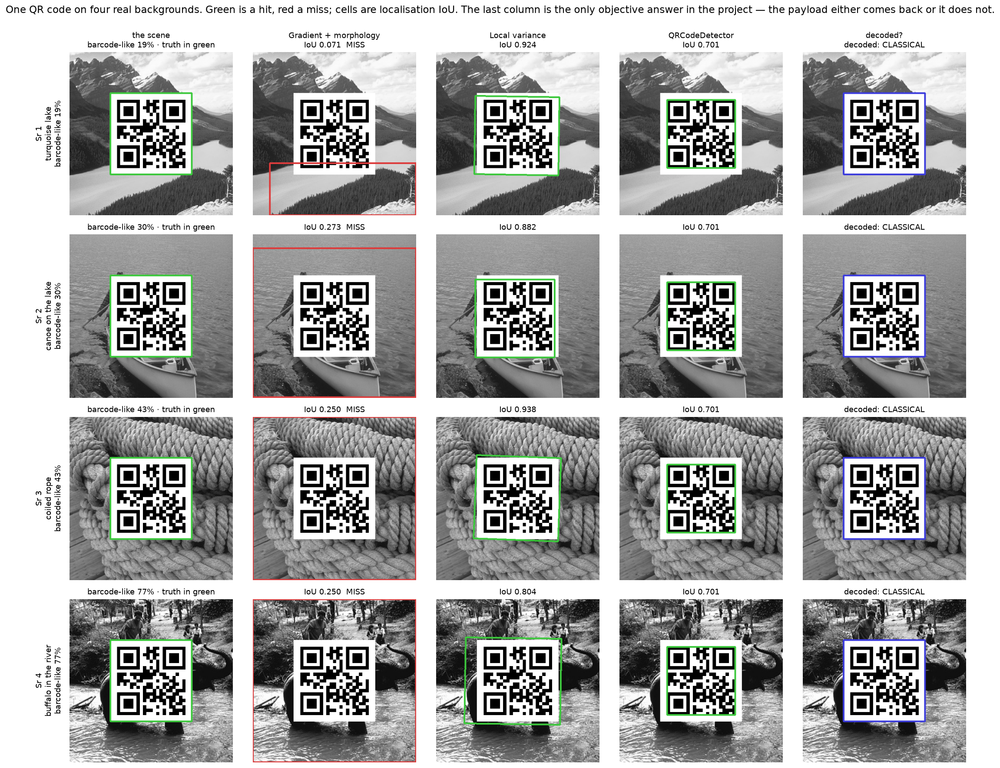
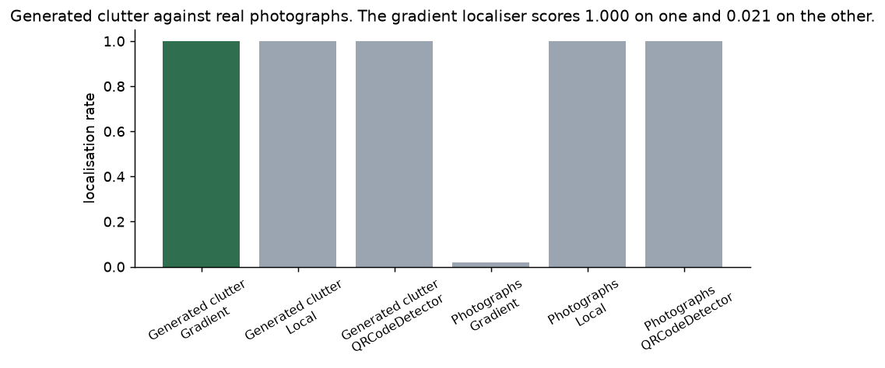
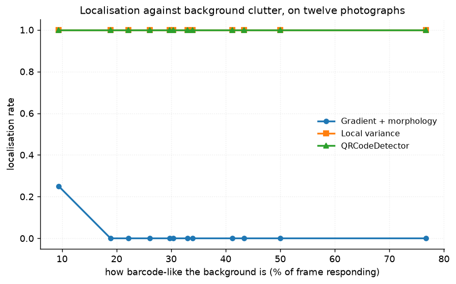
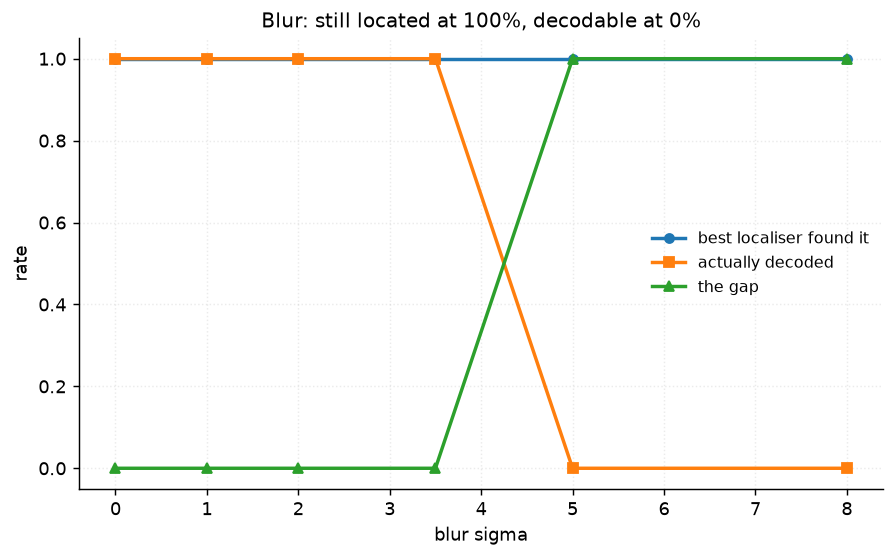
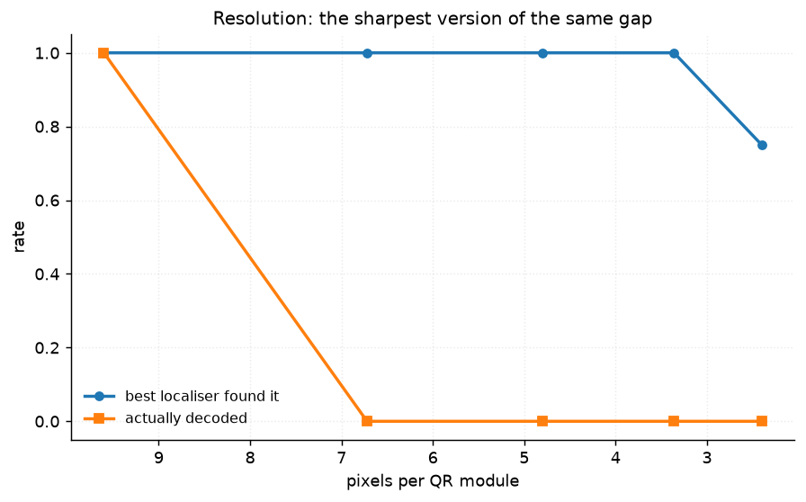
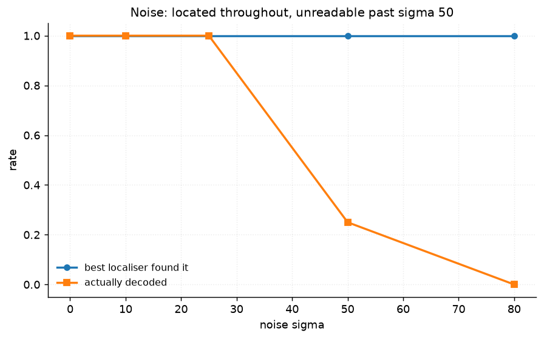
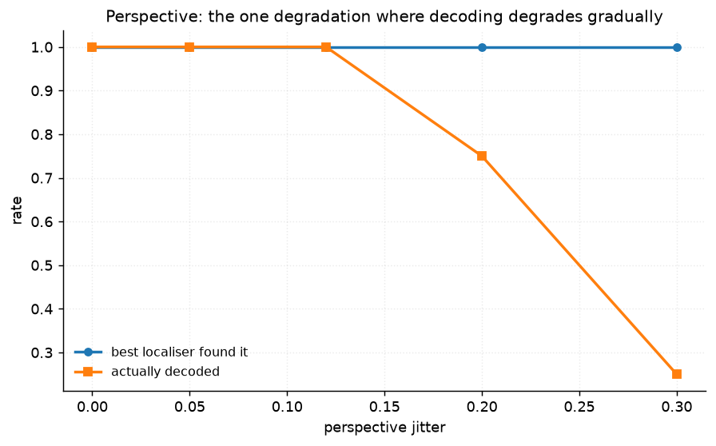

# 53 · Barcode and QR detection — classical computer vision

[](https://www.python.org/)
[](https://opencv.org/)
[](#)
[](#)

Most "barcode detection" demos stop at drawing a box. That is the easy half, and
it hides both of this project's results.

> **The claim under test:** localisation and decoding degrade at different rates.
> True, and by a lot — at blur σ 5, at 6.7 pixels per module, and at noise σ 80,
> the code is **located 100% of the time and decoded 0%**. A detection rate
> overstates a pipeline by exactly that gap.

> **And the thing the synthetic background was hiding:** the gradient localiser
> scores **1.000 on generated clutter and 0.021 on real photographs**. Random
> rectangles have no repeating vertical structure; a barcode localiser looks for
> exactly that.

Decoding gives something rare in this repository: a **binary, objective ground
truth** with no metric choice at all. The payload comes back or it does not.

**No neural network, no training, no GPU.**

---

## Results

One QR code placed on four real backgrounds. Green is a hit, red a miss; cells
are localisation IoU. The last column is the objective one.



| Sr | Background | Gradient + morphology | Local variance | QRCodeDetector | Decoded |
|---:|---|---:|---:|---:|---|
| 1 | turquoise lake · barcode-like 19% | **0.071** | 0.924 | 0.701 | **yes** |
| 2 | canoe on the lake · 30% | **0.273** | 0.882 | 0.701 | **yes** |
| 3 | coiled rope · 43% | **0.250** | 0.938 | 0.701 | **yes** |
| 4 | buffalo in the river · 77% | **0.250** | 0.804 | 0.701 | **yes** |

*A box counts as found at IoU ≥ 0.40, so every gradient entry here is a miss and
every variance entry a hit. The QR detector's flat 0.701 is the code's own
quiet-zone margin: it returns the module grid, which is slightly inside the
pasted square.*

---

## The signature result: the background was doing the work



| Background | Gradient + morphology | Local variance | QRCodeDetector | Decoded |
|---|---:|---:|---:|---:|
| **Generated clutter** | **1.000** | 1.000 | 1.000 | 1.000 |
| **Twelve photographs** | **0.021** | 1.000 | 1.000 | 1.000 |

**A 48× difference, on one of the three localisers, from changing nothing but the
background.** The generated scene is random rectangles on blurred noise: it has
no repeating vertical structure anywhere. A 1-D barcode localiser works by
finding strong horizontal gradient with weak vertical gradient and closing it up
— which is what a barcode *is*, and also what zebra stripes, saguaro ribs and
coiled rope are.

The other two localisers are unchanged at 1.000, which is what makes this a
property of the cue rather than of the photographs being harder in general.



| Photograph | barcode-like | Gradient | Variance | QRCodeDetector |
|---|---:|---:|---:|---:|
| bomber over cloud | 9.4% | **0.250** | 1.000 | 1.000 |
| zebra herd | 26.1% | 0.000 | 1.000 | 1.000 |
| saguaro blossom | 41.2% | 0.000 | 1.000 | 1.000 |
| buffalo in the river | 76.7% | 0.000 | 1.000 | 1.000 |

The only background the gradient localiser ever succeeds on is the bomber against
open sky — 9.4% of the frame responding, and even there it manages one time in
four.

**And decoding does not care about the background at all**: 1.000 on both. It
reads the code rather than hunting for it.

---

## Found is not decoded



| Blur σ | 0 | 1 | 2 | 3.5 | **5** | 8 |
|---|---:|---:|---:|---:|---:|---:|
| Located | 1.000 | 1.000 | 1.000 | 1.000 | **1.000** | **1.000** |
| Decoded | 1.000 | 1.000 | 1.000 | 1.000 | **0.000** | **0.000** |



| Pixels per module | 9.6 | **6.7** | 4.8 | 3.4 | 2.4 |
|---|---:|---:|---:|---:|---:|
| Located | 1.000 | **1.000** | 1.000 | 1.000 | 0.750 |
| Decoded | 1.000 | **0.000** | 0.000 | 0.000 | 0.000 |

**Resolution is the sharpest version.** Between 9.6 and 6.7 pixels per module the
decode rate goes from 1.000 to 0.000 while the localisation rate does not move at
all. A system reporting "detected" is reporting nothing about whether it worked.




| Noise σ | 0 | 10 | 25 | **50** | 80 |
|---|---:|---:|---:|---:|---:|
| Located | 1.000 | 1.000 | 1.000 | **1.000** | 1.000 |
| Decoded | 1.000 | 1.000 | 1.000 | **0.250** | 0.000 |

**Perspective is the only degradation that degrades gradually** — 1.000, 1.000,
1.000, 0.750, 0.250 as the jitter grows. Everything else is a cliff, because
error correction either has enough intact modules or it does not.

---

## What a QR code shrugs off

| Rotation | 0° | 5° | 15° | 30° | **45°** | 90° |
|---|---:|---:|---:|---:|---:|---:|
| **Decoded** | 1.000 | 1.000 | 1.000 | 1.000 | **1.000** | 1.000 |
| Gradient + morphology | 1.000 | 1.000 | 1.000 | 1.000 | **0.000** | 1.000 |
| Local variance | 1.000 | 1.000 | 1.000 | 1.000 | **1.000** | 1.000 |

**Rotation costs decoding nothing** — a QR code carries three finder patterns
precisely so that its orientation can be recovered. It costs the gradient
localiser everything at 45°, where horizontal and vertical gradient are equal by
construction and the cue it depends on vanishes. At 90° the cue is back and so is
the localiser.

---

## How the images were chosen

Twelve photographs ranked by **how much they already look like a barcode** to the
localiser's own cue — horizontal gradient minus vertical, blurred, closed with a
wide rectangle, Otsu-thresholded. That is `locate_gradient_morphology` up to the
contour step, so the axis is the method's own response rather than a proxy for it.

```
bomber_over_cloud      9.4%    skiff_in_weed        33.9%
turquoise_lake        18.9%    saguaro_blossom      41.2%
polar_bears_playing   22.2%    coiled_rope          43.4%
zebra_herd            26.1%    giraffes_drinking    50.0%
canoe_on_the_lake     29.7%    buffalo_in_the_river 76.7%
cougar_among_birches  30.4%    trocadero_statue     33.0%
```

The bomber against open sky is the control. The zebras, the saguaro ribs and the
coiled rope are the genuine false positives — repeating vertical structure is
what a 1-D barcode is. None of the twelve appears in any other project;
`tools/check_image_reuse.py` enforces that by perceptual hash.

---

## Try it on your own image

```bash
python infer.py photo.jpg                       # find and decode whatever is there
python infer.py --background zebra_herd --blur 4
python infer.py --background coiled_rope --scale 0.5
```

With `--background` a code of known payload is placed on one of the project's
photographs, so both the localisation IoU and the decode are checked against
truth. On your own photograph there is no truth, so what is printed is each
localiser's box, whether anything decoded, and your image's barcode-like share —
which predicts the gradient localiser's false positives before it runs.

---

## Limitations

* **The codes are generated and pasted, not photographed.** A real barcode is
  printed on a curved, specular, unevenly lit surface; here it is a clean binary
  image under a known homography. Every rate in this project is an upper bound.
* **`make_code39` implements a subset of Code 39** sufficient for the payloads
  used. It is not a general encoder.
* **The 1-D decoder is OpenCV's `BarcodeDetector`**, whose availability and
  *arity* both vary by build — this project handles the three- and four-value
  forms and reports whether a decoder exists at all, because "0% decoded" and
  "no decoder installed" are very different findings.
* **`FOUND_IOU = 0.4` is a threshold choice.** The gradient localiser's 0.021 is
  not sensitive to it — it mostly returns boxes with near-zero overlap — but the
  boundary cases are.
* **One code per image.** Real scanners deal with several codes in frame, partial
  occlusion and codes at the edge of the field, none of which is tested here.

---

## Tests

13 tests, run with `pytest projects/53_barcode_qr/tests -q`. They pin the ground
truth (a decoded payload being the only objective answer, the true corners, the
decoder arity that changed between OpenCV versions) and every finding: that the
generated background flatters the gradient localiser, that decoding does not care
about the background, that localisation survives long after decoding stops on
three separate degradations, that resolution is the sharpest version of that gap,
that perspective is the one that degrades gradually, that rotation costs decoding
nothing, and that 45° is where the gradient cue vanishes.

---

## Keywords

barcode detection · QR code · QRCodeDetector · Code 39 · localisation ·
decoding · gradient morphology · local variance · finder pattern · error
correction · perspective · resolution limit · pixels per module ·
classical computer vision · no deep learning · OpenCV · Python · CPU only ·
reproducible image processing experiments

## References

* ISO/IEC 18004 — the QR code specification, including the finder patterns that
  make rotation free.
* ISO/IEC 16388 — Code 39.
* Zamberletti, Gallo & Albertini, *Robust Angle Invariant 1D Barcode Detection*,
  ACPR 2013 — on why gradient-orientation cues fail at 45°.
* Gallo & Manduchi, *Reading 1-D Barcodes with Mobile Phones Using Deformable
  Templates*, TPAMI 2011 — on the resolution limit.
