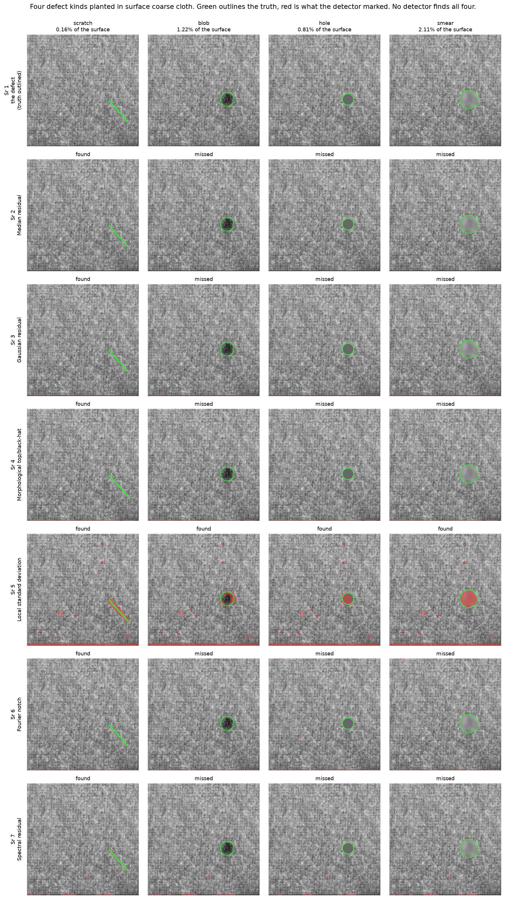
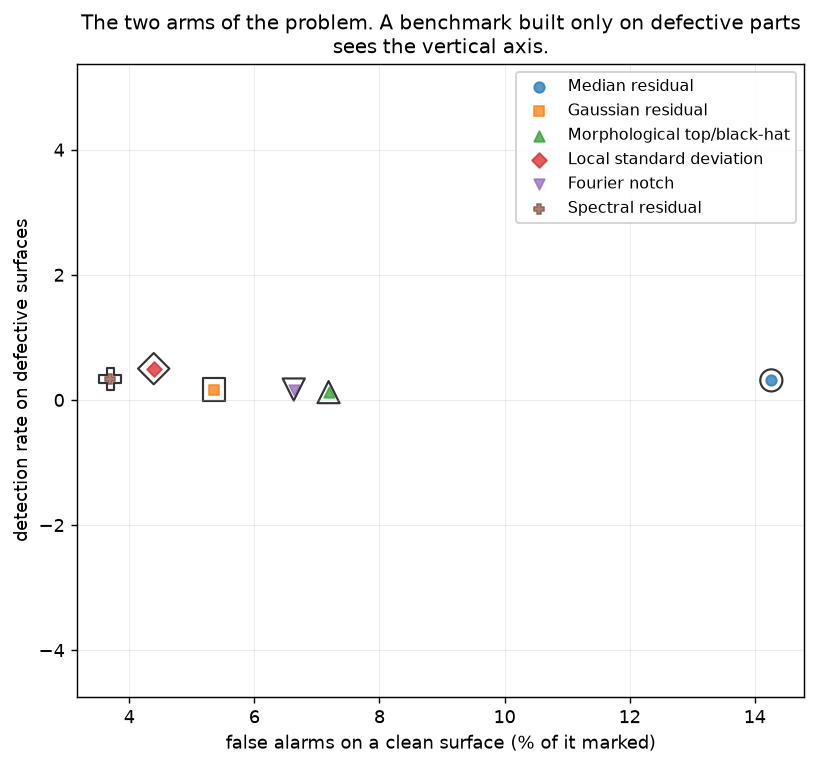
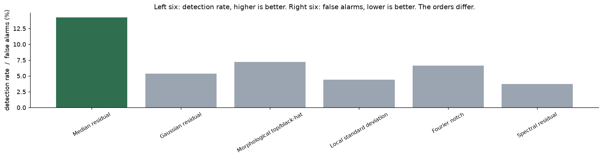
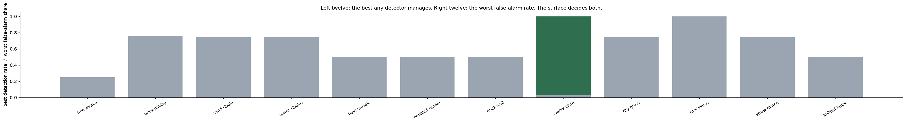
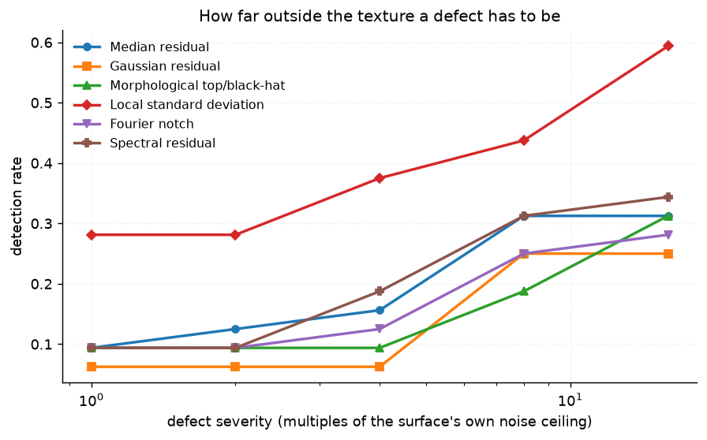
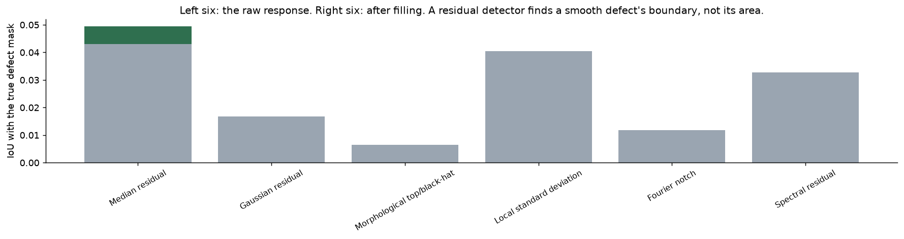

# 53 · Industrial defect detection — classical computer vision

[](https://www.python.org/)
[](https://opencv.org/)
[](#)
[](#)

An inspection camera looks at a surface that is supposed to be uniform, and
anything breaking the uniformity is a defect. Every classical method is one idea
— **model what the surface should look like and flag the residual** — and they
differ only in what "should look like" means.

> **The detectors are complementary, not competing.** A **smear** — a local loss
> of texture at unchanged brightness — is found by the local standard deviation
> on **0.58** of attempts and by **4 of the other five exactly never**, because
> no intensity residual can see it at all. Picking "the best defect detector" is
> picking which defects to miss.

> **A benchmark built only on defective parts sees half the problem.** On the
> same twelve surfaces with **nothing wrong with them**, where the true answer is
> an empty mask, these detectors mark between **3.7% and 14.3%** of the surface.
> That is the number that stops a production line.

> **And the surface decides more than the detector does.** The best detection
> rate *any* of the six achieves spans **0.25 to 1.00** across the twelve
> surfaces — wider than the spread between any two detectors on one surface.

> **Pixel accuracy is unusable and is never reported.** A defect covers **1.07%**
> of a surface, so flagging nothing is right **98.92%** of the time.

**No neural network, no training, no GPU.**

---

## Results

Four defect kinds planted in one surface. Green outlines the truth, red is what
the detector marked.



| Sr | Defect | Median residual | Gaussian residual | Morphological | Local std dev | Fourier notch | Spectral residual |
|---:|---|:--:|:--:|:--:|:--:|:--:|:--:|
| 1 | scratch | ✅ | ✅ | ✅ | ✅ | ✅ | ✅ |
| 2 | blob | — | — | — | ✅ | — | — |
| 3 | hole | — | — | — | ✅ | — | — |
| 4 | smear | — | — | — | ✅ | — | — |

*One surface, one seed — the table over all twelve is below. A scratch is a step
in intensity and everything finds it; the other three are changes in **texture**
and only one detector is looking at texture.*

**4 of the six find a smear exactly never.** Not rarely — never, on twelve
surfaces.

The mechanism is not a surprise once it is stated, and it is checked directly
rather than inferred: inside the smear the **mean is unchanged** (within 6 grey
levels) and the **local standard deviation falls by more than 20%**. Every
detector except one works on an intensity residual, and there is no intensity
residual to find. The one that works on texture finds it.

A scratch is the opposite case — a step in intensity with no texture change — and
almost everything finds it.

So the honest summary of this table is not a ranking. It is: **decide what can go
wrong on your line, then pick the detector that can see it.** A system with one
detector has decided which defects to miss, whether or not anyone chose that.

---

## A clean surface is the other half of the problem



| Detector | Detection rate | False alarm share |
|---|---:|---:|
| Local standard deviation | **0.500** | 4.39% |
| Spectral residual | 0.333 | **3.70%** |
| Median residual | 0.312 | **14.27%** |
| Gaussian residual | 0.167 | 5.36% |
| Fourier notch | 0.167 | 6.63% |
| Morphological top/black-hat | 0.125 | 7.19% |

The two arms **do not rank the detectors the same way**. The median residual and
the spectral residual have almost identical detection rates
(0.312 and 0.333) and their
false-alarm rates differ by
**3.9x**. A comparison run
only on defective parts would call those two equivalent.



And the absolute numbers matter more than the ordering: **the best of these marks
3.7% of a good surface**. On a line running a part a second that is a false alarm
every thirty seconds. None of these detectors is deployable at this threshold —
which is a more useful conclusion than a ranking, and it is only visible because
the clean arm exists.

---

## The surface decides more than the detector



| Surface | Uniformity | Noise ceiling | Best detection rate | Worst false alarms |
|---|---:|---:|---:|---:|
| fine weave | 1.75 | 4.45 | 0.25 | 2.4% |
| brick paving | 2.07 | 4.45 | 0.75 | 75.6% |
| sand ripple | 3.67 | 11.86 | 0.75 | 4.1% |
| water ripples | 4.37 | 5.93 | 0.75 | 8.9% |
| field mosaic | 4.95 | 2.97 | 0.50 | 37.2% |
| pebbled render | 8.66 | 8.90 | 0.50 | 1.3% |
| brick wall | 10.02 | 5.93 | 0.50 | 26.5% |
| coarse cloth | 10.04 | 10.38 | 1.00 | 2.9% |
| dry grass | 13.72 | 37.06 | 0.75 | 0.7% |
| roof slates | 14.03 | 5.93 | 1.00 | 68.3% |
| straw thatch | 19.30 | 37.06 | 0.75 | 2.6% |
| knitted fabric | 20.24 | 5.93 | 0.50 | 10.9% |

**A spread of 0.75 in what is achievable at all**, against a spread of 0.375
between the best and worst detector overall. The surface is the bigger term.

The direction is the interesting part. `surface_fine_weave` is the **most
uniform** surface in the set — a defect detector's ideal — and it is the hardest,
at 0.25. Its noise ceiling is 4.45 grey levels — the lowest in the set — so a
defect scaled to eight times that is still faint next to what the codec
and the sensor do anyway. **A very uniform surface makes a defect faint, not obvious**, because the
defect is scaled to the surface it has to hide in.

That is a property of this construction and it is stated rather than hidden: a
real line has a defect of a fixed physical size, not one scaled to the texture.
Both framings are defensible and give different answers, which is why the
severity sweep is reported separately.

The worst false-alarm column is worth a second look too. On
`brick paving` some
detector marks **76%** of a perfectly
good surface — a strongly patterned surface is not merely hard, it defeats a
residual model completely, and the regular mortar grid is flagged as defect
everywhere.



---

## Where the ground truth came from

The surfaces are **photographs**; the defects are **planted**, with the mask
recorded. That is the only way to have an exact truth here — a photograph of a
genuinely defective part carries no mask, and drawing one by hand would make the
truth a matter of opinion.

The four kinds are the things that actually go wrong: a **scratch** (a thin line,
brighter or darker), a **blob** (a stain or dent, soft-edged), a **hole** (missing
material, flat and textureless) and a **smear** (a local loss of texture at
unchanged brightness).

**Severity is measured in multiples of the surface's own noise ceiling** — the
robust spread of its median-filter residual — so severity 8 means the same thing
on a smooth weave and on tree bark.

A first version scaled defects by `surface_contrast` instead. That made every
defect about two and a half times the texture it was hiding in **on every
surface**, so every detector scored near zero everywhere and the comparison
measured nothing but the construction. A test now asserts the scaling.

---

## The bug that made every number zero

Every detector thresholds its residual at 4 robust sigmas and then cleans up. The
cleanup was:

```python
mask = cv2.morphologyEx(mask, cv2.MORPH_OPEN, np.ones((3, 3), np.uint8))
```

**A 3×3 opening erodes a two-pixel-wide line out of existence.** On one surface
the threshold produced **2011** correctly flagged pixels and the opening left
**82**, of which no connected component survived the minimum-area filter. Every
detector scored 0.00 on scratches and the table looked like a uniformly negative
result.

The fix is to **close before filtering and never open**: thresholding a thin
scratch leaves a dotted line, closing reconnects it, and the area filter then
removes genuine specks. Scratch IoU on that surface went from 0.00 to 0.73.

A test now feeds `_flag` a synthetic two-pixel line and asserts it survives, and
another asserts the source contains `MORPH_CLOSE` and not `MORPH_OPEN`.

---

## The repair that did not work

A residual detector responds to the **boundary** of a smooth defect, not its
area — inside a soft blob the surface is locally unchanged, so there is nothing
to flag. The obvious repair is to close the response and fill the interior.

**It is worth between -0.006 and +0.002 IoU. Nothing.**



The edges a residual detector produces are broken enough that a 21-pixel closing
does not enclose them, so there is no interior to fill. The step is kept and the
number reported, because "the obvious repair was tried and it did not work" is a
result, and deleting it would leave the next reader to try it again.

It is also why this project reports a **detection rate** as its headline and IoU
only alongside: whether the extent was traced precisely matters to a repair
robot, and not at all to a reject gate.

---

## Try it

```bash
python infer.py --surface surface_coarse_cloth --defect smear
python infer.py --surface surface_fine_weave --defect scratch
python infer.py --surface surface_brick_wall --clean
python infer.py photo.jpg --defect blob
```

`--clean` plants no defect at all, so the true answer is an empty mask and
everything printed is a false alarm. Every run prints the detection rate and the
false-alarm share together, because neither means anything alone.

---

## Limitations

* **The defects are planted.** Real defects are three-dimensional, interact with
  the lighting, and do not have crisp analytic shapes. Every number here is an
  upper bound on a much easier problem.
* **Severity is relative to the surface**, which makes a very uniform surface
  *harder* rather than easier. A real line has defects of fixed physical size.
  The severity sweep is there so both readings are available.
* **One defect per image**, always present when the defective arm runs. Real
  inspection is almost entirely clean parts, which is what makes the false-alarm
  number the operative one.
* **No lighting variation between parts**, which in practice is the largest
  single source of false alarms and is completely absent here.
* **`K_SIGMA = 4` and `MIN_AREA = 40` are shared by every detector** so the
  comparison is of models rather than thresholds. Tuning each detector
  separately would produce better numbers and a worse experiment.
* **Twelve surfaces, all from one corpus.** They are photographs of real
  surfaces, not of manufactured parts under inspection lighting.

---

## Tests

18 tests, run with `pytest projects/53_defect_detection/tests -q`. They pin the
result (the detectors are complementary and at least three are blind to a smear;
the clean arm is non-zero for every detector; the two arms rank them differently;
the surface spread exceeds 0.5; pixel accuracy is unusable), the mechanism
(inside a smear the mean is unchanged and the local standard deviation is not),
the bug (a two-pixel line must survive `_flag`, and the source must close rather
than open), the repair that failed, and the construction — that severity is
scaled to the noise ceiling and not the contrast.

---

## Keywords

defect detection · surface inspection · industrial vision · anomaly detection ·
texture analysis · morphological top-hat · black-hat · spectral residual ·
Fourier notch filter · local standard deviation · false alarm rate ·
class imbalance · classical computer vision · no deep learning · OpenCV ·
Python · CPU only · reproducible image processing experiments

## References

* Xie, *A Review of Recent Advances in Surface Defect Detection using Texture
  Analysis Techniques*, ELCVIA 2008 — the family of methods compared here.
* Hou & Zhang, *Saliency Detection: A Spectral Residual Approach*, CVPR 2007 —
  the spectral residual detector.
* Tsai & Huang, *Defect detection in polished surfaces using Fourier filtering*,
  Machine Vision and Applications 2003 — the Fourier notch approach.
* Ngan, Pang & Yung, *Automated fabric defect detection — a review*, Image and
  Vision Computing 2011 — on why the false-alarm rate is the operative number.
* Surfaces come from the USC-SIPI image database; provenance is recorded in
  `assets/real/README.md`.
