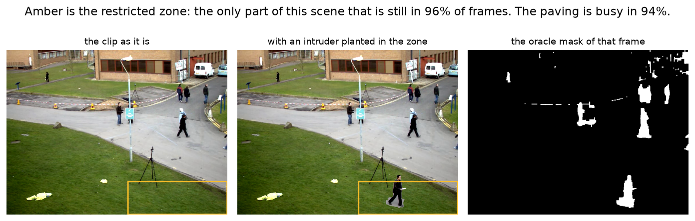
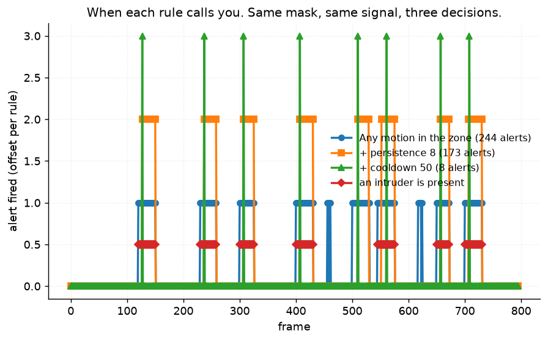
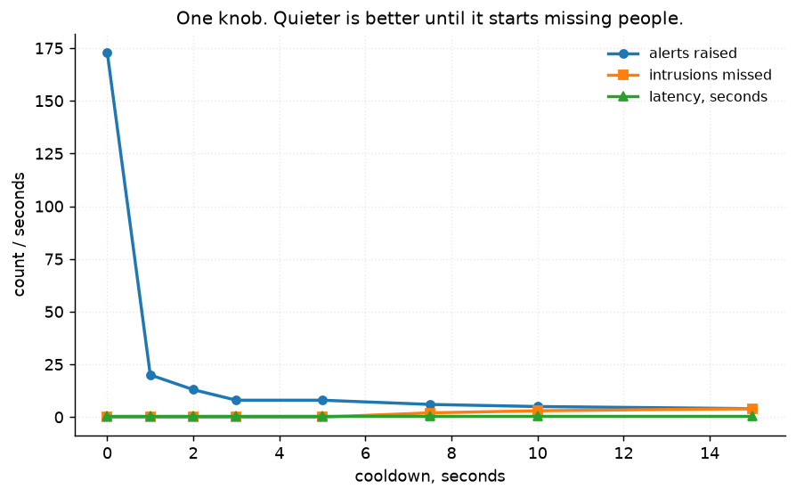
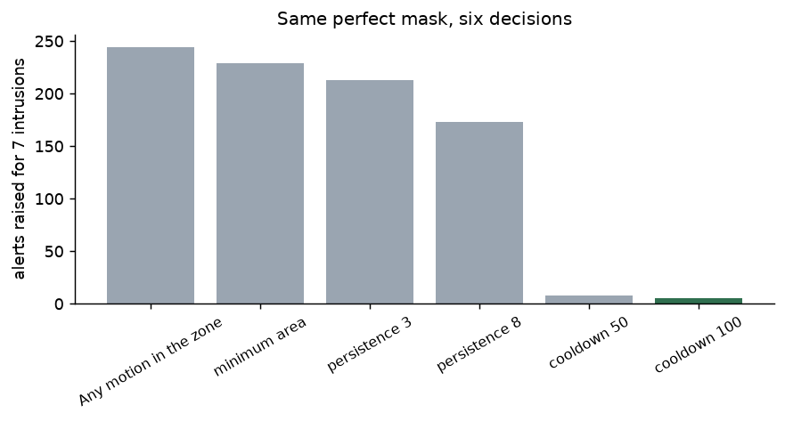
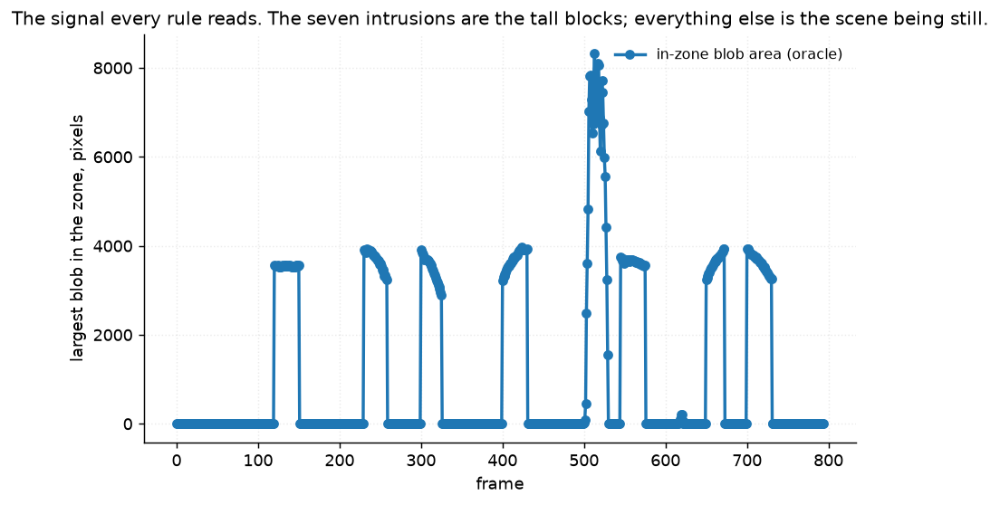

# 54 · Motion-triggered security alert — classical computer vision

[](https://www.python.org/)
[](https://opencv.org/)
[](#)
[](#)

A camera watches a place. Motion is detected. **When should it call somebody?**

That is not the question project 30 asks. Project 30 asks which pixels changed
and scores masks. This project holds the mask **fixed** and varies only what is
done with it.

> **The mask is not the system. The decision is.** Given the *oracle* mask — the
> exact per-pixel truth project 30 had to earn — the rule "alert if anything
> moves in the zone" fires **244 times for 7 intrusions**. That is **35 telephone
> calls per intruder**, and nothing about the pixels is wrong.

> **One knob fixes it, and it is not a better detector.** Adding a cooldown takes
> 244 alerts to **8** — one per intruder — while still catching **7 of 7**, for
> **0.7 s** of latency. Minimum area and persistence together only get it to 173.

> **The mask barely matters for this question.** Swapped for a *causal* mask, one
> a camera could actually compute live with no knowledge of the future, the naive
> rule fires **241** times instead of 244 and the tuned rule is **identical**:
> 8 alerts, 7 of 7. The thing project 30 spends a whole project improving makes
> almost no difference to whether the alarm is usable.

> **Firing the right number of times is not the same as firing at the right
> moments.** A control that fires **8** times at random catches **3 of 7**.

**No neural network, no training, no GPU.**

---

## Results



The restricted zone is the grass at the bottom right — chosen by measurement, not
by eye. Every candidate region was scored for how often it contains motion at
all: the paving at the centre is busy in **94%** of frames and this is busy in
**3.8%**. It is the only part of this scene that behaves like somewhere you would
put an alarm.



That figure is the project. Same footage, same mask, same signal — three
decisions. The naive rule fires continuously for the whole time an intruder is in
frame; the tuned rule fires once. Both also fire around frames 500 and 620, where
a real person walks through the zone and no label exists.

| Rule | Alerts | Found | Missed | Latency (s) | False alerts | False per minute |
|---|---:|:--:|---:|---:|---:|---:|
| Any motion in the zone | **244** | 7/7 | 0 | 0.00 | 12 | 9.1 |
| + minimum area | 229 | 7/7 | 0 | 0.00 | 0 | 0.0 |
| + persistence 3 | 213 | 7/7 | 0 | 0.20 | 0 | 0.0 |
| + persistence 8 | 173 | 7/7 | 0 | 0.70 | 0 | 0.0 |
| **+ cooldown 50** | **8** | **7/7** | **0** | 0.70 | 0 | 0.0 |
| + cooldown 100 | 5 | 4/7 | **3** | 0.70 | 0 | 0.0 |
| *Always alert (control)* | 795 | 7/7 | 0 | 0.00 | **563** | **424.9** |
| *Never alert (control)* | **0** | 0/7 | **7** | — | **0** | **0.0** |
| *Random, rate-matched (control)* | 8 | **3/7** | 4 | 1.30 | 4 | 3.0 |

**`Never alert` has a perfect false-alarm rate.** It is in the table for the same
reason the others are: a false-alarm number quoted without a detection number
describes a system that has been unplugged.

`Always alert` is the other end — it catches every intrusion and rings **425
times a minute**.

---

## Where the ground truth comes from

Two things, and the awkward part is named rather than smoothed over.

**1 — Planted intrusions.** A real pedestrian is cut out of the clip with the
oracle mask and pasted into the zone across a **recorded span of frames** on a
recorded path. Entry and exit are therefore exact. The person is real pixels from
this camera at this exposure; only the schedule is invented, and the schedule is
precisely what is being measured.

**2 — Verified-quiet frames.** The zone is **not** empty for the whole clip: real
people cross it in **30 of 795 frames**. So "no intrusion" cannot be assumed, it
has to be checked frame by frame with the oracle. A false alert is counted only
where the zone is verified still. Alerts during real, unlabelled activity are
counted in a **third bucket** — neither correct nor incorrect — rather than being
quietly assigned to whichever column flatters the result.

**One intrusion was refused rather than planted.** The span 470–505 overlaps
frames 502–505, where a real person walks through the zone, which would make
"what caused that alert" unanswerable. It is left in the list and rejected by
`plan_intrusions` at run time:

| Frames | Seconds | Overlaps real activity | Planted |
|---|---:|:--:|:--:|
| 120–150 | 3.1 | 0 | yes |
| 230–258 | 2.9 | 0 | yes |
| 300–325 | 2.6 | 0 | yes |
| 400–430 | 3.1 | 0 | yes |
| **470–505** | 3.6 | **4** | **REFUSED** |
| 545–575 | 3.1 | 0 | yes |
| 650–672 | 2.3 | 0 | yes |
| 700–730 | 3.1 | 0 | yes |

A guard nobody can see firing is a guard nobody can trust, so the list keeps a
span that must be rejected.

---

## One knob



| Cooldown (s) | Alerts | Found | Missed | Latency (s) |
|---:|---:|:--:|---:|---:|
| 0.0 | 173 | 7/7 | 0 | 0.70 |
| 1.0 | 20 | 7/7 | 0 | 0.70 |
| 2.0 | 13 | 7/7 | 0 | 0.70 |
| **3.0** | **8** | **7/7** | **0** | 0.70 |
| 5.0 | 8 | 7/7 | 0 | 0.70 |
| 7.5 | 6 | **5/7** | 2 | 0.70 |
| 10.0 | 5 | 4/7 | 3 | 0.70 |
| 15.0 | 4 | 3/7 | 4 | 0.70 |

**One second of cooldown removes 88% of the alerts and costs nothing at all** —
not a missed intrusion, not a millisecond of latency. Three seconds gets it to 8.
Past 7.5 seconds the system starts missing people, because two intruders less
than a cooldown apart become one alert.

The latency column never moves. That is worth noticing: a cooldown delays the
*second* alert, never the first, so it buys quiet at no cost in how fast you hear
about the first intruder. The latency in this project comes entirely from the
**persistence** requirement — 8 consecutive frames at 10 fps is 0.7 s of waiting
to be sure it is a person and not a bird.

---

## The mask hardly matters

| Rule | Oracle mask | Causal mask |
|---|:--:|:--:|
| Any motion in the zone | 244 alerts, 7/7 | 241 alerts, 7/7 |
| + minimum area | 229, 7/7 | 229, 7/7 |
| + persistence 8 | 173, 7/7 | 173, 7/7 |
| **+ cooldown 50** | **8, 7/7** | **8, 7/7** |
| + cooldown 100 | 5, 4/7 | 5, 4/7 |

The oracle uses the median of the **whole clip, including the future**. The
causal mask uses only the last 60 frames, which is what a camera could compute
live. For this question they are **the same**.

That is the strongest form of the project's point. An enormous amount of
classical work — all of project 30 — goes into making the mask better. Here the
best possible mask and a plainly worse one produce an identical alarm, because
the alarm's behaviour is set by three integers in the decision layer and not by
the pixels.

*This is a claim about this zone and this clip, where the intruder is large,
high-contrast and unoccluded. A smaller or more ambiguous target would separate
the two masks; nothing here shows otherwise.*




---

## Shared footage, stated

**This uses `vtest.avi`, which projects 29, 30 and 57 also use.** That is the
reason this project was built last, and it is stated here rather than left to be
noticed.

The pixels are the same 795 frames. What differs is that **nothing here is scored
per pixel**: the unit is an event, the metrics are alerts per minute and seconds
from entry to alert, and the figures are timelines rather than frames. Project 30
would answer "0.604 IoU"; this one answers "eight telephone calls, none of them
wrong, 0.7 seconds after the person steps on the grass".

---

## Try it

```bash
python infer.py                        # the whole clip, every rule
python infer.py --rule "Any motion in the zone"
python infer.py --cooldown 30 --persistence 8
```

---

## Limitations

* **Seven intrusions.** Every detection count is out of seven, so one event is 14
  percentage points. The alert counts are on firmer ground — those are hundreds
  of frames — but nothing here supports a fine distinction in detection rate.
* **One zone, one clip, one camera.** The zone is a rectangle over grass in a
  scene that is otherwise busy. A doorway, a fence line or a car park would each
  behave differently, and the 3.8%-busy figure that justified this zone is a
  property of this footage.
* **The intruder is composited.** It keeps the illumination of the frame it was
  cut from, casts no new shadow, and is never occluded. Its mask was taken from
  the oracle, so it arrives carrying **its own cast shadow and a little paving**
  — which makes it slightly easier to detect than a real person on grass.
* **The planted person is the same person every time**, at the same scale, walking
  a straight line. A crawling, a stationary or a distant intruder is not tested.
* **"Verified quiet" is verified by the oracle**, which is a threshold on a
  median background — not an independent observer. It is the best truth available
  here and it is not a person's judgement.
* **No tracking.** A real system would associate blobs across frames and alert on
  a *track* entering the zone, which is strictly more information than the
  per-frame blob area used here.
* **Latency is measured from the frame the composite begins**, which is the frame
  the intruder is fully present. A real intruder enters gradually.

---

## Tests

26 tests, run with `pytest projects/54_motion_alert/tests -q`. The decision layer
is pure arithmetic on a signal, so most of it is tested against hand-written
signals rather than against the clip: persistence resets on a gap, a cooldown
collapses a run into one alert and then permits another once it expires, minimum
area ignores small blobs. The rest pin the result (a perfect mask with the naive
rule is unusable; the cooldown is the decisive knob; too much of it starts
missing intrusions; a rate-matched random control catches fewer), the
construction (the zone is verified still rather than assumed; a span overlapping
real activity is refused; the planted clip differs from the original only inside
the spans) and the scoring bug below.

**A correct alert was being counted as a false one.** `quiet` is measured on the
unmodified clip, so it still contains the frames an intruder was later planted
into — and without subtracting the spans, every alert during an intrusion was
also a false alarm. The first run of this project reported **214** false alerts
where there are **12**. The subtraction now happens inside the scorer, where a
caller cannot forget it, and a test pins it.

---

## Keywords

motion detection · security alert · intrusion detection · background subtraction ·
region of interest · debounce · cooldown · persistence filter · false alarm rate ·
event-level evaluation · alerts per minute · detection latency · control
experiment · classical computer vision · no deep learning · OpenCV · Python ·
CPU only · reproducible image processing experiments

## References

* Piccardi, *Background subtraction techniques: a review*, IEEE SMC 2004 — the
  mask stage, which this project deliberately holds fixed.
* Ferryman & Shahrokni, *PETS2009: Dataset and challenge*, PETS 2009 — on
  event-level rather than pixel-level evaluation of surveillance video.
* `vtest.avi` ships with OpenCV under the BSD 3-Clause licence; provenance is
  recorded in `assets/real/README.md`.
