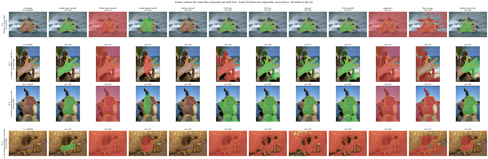
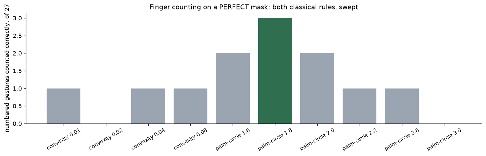
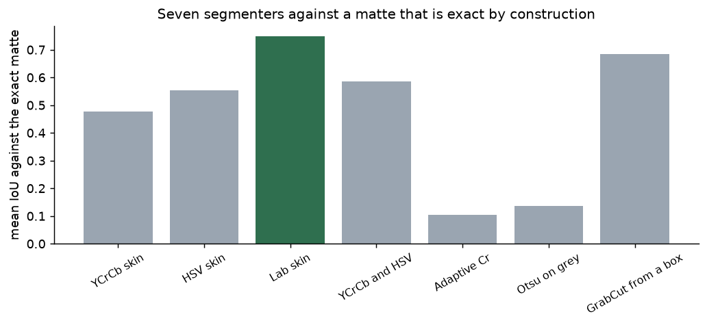
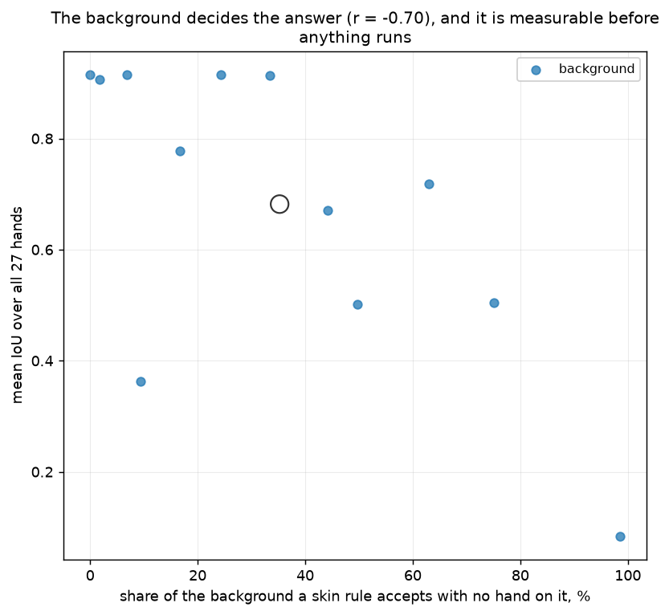
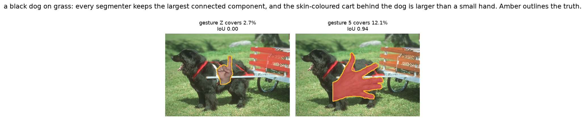
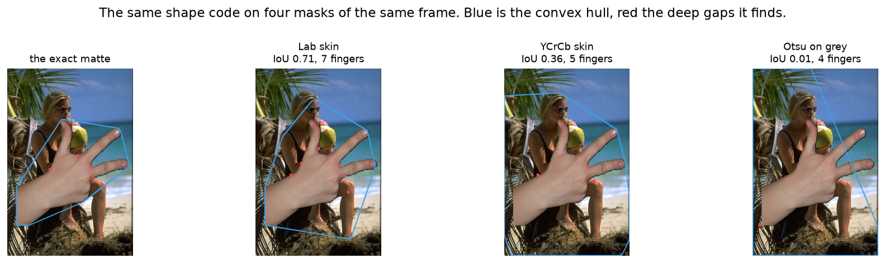

# 56 · Hand gesture recognition — classical computer vision

[](https://www.python.org/)
[](https://opencv.org/)
[](#)
[](#)

The classical hand-gesture pipeline is two stages: **segment the hand**, almost
always by skin colour, then **describe its shape**, usually by counting the deep
convexity defects between the fingers. Every tutorial spends its words on the
second stage, because that is the clever part.

> **The second stage does not work here at all — and that has to be said before
> anything else.** Handed a **perfect** mask, two classical finger-counting rules
> across ten settings between them manage **3 of the 5** numbered gestures at
> best. The four-finger gesture is read as one at every setting tried. These are
> real hands at arbitrary orientations with the forearm in frame, and both rules
> assume an upright, palm-forward hand with the wrist at the bottom.

> **The first stage is where the variance is, and it is the background that
> moves it.** Running every hand on every background — 27 × 12 = **324
> composites** — the spread across backgrounds is **0.831 IoU** and the spread
> across hands is **0.425**. The background moves the answer **2.0× further than
> which hand it is**.

> **And it is predictable before anything runs.** How much of a background a
> skin rule already accepts, measured with no hand on it, correlates with the
> score at **r = −0.70**. On dolphins in open water the best segmenter averages
> **0.915**; on a sunlit sandy wall, **0.084**.

> **An ellipse drawn where a hand usually is, with the image never read, scores
> 0.441 and beats 2 of the 7 real segmenters.**

**No neural network, no training, no GPU.**

---

## Results

Four hand-and-background pairs spanning the difficulty axis. **Amber outlines the
mask the composite was built from.** Green fill where the segmenter recovered it,
red where it did not.



| Sr | Background | Oracle | Whole frame | Centre ellipse | Nothing | YCrCb | HSV | Lab | YCrCb∩HSV | Adaptive Cr | Otsu | GrabCut |
|---:|---|:--:|:--:|:--:|:--:|:--:|:--:|:--:|:--:|:--:|:--:|:--:|
| 1 | dolphins, 0% skin-like | 1.00 | 0.12 | 0.54 | 0.00 | **0.98** | 0.97 | 0.95 | 0.97 | 0.12 | 0.19 | 0.77 |
| 2 | a woman on a beach, 44% | 1.00 | 0.20 | 0.37 | 0.00 | 0.36 | 0.56 | **0.71** | 0.57 | 0.20 | 0.01 | 0.52 |
| 3 | a bronze figure, 33% | 1.00 | 0.22 | 0.54 | 0.00 | 0.53 | 0.53 | **0.95** | 0.54 | 0.22 | 0.37 | 0.84 |
| 4 | a sandy wall, 99% | 1.00 | 0.08 | 0.37 | 0.00 | 0.08 | 0.09 | 0.10 | 0.09 | 0.08 | 0.13 | **0.44** |

*Row 1 is what every tutorial screenshot looks like. Row 4 is the same seven
methods on a background that is the colour of skin, and **nothing reaches 0.45**.
Row 2 has real human skin in the background — the segmenters take her arm as
readily as the hand.*

---

## Where the ground truth comes from

The 27 hand photographs are **real**, of eight different people, and they arrive
already cut out against pure black. That is somebody else's segmentation,
inherited rather than invented — but it means a threshold at grey level 20
recovers an **exact foreground mask** for free.

So the construction is:

1. take the real hand and its exact mask,
2. **composite it onto a real photograph** at a recorded position and scale,
3. ask each segmenter to recover the mask it was built from.

Nothing about the hand is synthetic — it is a photograph of a hand on a
photograph of a place — and the only invented quantity is *where* it was put,
which is exactly the quantity being scored. This is the same device project 30
uses for background subtraction and project 54 for defects.

**How exact is "exact"?** Measured per photograph, as the share of the frame
sitting in the halo between backdrop and hand:

| | |
|---|---|
| median halo | **0.67%** |
| worst | **11.3%** (the `4` gesture — a forearm in shadow) |
| best | 0.23% |

One photograph is markedly worse than the rest. It is named rather than dropped.

**The gesture label is real too**: the dataset names each file after the sign it
shows. Five of the twenty-seven are numbers, which gives a small but genuine
finger-count accuracy — and the letters are **not** assigned a finger count here,
because whether the thumb counts as extended in `A` or `S` is a judgement, and
inventing one would turn the dataset's label into mine.

---

## Settle the second stage first



Before blaming a segmenter for anything, hand the shape code a **perfect** mask
and see whether it works.

| Rule | Parameter | Correct |
|---|---:|:--:|
| convexity defects + 1 | 0.01 | 1/5 |
| convexity defects + 1 | 0.02 | 0/5 |
| convexity defects + 1 | 0.04 | 1/5 |
| convexity defects + 1 | 0.08 | 1/5 |
| palm-circle crossings | 1.6 | 2/5 |
| **palm-circle crossings** | **1.8** | **3/5** |
| palm-circle crossings | 2.0 | 2/5 |
| palm-circle crossings | 2.2 | 1/5 |
| palm-circle crossings | 2.6 | 1/5 |
| palm-circle crossings | 3.0 | 0/5 |

**Ten settings across two rules, and the best gets 3 of 5.** So any claim that
segmentation is the bottleneck has to be made carefully: the stage downstream of
it is not working either.

Counting convexity defects directly — the rule in every tutorial — returns
**three or four gaps whatever the hand is doing**, because the photographs
include the **forearm** and the wrist contributes defects of its own. Replacing
it with Malima's palm-circle method (count how many runs of foreground a circle
at 1.8 palm radii crosses) roughly triples the accuracy, from 1/5 to 3/5. That
repair is kept and tested so it stays made.

It still is not good. The honest reading is that these rules were designed for a
webcam pointed at an upright palm, and this is a set of real hands at arbitrary
orientations.

---

## Now the first stage



| Segmenter | Mean IoU | Recovered (IoU ≥ 0.5) | Feature gap | Fingers |
|---|---:|:--:|---:|:--:|
| *Oracle mask (control)* | **1.000** | 27/27 | 0.000 | 3/5 |
| *Whole frame (control)* | 0.103 | 0/27 | 0.758 | 0/5 |
| *Centre ellipse (control)* | **0.441** | 9/27 | 0.489 | 0/5 |
| *Nothing (control)* | 0.000 | 0/27 | 1.222 | 0/5 |
| YCrCb skin | 0.477 | 13/27 | 0.340 | 1/5 |
| HSV skin | 0.554 | 15/27 | 0.192 | 3/5 |
| **Lab skin** | **0.747** | **23/27** | **0.060** | 2/5 |
| YCrCb ∩ HSV | 0.586 | 16/27 | 0.212 | 2/5 |
| Adaptive Cr | 0.104 | 0/27 | 0.757 | 0/5 |
| Otsu on grey | 0.135 | 0/27 | 0.461 | 0/5 |
| GrabCut from a box | 0.685 | 21/27 | 0.154 | 2/5 |

**The ellipse control at 0.441 beats `Adaptive Cr` and `Otsu on grey`**, neither
of which reads colour at all. That is not a quirk of polarity — both directions
were measured for each (Otsu scores 0.055 one way and 0.135 the other; adaptive
Cr 0.031 and 0.104) and the better is reported. A brightness threshold has **no
way to know which side of the cut is the hand**, and choosing per image by
looking at the answer would not be a method.

`GrabCut` is told roughly where to look, which the others are not, so its 0.685
is not a like-for-like win — the interesting part is that **`Lab skin` beats it
anyway**, at 0.747.

*That number was not reproducible until it was fixed.* GrabCut seeds its colour
models from OpenCV's **global** RNG, so its answer depends on how much
randomness anything else in the process consumed first — on one frame here the
IoU ranged from **0.532 to 0.691** across runs that differed in nothing else. It
surfaced as a test that passed alone and failed in the full suite. The call is
now seeded, and a test churns the RNG in between and asserts the mask is
identical.

The *feature gap* column is what connects the two stages: how far the shape
descriptors computed on a recovered mask sit from the ones the exact matte gives
on the identical frame. It tracks IoU closely (r = −0.93 across the seven), which
is what makes the segmentation number mean something downstream rather than being
a pixel score for its own sake.

---

## It is the background, not the hand



Running the full grid — **every hand on every background, 324 composites** — so
that only one thing varies at a time:

| | |
|---|---|
| spread across the 12 backgrounds | **0.831 IoU** |
| spread across the 27 hands | **0.425 IoU** |
| ratio | **2.0×** |

| Background | Skin-like | Mean IoU | Median IoU | Total failures |
|---|---:|---:|---:|:--:|
| dolphins in open water | 0.0% | **0.915** | 0.939 | 0/27 |
| a painted mural and a city street | 1.7% | 0.907 | 0.925 | 0/27 |
| a cormorant on a branch | 6.9% | 0.915 | 0.944 | 0/27 |
| **a black dog on grass** | 9.4% | **0.363** | **0.000** | **15/27** |
| a polo player on a horse | 16.7% | 0.777 | 0.802 | 0/27 |
| the steps of a Mayan pyramid | 24.3% | 0.915 | 0.944 | 0/27 |
| a bronze human figure on a rock | 33.4% | 0.914 | 0.940 | 0/27 |
| a woman on a beach — real skin | 44.1% | 0.670 | 0.672 | 0/27 |
| people unloading a plane on snow | 49.8% | 0.501 | 0.701 | 9/27 |
| orange koi carp under water | 63.0% | 0.718 | 0.765 | 1/27 |
| a guard beside a sentry box | 75.1% | 0.504 | 0.503 | 1/27 |
| **a man sweeping beside a sunlit sandy wall** | **98.6%** | **0.084** | 0.081 | 5/27 |

*"Total failures" counts hands scoring below 0.05 — found not badly but not at
all. The column is here because **the mean lies without it**: `a black dog on
grass` has a mean of 0.363 and a **median of 0.000**.*

Skin-likeness is measured **from the background alone, with no hand on it**, so
it predicts difficulty rather than explaining it afterwards. It correlates with
the score at **r = −0.70**.

**The axis does not explain everything, and chasing the exception found the
better result.** `a black dog on grass` is only 9.4% skin-like and scores
**0.363** — 0.47 IoU below what the trend predicts, the largest miss in the
table.

The first explanation written here was that the hand *merges* into the dog. **That
was wrong, and testing it is what produced the real answer.** The blob every
segmenter selects is not the dog at all — it is the **varnished orange-red cart**
behind it, which reads as skin in Lab.

Every segmenter keeps the largest connected component. So when a background
contains a skin-coloured object larger than the hand, the rule picks that object
and the score is not degraded — it is **zero**. The prediction that follows is
specific and it holds: on this background the score tracks **how much of the frame
the hand covers**, at **r = +0.83**. The 15 hands that fail cover 0.0496 of the
frame on average; the 12 that succeed cover 0.0914.



**It is a size contest, and the loser scores zero.** A wide open palm wins
(gesture `5` scores 0.94 there); a small closed one loses completely (gesture `2`
and gesture `C` both score 0.00).

That also explains the two *different* failure modes now visible in the median
column. The sandy wall fails **gradually** — mean 0.084, median 0.081, only 5
total failures — because skin colour is genuinely everywhere and every mask is
bad. The dog fails **bimodally** — mean 0.363, median 0.000, 15 total failures —
because the outcome is a coin flip decided by hand size. A table of means alone
would have shown those as the same kind of problem.

The bronze statue is the pleasant surprise: at 33% skin-like it was picked as an
adversarial case and it is **not hard at all** (0.914). Bronze is the wrong
saturation. Being *shaped* like a person does not matter to a colour rule —
only being *coloured* like one does, which is the whole point in one row.



---

## Try it

```bash
python infer.py --hand 5_P__5_P_hgr1_id04_2 --background 314016   # easy
python infer.py --hand 3_P__3_P_hgr1_id02_2 --background 81090    # real skin behind
python infer.py --hand 1_P__1_P_hgr1_id01_3 --background 293029   # a sandy wall
python infer.py --list
```

Every run prints the IoU against the exact matte and the finger count beside the
one the dataset recorded, because a good mask and a right answer are not the same
thing here. The sandy wall is the whole project in one output:

```
segmenter                     IoU  fingers  feature gap
Oracle mask (control)        1.00        1 ok        0.000
Centre ellipse (control)     0.37        0           0.648
YCrCb skin                   0.08        0           0.571
HSV skin                     0.09        3           0.538
Lab skin                     0.10        6           0.435
Otsu on grey                 0.13        3           0.470
GrabCut from a box           0.43        0           0.653

an ellipse drawn without reading the image scores 0.37 and beats 6 of them
with a perfect mask the shape rule says 1 finger; the dataset says 1.
```

**The ellipse beats six of the seven.** And the shape rule gets the answer right
from the exact matte and wrong from every mask any method recovered — `Lab skin`
reports **six fingers**.

---

## Limitations

* **The hands are pre-segmented.** They arrive cut out on black, so this project
  can measure segmentation only by *putting them back* onto a background. A hand
  photographed against a real cluttered scene has motion blur, shadow, contact
  with the arm and a soft boundary — none of which survives a cut-and-paste.
  Every number here is an upper bound on an easier problem.
* **The matte is inherited**, not measured. It is the dataset authors' opinion
  about where the hand ends, and its own halo is 0.67% of the frame at the median
  and 11.3% at the worst.
* **No compositing realism.** No shadow is cast, no colour bleed, no relighting —
  the hand keeps the illumination of the studio it was shot in. A real hand in
  front of a sunlit sandy wall would be lit by it.
* **The hand is placed at one fixed position and scale** in every composite, so
  `GrabCut` and the ellipse control both benefit from knowing where to look.
  Their numbers are not like-for-like with the colour rules and are marked as
  such.
* **Five numbered gestures** is far too few to report a finger-counting accuracy
  with any confidence. It is reported as 3 of 5, and no more is claimed from it.
* **27 hands, but one photograph per gesture class**, so gesture *classification*
  is not measurable here at all and is not attempted — there is no second example
  of any class to recognise against.
* **Still images only.** A real gesture system works on video, and the hardest
  moment is a gesture mid-transition, which no still can contain.
* **One morphological cleanup shared by every segmenter**, which is fair but is
  also what breaks `a black dog on grass` for all of them at once.

---

## Tests

26 tests, run with `pytest projects/56_hand_gesture/tests -q`. They pin the
result (the background moves the answer further than the hand does; skin-likeness
predicts the score; the hardest background is the most skin-coloured; a drawn
ellipse beats at least one real segmenter; a worse mask costs the shape
description), the construction (the composite really is the hand inside the mask
and the background outside it; the composite is deterministic; **only the oracle
is given the truth**, checked by handing every other method a deliberately wrong
mask and asserting nothing changes), the labels (gestures come from the dataset,
and letters are never assigned a finger count), the second stage (it fails on a
perfect mask; the palm-circle rule beats raw defect counting; the count is
scale-free) and the bug that `distanceTransform` returns `FLT_MAX` on a mask with
no background pixels.

---

## Keywords

hand gesture recognition · finger counting · skin colour segmentation · YCrCb ·
HSV · Lab · convexity defects · convex hull · palm circle · distance transform ·
GrabCut · alpha matte · composite ground truth · control experiment ·
classical computer vision · no deep learning · OpenCV · Python · CPU only ·
reproducible image processing experiments

## References

* Malima, Özgür & Çetin, *A Fast Algorithm for Vision-Based Hand Gesture
  Recognition for Robot Control*, SIU 2006 — the palm-circle counting rule that
  replaced defect counting here.
* Kakumanu, Makrogiannis & Bourbakis, *A survey of skin-color modeling and
  detection methods*, Pattern Recognition 2007 — the colour spaces compared, and
  on why a background of the same chrominance defeats all of them.
* Rother, Kolmogorov & Blake, *"GrabCut" — interactive foreground extraction*,
  SIGGRAPH 2004.
* Hand photographs come from the **HGR1** gesture set (Silesian University of
  Technology; Grzejszczak, Kawulok & Galuszka); backgrounds from BSDS500.
  Provenance is recorded in `assets/real/README.md`.
