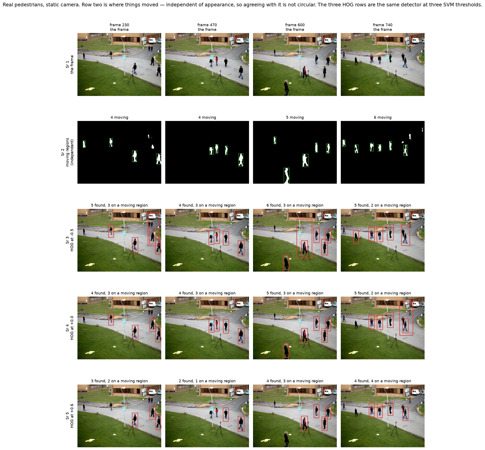
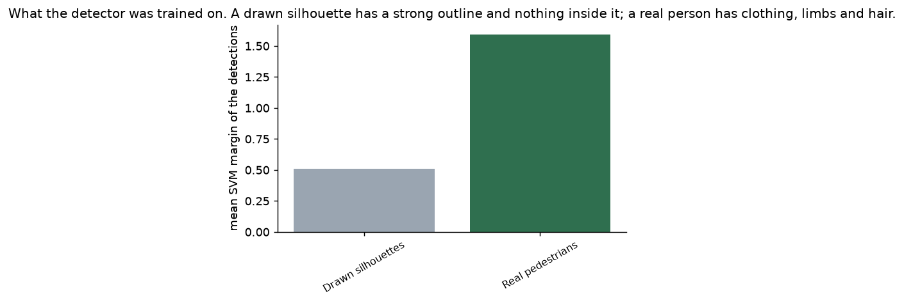
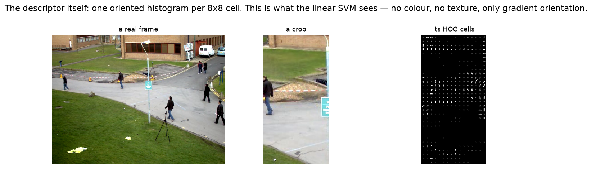
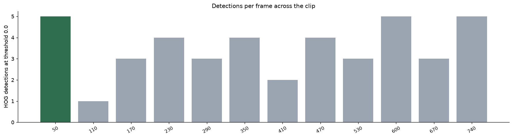
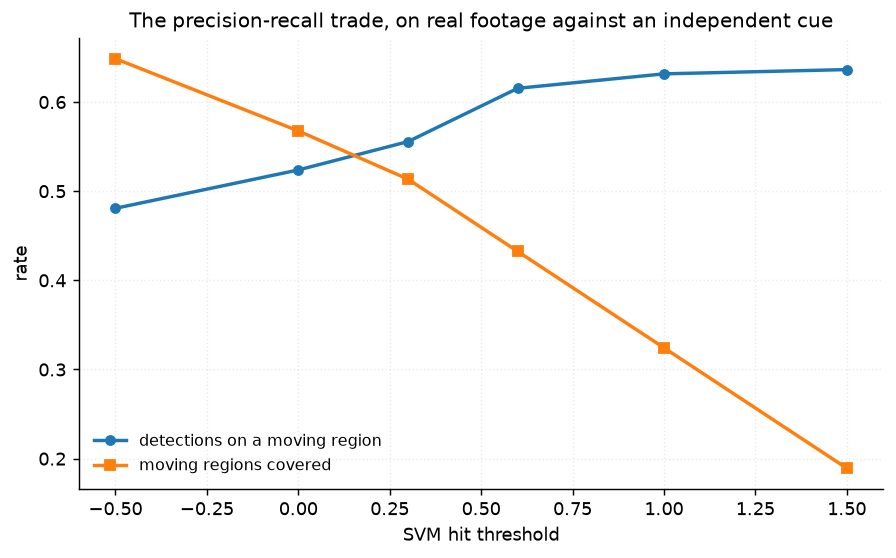
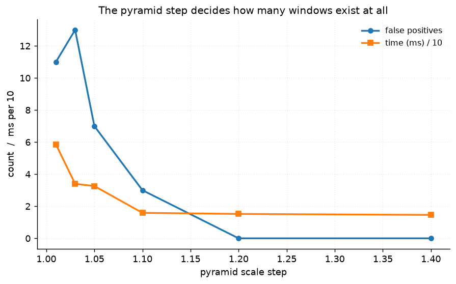

# 57 · Pedestrian detection — classical computer vision

[](https://www.python.org/)
[](https://opencv.org/)
[](#)
[](#)

Dalal & Triggs' HOG detector, 2005: a histogram of gradient orientations over
8×8 cells, a 3780-number descriptor, and one linear SVM. No training here —
OpenCV ships the INRIA weights.

This project was first built on drawn silhouettes, the way most HOG demos are.
That version had to be thrown away, and **why** is the first result below.

> **The detector scores drawn people at 0.51 and real people at 1.591.** Mean SVM
> margin; 5 of 13 detections clear 0.5 on the drawings against 40 of 52 on real
> pedestrians. Recall on the composited scenes never rises above **one silhouette
> in twelve** at any threshold or pyramid step. A benchmark built on drawings
> measures the drawings.

> **On real footage, checked against independent motion evidence:** 42 detections
> over twelve frames, **52.4% of them on something that moved**, and **56.8% of
> the person-sized moving regions found**. Raising the threshold from −0.5 to
> +1.5 takes agreement from 0.481 to 0.636 while coverage falls 0.649 → 0.189.

**No neural network, no training, no GPU.**

---

## Results

Four frames of a static-camera clip. Row 2 is where things *moved*, computed
from the temporal signal alone with no appearance model — HOG cannot see motion,
so agreeing with it is not circular. Rows 3–5 are the same detector at three SVM
thresholds.



| Sr | Frame | Moving regions | HOG at −0.5 | HOG at +0.0 | HOG at +0.6 |
|---:|---:|---:|---:|---:|---:|
| 1 | 230 | 4 | 5 | 4 | **3** |
| 2 | 470 | 4 | 4 | 4 | **2** |
| 3 | 600 | 5 | 6 | 5 | **4** |
| 4 | 740 | 6 | 5 | 5 | **4** |

*The twelve sampled frames are this project's twelve images. None is earlier than
frame 50: `moving_blobs` needs 40 frames of history before the background model
means anything, and frame 0 reports "nobody moved" for that reason alone.*

---

## The signature result: what the detector was trained on



| People | Detections | Mean margin | Max margin | Above 0.5 |
|---|---:|---:|---:|---:|
| **Drawn silhouettes** | 13 | **0.510** | 1.236 | **5** |
| **Real pedestrians** | 52 | **1.591** | 4.444 | **40** |

**3.1× in the mean and 3.6× in the maximum**, on the same detector at the same
threshold. The reason is the descriptor: HOG is a histogram of gradient
*orientations* over 8×8 cells, and the SVM was trained on photographs of people.
A flat filled silhouette has a strong outline and **nothing inside it** — no
clothing folds, no limb shading, no hair. Most of its cells are empty, and an
empty cell is not evidence of a person.



The composited benchmark is a floor rather than a score, and tuning does not
lift it:

| | precision | recall | F1 | TP | FP | FN |
|---|---:|---:|---:|---:|---:|---:|
| Composited scenes, threshold 0.0 | 0.000 | **0.000** | 0.000 | 0 | 7 | 24 |

| Silhouette height | 80–110 px | 110–150 px | 150–220 px | 220–320 px |
|---|---:|---:|---:|---:|
| Recall | **0.000** | **0.000** | **0.000** | **0.000** |
| False positives | 6 | 15 | 6 | 1 |

**It is not a size mismatch.** The drawings are rendered at four height bands
spanning the detector's whole useful range and recall is zero at every one. It is
not a threshold either: at −1.0 on the finest pyramid the detector finds one
silhouette out of the twelve in four scenes, at a precision of 0.04.

---

## On real footage, against independent evidence

There is no human annotation for this clip, so none is claimed. What there is:
the camera is static, so a region that moves is an object. MOG2 background
subtraction establishes that from the temporal signal alone, and the two cues
share no information.



| Frame | HOG detections | Moving regions | On a moving region | Regions detected | Mean margin |
|---:|---:|---:|---:|---:|---:|
| 50 | 5 | 2 | 2 | 2 | 1.96 |
| 110 | 1 | 1 | 0 | 0 | 1.35 |
| 170 | 3 | 3 | 2 | 2 | 0.95 |
| 230 | 4 | 4 | 3 | 3 | 2.86 |
| 290 | 3 | 1 | 0 | 0 | 1.66 |
| 350 | 4 | 3 | **4** | 3 | 1.82 |
| 410 | 2 | **0** | 0 | 0 | 1.02 |
| 470 | 4 | 4 | 3 | 3 | 2.22 |
| 530 | 3 | 4 | 1 | 1 | 3.62 |
| 600 | 5 | 5 | 3 | 3 | 2.19 |
| 670 | 3 | 4 | 2 | 2 | 1.95 |
| 740 | 5 | 6 | 2 | 2 | 1.23 |

**42 detections, 37 moving regions, 22 agreements and 21 regions covered.** Two
rows are worth reading rather than averaging:

* **Frame 350 has 4 detections on 3 regions.** Two people walking together merge
  into a single blob; HOG separates them and the motion cue cannot. The
  disagreement is the motion cue's fault, not the detector's.
* **Frame 410 has 2 detections and 0 regions.** Everybody visible is standing
  still. Background subtraction sees nothing; HOG sees people, correctly.

Neither column is truth, and the places where they disagree are where each one's
failure mode lives.

---

## The threshold trade



| Hit threshold | Detections | On a moving region | Moving regions covered |
|---:|---:|---:|---:|
| −0.5 | 52 | 0.481 | **0.649** |
| 0.0 | 42 | 0.524 | 0.568 |
| +0.3 | 36 | 0.556 | 0.514 |
| +0.6 | 26 | 0.615 | 0.432 |
| +1.0 | 19 | 0.632 | 0.324 |
| +1.5 | 11 | **0.636** | 0.189 |

Monotone in both directions, which is what a real precision/recall trade looks
like — and worth having *because* it is measured against a cue the detector
cannot see. Agreement gains 0.155 for a coverage loss of 0.460: on this clip,
tightening the threshold costs about three times what it buys.

---

## The pyramid step



| Scale step | 1.01 | 1.03 | 1.05 | 1.1 | 1.2 | 1.4 |
|---|---:|---:|---:|---:|---:|---:|
| False positives | 11 | 13 | **7** | 3 | 0 | 0 |
| Median ms | **58.6** | 34.0 | 32.6 | 15.9 | 15.2 | **14.6** |

**4.0× in time from 1.4 to 1.01.** The step decides how many windows exist at
all: a finer pyramid evaluates more scales, finds more of everything, and on
scenes with nothing to find that means only more false positives. 1.05 is the
default here and the usual published choice.

---

## Two bugs worth naming

**Non-maximum suppression rejected the SVM margin.** `cv2.dnn.NMSBoxes` asserts
`score_threshold >= 0`, and the margin is signed — so every negative threshold in
this project's own sweep raised an exception. `detect` now shifts the scores by a
constant before suppression. The shift is uniform, so it cannot change which box
wins a cluster; both properties are pinned by tests.

**The detector window is not the person.** OpenCV returns the 64×128 window,
which includes the margin the INRIA training crops carried around each person.
Comparing that window to a tight box costs roughly 0.1 of IoU for free.
`tighten_box` removes 15% of the width and 5% of the height, and a test asserts
that doing so *raises* total agreement with the motion evidence — otherwise the
correction would be an arbitrary fudge in the right direction.

---

## Try it on your own image

```bash
python infer.py photo.jpg                   # your own image
python infer.py --frame 600                 # a frame of the clip, with motion evidence
python infer.py --frame 600 --threshold 1.0
python infer.py --synthetic                 # a drawn scene, for comparison
```

It prints the **margin** for every detection, not just the box. If your image's
mean margin sits near 0.51 rather than 1.59, the detector is not seeing people in
it — it is returning whatever the window liked best. With `--frame` the boxes are
drawn green where a moving region supports them and red where nothing does.

---

## Limitations

* **There is no ground truth on the real footage.** Background subtraction is
  independent evidence, not annotation: it merges people who walk together, it
  includes their shadows, and it misses anyone standing still. All three show up
  in the per-frame table and none is corrected.
* **The clip is one scene** — a static overhead camera on an overcast day.
  Nothing here transfers to a moving camera, night footage or crowds.
* **`IoU ≥ 0.3` is a threshold choice** for calling a detection "on a moving
  region", loose because the blobs include shadows and so are systematically
  taller than the person.
* **The drawn scenes are kept, deliberately.** They are not a benchmark and are
  never reported as one; they exist to demonstrate that they do not work.
* **Timings are single-threaded medians on one machine** and are useful for the
  4× ratio between pyramid steps, not as absolute figures.
* **No tracking.** Each frame is detected independently, which is why frame 110
  finds one person and frame 740 finds five.

---

## Tests

17 tests, run with `pytest projects/57_pedestrian_detection/tests -q`. They pin
the finding that restructured the project (drawn silhouettes score a third of
what real people do, and no threshold or size band rescues the composited
recall), both bugs (NMS on negative scores, the window-to-person correction and
that it improves agreement rather than merely shrinking boxes), the independence
of the motion cue, the monotone threshold trade, and the descriptor geometry
— 7 × 15 blocks × 4 cells × 9 bins = 3780 features, 3781 SVM parameters.

They skip cleanly if `vtest.avi` is not cached.

---

## Keywords

pedestrian detection · HOG · histogram of oriented gradients · Dalal Triggs ·
linear SVM · INRIA · non-maximum suppression · image pyramid · background
subtraction · MOG2 · sliding window · detection threshold ·
classical computer vision · no deep learning · OpenCV · Python · CPU only ·
reproducible image processing experiments

## References

* Dalal & Triggs, *Histograms of Oriented Gradients for Human Detection*, CVPR
  2005 — the detector, the descriptor geometry and the INRIA dataset.
* Zivkovic, *Improved Adaptive Gaussian Mixture Model for Background
  Subtraction*, ICPR 2004 — MOG2, used here only as independent evidence.
* Dollár, Wojek, Schiele & Perona, *Pedestrian Detection: An Evaluation of the
  State of the Art*, TPAMI 2012 — on why detection benchmarks need real data.
* `vtest.avi` ships with OpenCV's sample data.
