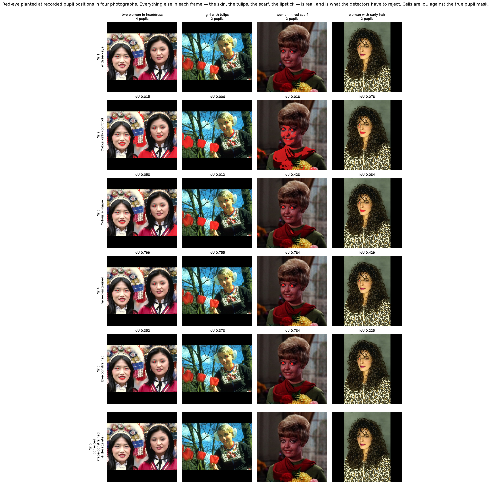
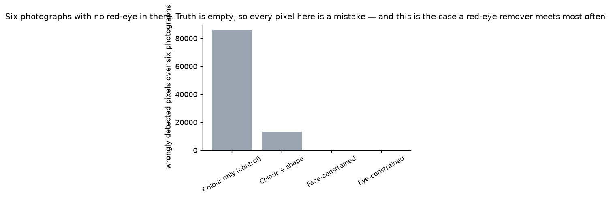
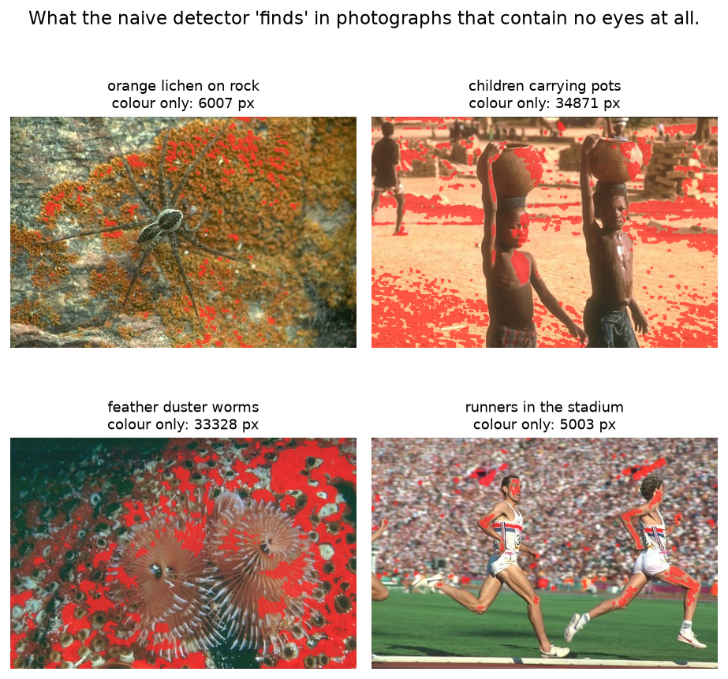
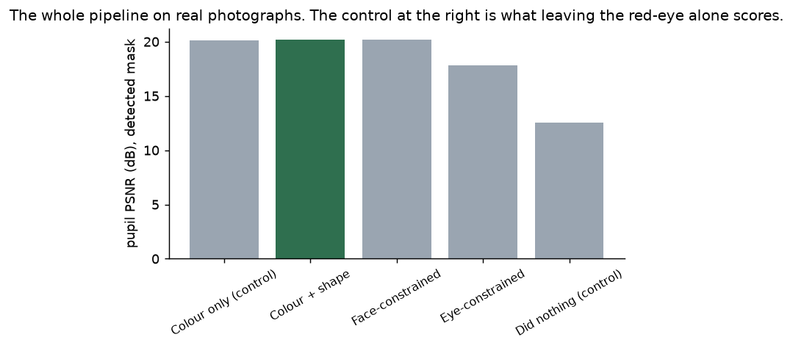
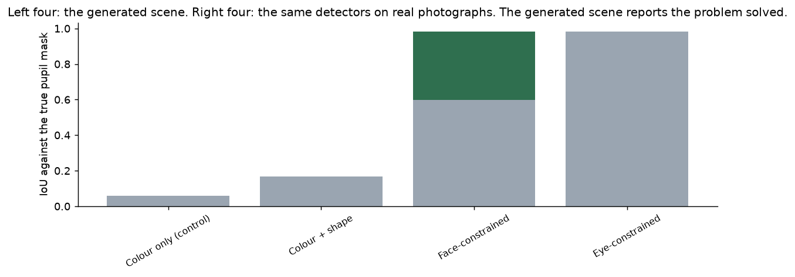
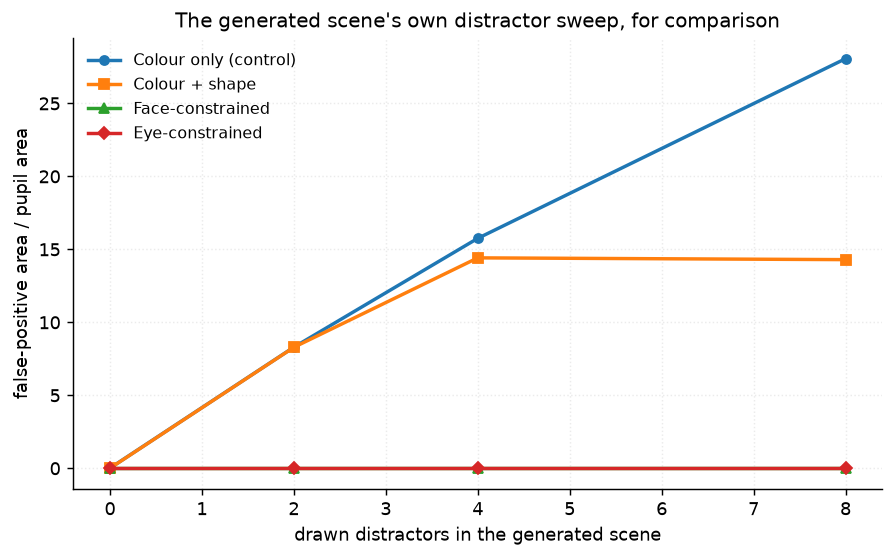
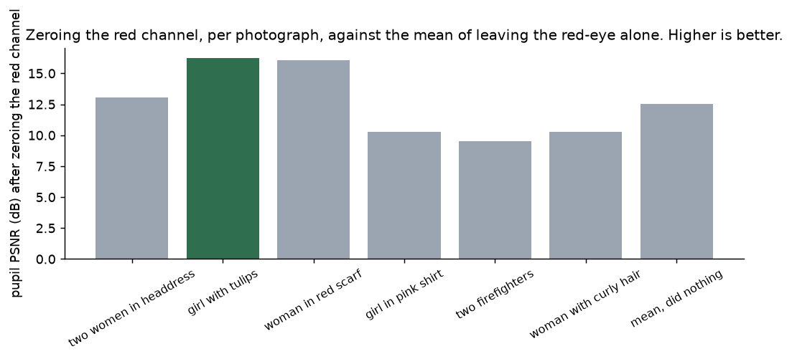
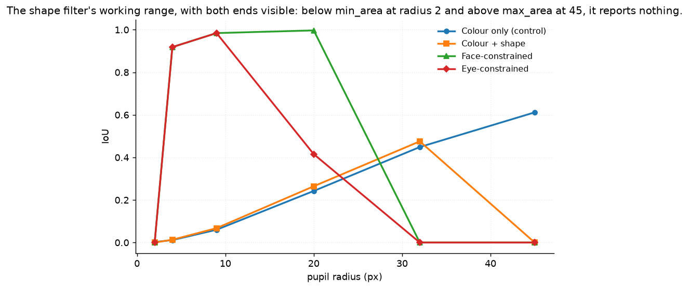
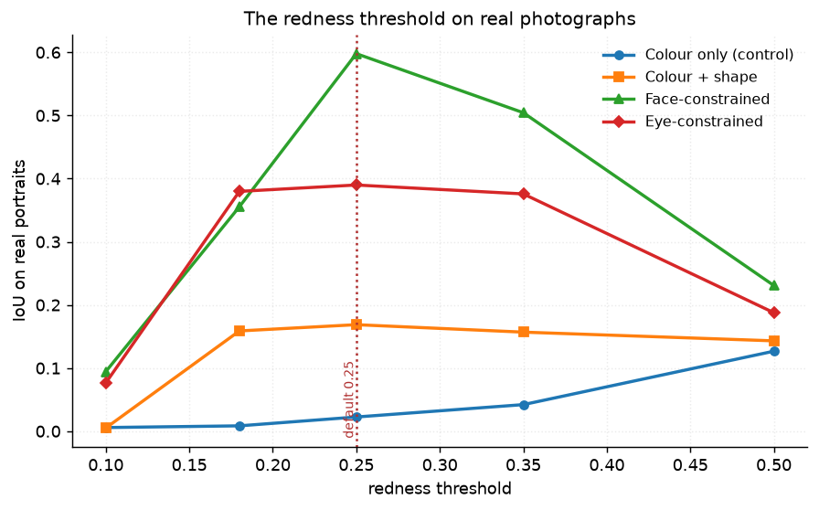

# 57 · Red-eye removal — classical computer vision

[](https://www.python.org/)
[](https://opencv.org/)
[](#)
[](#)

Red-eye is the flash coming back off the retina. Find the red pupils,
desaturate them, done — and both halves of that sentence are where it goes
wrong.

> **The generated scene says the problem is solved. The photographs do not.**
> The face-constrained detector scores **IoU 0.984** on a rendered face with
> drawn red distractors and **0.598** on the same detector's own photographs.
> Drawn distractors are discs and rectangles the shape filter is entitled to
> reject; lipstick, brake lights and sugar-shelled sweets are small, round and
> red.

> **On six photographs containing no red-eye at all**, the naive colour detector
> marks **86,294 pixels**, the shape filter **13,328**, and the face constraint
> **98**. Truth is empty here, so there is no metric choice to argue about — and
> this is the case a red-eye remover meets far more often than the other one.

> **Zeroing the red channel scores worse than leaving the red-eye alone** on
> three of the six portraits. Only a do-nothing control shows that; ranked
> against the other two corrections it merely looks like the weakest of three.

**No neural network, no training, no GPU.**

---

## Results

Red-eye planted at recorded pupil positions in four photographs. Everything else
in each frame — the skin, the tulips, the scarf, the lipstick — is photographed,
and is what the detectors have to reject. Cells are IoU against the true pupil
mask.



| Sr | Photograph | Pupils | Pupil-like blobs | Colour only (control) | Colour + shape | Face-constrained | Eye-constrained |
|---:|---|---:|---:|---:|---:|---:|---:|
| 1 | two women in headdress | 4 | 10 | 0.015 | 0.058 | **0.799** | 0.352 |
| 2 | girl with tulips | 2 | 8 | 0.006 | 0.012 | **0.755** | 0.378 |
| 3 | woman in red scarf | 2 | 2 | 0.018 | 0.428 | **0.784** | 0.784 |
| 4 | woman with curly hair | 2 | 2 | 0.078 | 0.084 | **0.429** | 0.225 |

| Detector | IoU | Pupil recall | FP area / pupil area | ms |
|---|---:|---:|---:|---:|
| Colour only (control) | 0.023 | 0.728 | **×64.2** | 1.7 |
| Colour + shape | 0.169 | 0.692 | ×14.6 | 1.8 |
| **Face-constrained** | **0.598** | 0.692 | ×0.30 | 15.9 |
| Eye-constrained | 0.390 | 0.485 | **×0.26** | 11.9 |

*Row 4 is the honest hard case: the woman's own lipstick is redder than the
planted red-eye, and even the face constraint only reaches 0.429 because the
mouth is inside the face box — the upper-60% rule is what keeps it that high.*

---

## The signature result: a photograph with nothing wrong with it



| Photograph | Pupil-like blobs | Colour only | Colour + shape | Face-constrained | Eye-constrained |
|---|---:|---:|---:|---:|---:|
| orange lichen on rock | 43 | 6,007 | 1,714 | **0** | **0** |
| children carrying pots | 59 | **34,871** | 3,259 | 98 | **0** |
| feather duster worms | 39 | 33,328 | 2,984 | **0** | **0** |
| runners in the stadium | 38 | 5,003 | 1,951 | **0** | **0** |
| scattered sweets | 12 | 3,613 | 2,645 | **0** | 47 |
| red brick house | 19 | 3,472 | 775 | **0** | **0** |
| **total** | | **86,294** | **13,328** | **98** | **47** |



Six photographs with no eyes in them. Truth is empty, so every pixel in that
table is a mistake, and no threshold choice can hide one. The naive detector
paints 22.6% of `children carrying pots` red — the earth, the pots, the skin.

**Two rows are worth reading against each other.** `scattered sweets` is the only
photograph where the face constraint marks nothing and the *eye* constraint marks
47 pixels: the eye cascade fires on round dark-rimmed discs, and the picture is
full of them. The tightest constraint is not automatically the safest one.

---

## The metric that hides all of it



| Detector | Correction | Pupil PSNR (dB) |
|---|---|---:|
| Colour only (control) | Mean of G and B | **20.08** |
| Colour + shape | Mean of G and B | **20.21** |
| Face-constrained | Mean of G and B | **20.21** |
| Eye-constrained | Mean of G and B | 17.82 |
| **Did nothing (control)** | none | **12.54** |

**The naive detector and the face-constrained one are 0.124 dB apart, while their
false-positive areas differ by 217×.** Pupil PSNR is computed over pupil pixels,
so it cannot see what a detector does to the rest of the frame — and the rest of
the frame is where all the damage is. A project that reported only this table
would conclude the face constraint buys nothing.

That is what the clean-photograph control is for.

---

## Generated against real



| Detector | Generated IoU | Real IoU | Generated FP area | Real FP area |
|---|---:|---:|---:|---:|
| Colour only (control) | 0.060 | 0.023 | ×15.8 | **×64.2** |
| Colour + shape | 0.068 | **0.169** | ×14.4 | ×14.6 |
| **Face-constrained** | **0.984** | **0.598** | ×0.0 | ×0.30 |
| Eye-constrained | **0.984** | **0.390** | ×0.0 | ×0.26 |

The generated scene reports the face and eye constraints as having **nothing left
to improve** — 0.984, zero false positives, indistinguishable from each other. On
photographs they separate by 0.21 IoU and neither is close to solved.

The inversion on the second row is worth stating rather than smoothing over: the
shape filter does **better** on photographs (0.169) than on the generated scene
(0.068), because the drawn distractors were deliberately sized and rounded to
slip through it. So the generated scene is harsh in the one place it is easy and
easy in the two places it is hard — which is the general failure mode of a
benchmark you wrote yourself.



---

## The correction, against doing nothing



| Photograph | Zero red channel | Mean of G and B | Desaturate (feathered) | **Did nothing** |
|---|---:|---:|---:|---:|
| two women in headdress | 13.06 | 20.56 | **20.94** | 12.21 |
| girl with tulips | 16.26 | **22.89** | 18.72 | 11.79 |
| woman in red scarf | 16.08 | **21.76** | 20.25 | 12.24 |
| girl in pink shirt | **10.28** | **22.92** | 21.14 | *12.28* |
| two firefighters | **9.55** | 16.77 | **21.51** | *13.79* |
| woman with curly hair | **10.27** | 17.78 | **19.44** | *12.94* |

Pupil PSNR in dB against the photograph, using the true mask so this measures the
correction alone. **On the last three rows, zeroing the red channel scores below
leaving the red-eye in place.** It removes the red and leaves a dark blue hole,
which is further from a real pupil than the red-eye was.

Both luminance-preserving corrections beat the do-nothing control on all six. The
feathered desaturation wins where the pupil is small and the surrounding skin
matters (the firefighters, at 21.51 dB against 16.77); the green/blue mean wins
where the pupil is large enough to be judged on its own.

---

## The shape filter's working range



| Pupil radius | 2 | 4 | 9 | 20 | 32 | 45 |
|---|---:|---:|---:|---:|---:|---:|
| Colour + shape | **0.000** | 0.013 | 0.068 | 0.264 | 0.475 | **0.000** |
| Face-constrained | **0.000** | 0.918 | 0.984 | **0.997** | **0.000** | **0.000** |

At radius 2 the blob is below `min_area = 12`; at 45 it is above
`max_area = 4000`. Both report zero. The sweep originally ran 4 → 20 and showed
a filter that always works — **any fixed geometric constraint has a working
range, and a sweep that stays inside it measures nothing.** At radius 32 the
pupils are large enough that the *face* cascade stops finding the face, which is
a second failure with the same shape.



The redness threshold has an optimum rather than a direction: 0.25 is best for
the face constraint on real photographs, and both 0.1 and 0.5 are worse.

---

## How the twelve photographs were chosen

Ranked by **pupil-like blobs** — how many small, round, red things the photograph
already contains. That is `detect_colour_shape` up to the point where it would
accept a blob, so the axis is the method's own response rather than a proxy for
it.

```
woman_in_red_scarf      2    runners_in_the_stadium  38
woman_with_curly_hair   2    feather_duster_worms    39
girl_in_pink_shirt      3    orange_lichen_on_rock   43
girl_with_tulips        8    children_carrying_pots  59
two_women_in_headdress 10    scattered_sweets        12
two_firefighters        5    red_brick_house         19
```

Six carry a frontal face and get red-eye planted at recorded pupil positions; six
have no face and no red-eye and serve as the empty-truth control.

**What is real and what is not.** The faces, the skin, the lighting and every red
object in every frame are photographed. Only the pupil recolouring is synthetic,
and it has to be: a photograph that already has red-eye carries no record of what
it looked like before, so there would be nothing to score a correction against.
The effect is added with a radial falloff rather than painted as a flat disc,
because the retina returns the flash.

**Which pupil positions were measured and which were not.** OpenCV's eye cascade
found **12 of the 16 pupils**; each was then checked against a pixel grid. The
four it missed are marked `"hand"` in `PORTRAITS` and were read off that grid
directly. The cascade's own miss rate is a result, not an inconvenience — it is
why `detect_eye_constrained` has the lowest recall in the table above.

None of the twelve appears in any other project; `tools/check_image_reuse.py`
enforces that by perceptual hash.

---

## Try it on your own image

```bash
python infer.py photo.jpg                      # find and fix whatever is there
python infer.py --portrait woman_in_red_scarf  # planted red-eye, exact truth
python infer.py --clean scattered_sweets       # a photo with no red-eye in it
python infer.py photo.jpg --detector "Colour only (control)"
```

It prints **how much of the frame each detector marked**, not just whether it
found the eyes, plus your photograph's pupil-like blob count. With `--clean`
there is no truth to score against and the count is the entire result.

---

## Limitations

* **The red-eye is planted, not photographed.** Real red-eye varies with pupil
  dilation, flash-to-lens distance and iris colour, and can be orange or gold
  rather than red. Every rate here is an upper bound.
* **Six portraits is a small sample**, and four of them are studio or posed
  shots with a single frontal face. Nothing here says how the detectors behave
  on a crowd, a profile or a child looking away.
* **The Haar cascades are pre-trained by someone else.** That is the one
  component in this project not built here, and it is stated rather than hidden;
  `detect_colour_only` and `detect_colour_shape` use nothing trained at all.
* **IoU against an empty truth mask is not a scale** — it is 1.000 for marking
  nothing and 0.000 for marking anything. The clean-photograph table therefore
  reports pixel counts, and `infer.py` omits the IoU column in that case.
* **`min_area`, `max_area` and `min_circularity` are fixed numbers.** The sweep
  above finds where they fail; it does not tune them, because tuning them on
  these twelve photographs would be fitting to the test set.
* **Timings are single-threaded medians on one machine.** The 9× between the
  colour detectors and the cascade-based ones is the useful part.

---

## Tests

18 tests, run with `pytest projects/57_red_eye_removal/tests -q`. They pin the
ground truth (the planted mask is exactly the recorded pupils, the pre-flash
image is the untouched photograph, the red-eye is added rather than painted),
the record of which pupils the cascade found, and every finding: that the
generated scene reports the problem solved, that pupil PSNR cannot see the
damage a detector does elsewhere, that the eye cascade finds eyes in a pile of
sweets, that zeroing the red channel is not always an improvement, and that the
shape filter fails at both ends of its range.

---

## Keywords

red-eye removal · red-eye detection · flash photography · redness map · Haar
cascade · face detection · eye detection · circularity · morphology · false
positives · desaturation · luminance preservation · empty-truth control ·
classical computer vision · no deep learning · OpenCV · Python · CPU only ·
reproducible image processing experiments

## References

* Gaubatz & Ulichney, *Automatic Red-Eye Detection and Correction*, ICIP 2002 —
  the face-then-colour pipeline this project's strongest detector follows.
* Viola & Jones, *Rapid Object Detection using a Boosted Cascade of Simple
  Features*, CVPR 2001 — the cascades OpenCV ships.
* Willamowski & Csurka, *Probabilistic Automatic Red Eye Detection and
  Correction*, ICPR 2006 — on why the correction matters as much as the
  detection.
* Photographs come from BSDS500 and the USC-SIPI image database; provenance for
  each is recorded in `assets/real/README.md`.
